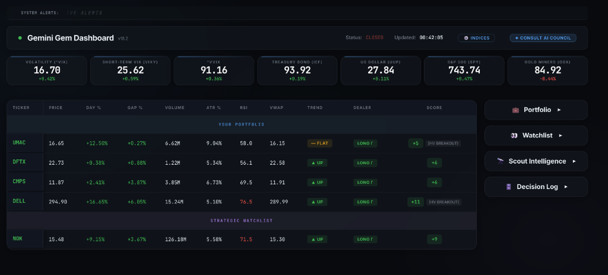
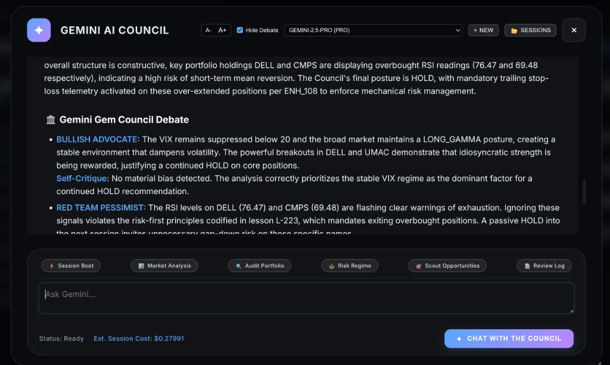

# 💎 GEM Investment Portfolio Agent Framework 

**An autonomous, multi-agent AI investment portfolio intelligence system powered by Google Gemini & Gemma.**

Each Markdown file (`.md`) is a **system instruction** for a dedicated AI sub-agent. Together, these agents form an institutional-grade investment portfolio council that analyses live market data, enforces risk protocols, and produces consensus-driven investment decisions — all accessible via a real-time, Web Dashboard with a built-in AI chat interface.

> **Cost-Optimized & Local-First.** The system uses a hybrid model architecture routing to Gemini 2.0 Flash Thinking (THINKING), Gemini 2.5 Pro (PRO), Gemini 2.5 Flash (FAST), and Gemma 4 31B (GEMMA) tiers — fully synchronized with the GEM Investment Portfolio Agent System source of truth.

---

## 🖥️ Platform Showcase

<p align="center">
  
  
</p>

---

## 🚀 Quick Start

### Prerequisites

- Python 3.10+
- A [Google AI Studio API Key](https://aistudio.google.com/app/apikey)
- A `config.json` file for API keys and local model overrides.

### Installation

```powershell
# 1. Clone the repo
git clone https://github.com/your-org/gemini_cli_subagent_system
cd gemini_cli_subagent_system

# 2. Install dependencies
# Option A: Run the automated installer script
powershell -ExecutionPolicy Bypass -File install.ps1

# Option B: Install manually
pip install -r requirements.txt

# 3. Set your Gemini API key
$env:GEMINI_API_KEY="your_api_key_here"

# 4. Launch the system
# Option A: Run using the virtual environment interpreter explicitly
.venv\Scripts\python.exe web_server.py

# Option B: Activate the virtual environment first, then run
.venv\Scripts\Activate.ps1
python web_server.py
```

The dashboard will be available at **http://localhost:8000**

---

## 🏗️ Architecture

The system runs as a high-performance Python framework with a dynamic model router:

```
┌─────────────────────────────────────────────────────────────────────┐
│                     web_server.py (Entry Point)                     │
│                                                                     │
│  ┌──────────────────────────┐   ┌──────────────────────────────┐    │
│  │   FastAPI Web Server     │   │    Background Data Daemon    │    │
│  │   (http://localhost:8000)│   │   (fetch_stocks.py thread)   │    │
│  │                          │   │                              │    │
│  │  GET  /api/data          │   │  Polls Yahoo Finance / SSoT  │    │
│  │  POST /api/chat          │   │  Updates GLOBAL_STATE every  │    │
│  │  POST /api/save_basket   │   │  30 seconds                  │    │
│  │  POST /api/save_watch    │   │                              │    │
│  └──────────┬───────────────┘   └──────────────┬───────────────┘    │
│             │                                  │                    │
│             ▼                                  ▼                    │
│        Model Router                       GLOBAL_STATE              │
│        (Logic Tier)                       (Shared Mem)              │
└─────────────┬──────────────────────────────────┬────────────────────┘
              │                                  │
        ┌─────▼────────────────┐           ┌─────▼────────────────┐
        │  GEMINI (THINKING)   │           │     GEMMA 4 31B      │
        │  (Reasoning & Search)│           │  (Precision Logic)   │
        └──────────────────────┘           └──────────────────────┘
```

### Terminal Orchestrator (Chat AI)

The chat interface in the dashboard connects directly to a **Gemini 2.0 Flash Thinking** (or best available) model configured as the Terminal Orchestrator. It has access to the following **tool functions**:

| `read_ssot()` | Reads the current SSoT (`ssot.json`) |
| `update_ssot(payload)` | Merges an execution payload into the SSoT |
| `read_trade_lessons()` | Reads all historical trade lessons |
| `update_trade_lessons(lesson)` | Appends a new insight to the lessons library autonomously (ENH_62) |
| `update_rules(rules_md)` | **NEW**: Commits rule promotions to `rules.md` (Human-gated per MANDATE_21) |
| `get_market_data()` | Returns live ticker/macro data (Fixed return logic) |
| `perform_web_forensic_search()` | Performs grounded search for catalysts and filings |
| `ask_<subagent>(query)` | Delegates a query to a specialised sub-agent |
| `ask_council(queries)` | Parallel Dispatcher — runs multiple agents simultaneously (3x speedup) |

Sub-agents marked as **Research**, **Sentiment**, **Bullish Advocate**, **Red Team Pessimist**, **Technical Validator**, and **Macro Sentinel** have built-in **Google Search Grounding** to fetch live 2026 catalysts and override static training data.

---

## 📁 File Reference

### Entry Points

| File | Purpose |
|------|---------|
| `python/web_server.py` | **Primary entry point.** Starts the FastAPI server, initialises all sub-agents, and exposes the `/api/chat` endpoint. |
| `python/main.py` | Alternative **CLI-only** orchestrator. Runs the same agent stack in a terminal chat loop. |
| `context/ssot.json` | **Master Data Store.** The Single Source of Truth for portfolio holdings, cost basis (WAC), and the dynamic watch list. Synchronized in real-time with the Web Dashboard. |
| `context/trade_lessons.json` | **Historical trade lessons.** Appended autonomously via ENH_62 to prevent repeating past mistakes. |
| `gem_trading_rules/rules.md` | **Canonical Rules Engine.** Local rules document containing all mandates, thresholds, and autonomous logic updates. |
| `scripts/` | **Automation Utilities.** Reusable Python scripts for bulk-refactoring and parsing logic across the ecosystem, minimizing token overhead. |
| `context/config.json` | **API Configuration.** Keys for Gemini, Finnhub, and local model routing overrides. |

---

## ⚡ High-Performance Features

### 🧠 Hybrid Model Routing (v18.0)
To optimize for both **cost** and **precision**, the system now routes sub-agents to specific model tiers:
- **GEMMA Tier (Gemma 4 31B)**: Handles deterministic, JSON-heavy, and structural analysis (Context, Structural, Technical Validator).
- **FLASH Tier (Gemini 2.5 Flash)**: Handles high-speed research, social sentiment, and news velocity monitoring.
- **THINKING Tier (Gemini 2.0 Flash Thinking)**: Reserved for the Terminal Orchestrator and deep-reasoning sub-agents (advocates, Research).
- **PRO Tier (Gemini 2.5 Pro)**: Reserved for complex Macro Arbitration (e.g. Macro Sentinel).

### 🛡️ Smart Key Routing (Gemini Free Tier Key Routing)
To minimize development and operational costs, the framework features **Autonomous Key Routing**:
- **Dual-Key Isolation:** The system leverages both a paid/Pro API key (`GEMINI_API_KEY`) and a free-tier API key (`GEMINI_FREE_TIER_API_KEY`).
- **Targeted Free Routing:** Flash and Gemma query streams are automatically isolated and routed to the free-tier API key, preserving paid quotas.
- **Robust Fail-Safe Fallbacks:** If the free-tier key hits its 15 RPM query rate limit or quota caps, the orchestrator triggers an automatic failover to the primary/paid key to complete the request seamlessly.
- **Recommended Setup:** For the most cost-efficient and premium performance, **users are strongly advised to configure both keys** (a paid key for Pro reasoning/caching, and a free-tier key for Flash research and Gemma constraints).

### 💼 Dynamic Ticker Management
The dashboard now features an **Inline Ticker Manager**:
- **Basket Management**: Add/Delete tickers directly in the portfolio view. Update shares and cost basis (UAC) with instant SSoT synchronization.
- **Watch List**: Maintain a separate list of monitored symbols. The data daemon automatically begins polling any ticker added to the watch list.
- **SSoT Sync**: All UI updates trigger a `POST` to the framework, ensuring the AI Council always analyzes the most current state of your universe.

### 🚀 Context Caching (ENH_CACHE_01)

The system aggregates the entire rulebook, trade history, and subagent instructions into a **Gemini Context Cache**. This reduces the per-turn token cost and eliminates "cold start" latency, allowing the Orchestrator to respond in seconds.

> [!NOTE]
> **Cost-Aware Caching Policy:** Context caching is a dynamic, user-controlled toggle available under paid model tiers (Pro tiers) in the dashboard overlay. The framework automatically disables context caching on Free Tiers to prevent API quota exhaustion and rate-limit blocks.


### 🏛️ Autonomous Rule Evolution (ENH_61/62)
The system "Learns" from market events. When a high-conviction pattern is identified, the **Context Engine** proposes a new rule. Once you provide **MANDATE_21** approval, the system autonomously modifies `rules.md`.

### Sub-Agent Markdown Instructions

Each file below (located in the `engine_instructions/` folder) is loaded as a system instruction for a dedicated AI sub-agent. High-precision nodes have been migrated to the **GEMMA** tier for improved instruction-following and cost efficiency:

| File | Agent Name | Mode | Role |
|------|-----------|------|------|
| `terminal.md` | **Terminal Orchestrator** | THINKING | Routes user queries, delegates to sub-agents, synthesises final decisions |
| `macro_sentinel.md` | **Macro Sentinel** | PRO | Macro regime detection, Calendar Shield monitoring (Search Enabled) |
| `bullish_gem.md` | **Bullish Advocate** | THINKING | Constructs the strongest bull case + self-critique (Search Enabled) |
| `red_team_gem.md` | **Red Team Pessimist** | THINKING | Constructs the strongest bear case + self-critique (Search Enabled) |
| `neutral_gem.md` | **Neutral Structuralist**| GEMMA | Unbiased structural analysis; breaks ties with quantitative evidence |
| `execution.md` | **Execution Engine** | GEMMA | Generates `EXECUTION_PAYLOAD` JSON; manages sizing and order routing |
| `structural_engine.md` | **Structural Engine** | GEMMA | GEX regime, dark pool posture, VWAP structure analysis |
| `technical_validator.md` | **Technical Validator** | GEMMA | Final gate — validates thesis against quantitative restrictions |
| `research.md` | **Research Engine** | THINKING | Live web search for macro narrative, filings, sector rotation signals |
| `sentiment_engine.md` | **Sentiment Engine** | GEMMA | Social sentiment, news velocity, dark pool order flow (Search Enabled) |
| `context_engine.md` | **Context Engine** | GEMMA | SSoT state bridge — maintains session continuity and trade thesis integrity |
| `gex_engine.md` | **GEX Engine** | GEMMA | Gamma Exposure modelling, dealer hedging flow, pin risk analysis |
| `post_trade_review.md` | **Review Engine** | FAST | Post-trade reflection — thesis vs. outcome, misfire detection, lesson authoring |

### Model Hierarchy

The system uses a **tiered fallback model** strategy defined in `agent_framework.py`:

| Mode | Model Priority | Used By |
|------|---------------|---------|
| `THINKING` | `Dynamic Flash Thinking` → `gemini-3.1-pro-preview` | Orchestrator, Council advocates, Research |
| `PRO` | `gemini-2.5-pro` → `gemini-3.1-pro-preview` | Macro Sentinel, complex fallbacks |
| `GEMMA` | `gemma-4-31b-it` → `gemini-2.5-flash` | Context, Execution, Structural, Rule Enforcement |
| `FAST` | `gemini-2.5-flash` → `gemini-3-flash-preview` | Utility engines (Sentiment, Review, etc.) |

> [!NOTE]
> **Gemini Plan Upgrade:** If `GEMINI_SUBSCRIPTION_LINKED` is set to true in your configuration, the system automatically upgrades the `GEMMA` routing tier to use superior `PRO` models (`gemini-2.5-pro` → `gemini-3.1-pro-preview`) for execution and rule enforcement.

If a model returns a `429 Resource Exhausted` error, the system automatically parses the specific `retry-after` wait time from Google's API header and executes a dynamic backoff before retrying.

---

## 🖥️ Web Dashboard

The glassmorphic dashboard is served at **http://localhost:8000** and includes:

- **Real-time market table** — Ticker, Price, Gap %, Volume, ATR %, RSI, VWAP, Trend, Dealer Posture, Score.
- **Macro HUD** — Live cards for tracked macro indices (VIX, SPY, IEF, UUP, GDX, etc.).
- **Dynamic Portfolio Basket** — Inline management of your holdings. Add/Delete tickers and update cost basis (`UAC ($)`) with real-time **SSoT Sync**.
- **Interactive Watch List** — Monitor new setups by injecting symbols directly into the background data daemon.
- **Settings Gear Popover** — A professional configuration menu for managing API endpoints and caching logic. Includes dynamic plan-aware visibility that automatically isolates and hides raw advanced settings if you are an active Gemini Plan user, ensuring a seamless, clutter-free experience.
- **GEMINI AI COUNCIL Chat** — Full AI chat interface. Supports **Markdown rendering**, parallel "Council Debate" synthesis, and dynamic "Thinking..." indicators.

### Keyboard Shortcuts
- `Enter` — Send chat message
- `Shift + Enter` — New line in chat input

---

## ⚙️ Configuration

### Managing the Ticker Universe
All tickers are managed via the **Portfolio Basket** and **Watch List** on the dashboard. 
1.  **Add Ticker**: Type the symbol into the `SYM` field and click `+`.
2.  **Edit Basis**: Update your shares or cost basis directly in the table.
3.  **Sync**: Click **SYNC** to commit your changes to the local `ssot.json` data store. 
    *   *Note: Changes are instantly reflected in the background data poller.*

### 🔑 Configuring API Keys & Services

The system supports configuring API keys using environment variables or directly inside the local `config.json` file in the project root.

#### Environment Variables (Shell-Level overrides)
```powershell
# Set primary API key
$env:GEMINI_API_KEY="your_paid_api_key_here"

# Set free tier API key (optional, to isolate free quota)
$env:GEMINI_FREE_TIER_API_KEY="your_free_tier_api_key_here"

# Launch server
python python/web_server.py
```

#### File-Based Configuration (`config.json`)
For persistent, localized service credentials, configure the following keys inside `config.json` in the root of the project:

| Configuration Key | Tier / Service | Purpose |
|-------------------|----------------|---------|
| `GEMINI_API_KEY` | Google AI Studio (Paid/Pro) | Primary key used for standard/paid models (PRO tier routing). |
| `GEMINI_FREE_TIER_API_KEY` | Google AI Studio (Free) | Dedicated routing for free-tier queries (THINKING, FLASH, and GEMMA tiers) to protect paid quotas and isolate costs. |
| `FINNHUB_API_KEY` | Finnhub Market Data | Optional. High-speed stock price quotes and market telemetry. |
| `POLYGON_API_KEY` | Polygon.io Market Data | Optional. Historical aggregates and equity pricing metadata. |
| `ALPHA_ADVANTAGE_API_KEY` | Alpha Vantage Market Data | Optional. Alternative financial statements and indicator tracking. |

### Editing Sub-Agent Instructions

Each Markdown file (.md) in the root or `gem_trading_rules/` is human-readable and can be edited directly. The changes take effect on the **next server restart**. No manual synchronisation is required.

---

## 🗄️ Data Architecture

### SSoT (Single Source of Truth)

The `ssot.json` file is the system's persistent memory. The AI Orchestrator reads from it at the start of each session and writes back execution payloads automatically using the `update_ssot` tool — no manual copy-paste required.

### Trade Lessons

The `trade_lessons.json` file is a growing library of codified trade post-mortems. The system now **automatically appends new lessons** via the `update_trade_lessons` tool after the Orchestrator identifies long-term insights during a council session.

### User Config

`user_config.json` is auto-created the first time you save a ticker or index list from the dashboard:

```json
{
  "tickers": ["ONDS", "UMAC", "RCAT", "DFTX"],
  "macro": ["^VIX", "VIXY", "IEF", "UUP", "SPY", "GDX"]
}
```

---

## 🧠 Governance Backbone

### Mandates vs. Protocols

The `rules.md` file separates two distinct classes of directives:

1. **Mandates (`MANDATE_*`)** — Non-negotiable system behaviour constraints (e.g., always emit untruncated JSON, weighted consensus mechanics).
2. **Rules / Protocols (`ENH_*`)** — Financial execution strategies and domain knowledge (e.g., macro shock veto, pre-trade formulation, post-14:30 liquidity gates).

The **Rule Enforcer Engine** validates all decisions against these mandates before any execution payload is written. The migration to Markdown ensures the AI pays higher attention to these mandates by stripping syntax noise.

### Adversarial Council Design

The consensus council uses a structured adversarial debate:
1. **Bullish Advocate** — Best bull case + self-critique
2. **Red Team Pessimist** — Best bear case + self-critique
3. **Neutral Structuralist** — Unbiased quantitative verdict

The Terminal Orchestrator synthesises all three positions into a final `HOLD / BUY / SELL / TRIM` decision with a source index.

---

## 📋 Changelog

### v11.08-UI-DeepDive-Patch *(2026-06-13)*
- **Dashboard Refinement & Formatting:** Executed a comprehensive CSS/HTML UI overhaul targeting excessive margins and padding in the Chat Modal and Dashboard. Dialed chat UI typography down from `1.1rem` to `0.95rem` and compacted line heights to fit data-dense fintech profiles. Refined grid table borders with a low-opacity `0.06` divider line and `0.04` hover highlight for rapid row scanning.
- **Settings Gear Overhaul:** Replaced the cluttered top-right checkbox controls in the chat modal with a premium animated settings popover (`⚙️`). Subscriptions are dynamically tracked—users with an active Gemini Plan automatically have "Advanced" fallback elements (Paid Tiers, Context Caching overrides) hidden behind a clean `✅ GEMINI PLAN ACTIVE` banner to reduce cognitive load.
- **SSoT JSON Truncation Intercept:** Patched a chat history UI leak where incomplete `EXECUTION_PAYLOAD` JSON (due to max output truncation or errors) bypassed the `<details>` wrapper fallback. The backend now traps the `json.loads` exception and safely renders a visually-distinct `⚠️ Incomplete SSoT Payload (Truncated)` warning to prevent raw broken JSON blocks from bleeding into the chat UI.
- **History Guard 400 Error Fix:** Resolved a critical race condition triggering a `400 INVALID_ARGUMENT` API exception on multi-turn loops. The history guard—which prunes orphaned `function_call` parts—was over-aggressively wiping out valid `function_call` requests inside the tool loop *before* the Orchestrator could respond with the required `function_response`. The guard is now strictly gated to `isinstance(current_message, str)` and only executes upon fresh user text submissions.
- **Global Documentation Sync:** Renamed core agent instructions to `INSTRUCTIONS.md`, created universal `.cursorrules` routing, and bumped framework version to `v11.08-UI-DeepDive-Patch`.

### v11.03-GDrive-Decoupling-Patch *(2026-06-11)*
- **UI Safety & Decoupling:** Added a repository-specific UI decoupling guardrail to the Master Custodian rules (`antigravity.md`) to prevent layout mixing between the subagent dashboard (which utilizes direct FastAPI background database payload ingestion and local streaming) and the trading agent dashboard (which uses manual import/export clipboard operations).
- **UI Restoration:** Restored the interactive Gemini AI Council chat modal and launcher button (`launch-chat-btn`), re-linked `modern_ui.js` and `marked.js` library, and removed the redundant manual `Export to Council` and `Import from Council` sidebars from the `gemini_cli_subagent_system` dashboard UI.
- **Global Parity Sync:** Bumped and synchronized the framework version to `v11.03-GDrive-Decoupling-Patch` across master rules, `antigravity.md`, and all sub-agent markdown files in both repositories.

### v11.01-L249-Cascade-Patch *(2026-06-10)*
- **SSoT Cascade Mitigation Rule (ENH_249):** Codified a revised version of L-249 (POST-10:30 CASCADE MITIGATION) into rules.md with absolute execution supremacy. This rule triggers a mechanical 25% trim via marketable limit orders when index dealer posture is SHORT_GAMMA and an asset falls below its daily VWAP after 10:30 AM EST.
- **Bypasses and Exclusions:** Configured ENH_249 to bypass the ENH_FIN_02 Alpha-Friction Gate (volatility_override = TRUE), the MANDATE_34 LONG_GAMMA shield paradox, and the MANDATE_13 Consensus Deadlock pipeline.
- **Global Parity Sync:** Synchronized and bumped the framework version to `v11.01-L249-Cascade-Patch` across master rules, antigravity.md, and all sub-agent markdown files.

### v11.00-NotebookLM-Bridge *(2026-06-09)*
- **Terminal Schema Realignment (ENH_251):** Systemically scrubbed and permanently deprecated the legacy 0-100 `health_score` metric. The Council and Stage 0 Boot Prompts are now natively aligned with the master `-6 to +6` `score` SSoT gradient to eliminate execution friction.
- **SSoT Math Clamping:** Injected a hard `-6, 6` range clamp into the `fetch_stocks.py` scoring engine to permanently bound the values, preventing recent oscillator additions (MACD/BB) from overflowing the baseline logic thresholds.
- **Google Finance AI Voice Emulation:** Upgraded the Master Router (`terminal.md`) to natively format and synthesize the final `EXECUTION_PAYLOAD` with a `💡 AI Overview` block. This identically mimics the structure of Google Finance's internal LLM (Catalyst synthesis, 3 Key Drivers, Valuation Context).
- **Global Documentation Sync:** Bumped and synchronized version to `v11.01-L249-Cascade-Patch` across rules SSoT, root `antigravity.md`, and all 15+ sub-agent markdown files.

### v10.80-Advanced-Oscillator-Integration *(2026-06-09)*
- **Multi-Dimensional Momentum (ENH_250):** Shifted the core Technical Engine's RSI calculation from a 14-day to a highly sensitive 9-day period. Introduced MACD (12/26/9), Bollinger Bands (20-day, 2 std dev, %B), and Money Flow Index (14-day MFI) into the stock scoring loop.
- **Engine Rule Adaptations:** Systematically shifted hardcoded RSI thresholds across all sub-agent prompts (e.g., `MANDATE_38`, `MANDATE_40`) up by 5-10 points to accommodate the "hotter" 9-day RSI, preventing premature execution trims during strong high-beta trends.
- **Global Parity Sync (MANDATE_29):** Bumped and synchronized version to `v11.01-L249-Cascade-Patch` across rules SSoT, root `antigravity.md`, `README.md`, and all engine markdown files in both repositories.

### v10.70-News-Scan-Integration *(2026-06-09)*
- **News Scan Prompt Template (NEW):** Created `prompts/news_scan_prompt.txt` to instruct the Council to execute targeted Google searches for macroeconomic/political events (today and tomorrow) and stock-specific catalysts, assigning Torque Scores (1-10) per MANDATE_11.
- **Backend API Integration:** Added `/api/prompts/news_scan` route in `python/fetch_stocks.py` to serve the news scan prompt template.
- **UI Button Integration:** Added a premium-styled "📰 News Scan" button to the "Export to Council" sidebar panel in `static/index.html`.
- **UI Action Logic:** Implemented click handler in `static/app.js` to fetch both the news scan prompt and current market snapshot, combine them, copy to the clipboard, and display success indicators.

### v10.69-Diversified-Retrieval-Matrix *(2026-06-08)*
- **SSoT Schema & GEX Calculation Protocol (ENH_32):** Injected the `diversified_retrieval_queries` array (supporting M distinct retrieval types: `short_term_query`, `medium_term_query`, `long_term_query`, and `catalyst_specific_query`) into the `forensic_intelligence` object within the `ENH_32` schema. Isolated these query strings from standard trading summaries to prevent noise contamination during historical vector matching.
- **Narrative Bridge & Proactive Search (ENH_48 & ENH_77_LIVE_WEB):** Mandated that `DATA_ANALYST` and `RESEARCH_ENGINE` populate the new `diversified_retrieval_queries` schema. When evaluating an asset, they generate separate, parallel search queries tailored to multi-perspective dimensions (e.g., "Tier-1 regulatory events" vs "safe-haven macro rotations"), establishing an M×K matrix of historical intelligence for the deliberative agents.
- **Sympathy Momentum Bypass (MANDATE_37 / ENH_110):** Tied the sympathy momentum bypass rule explicitly to `diversified_retrieval_queries`. If the `catalyst_specific_query` retrieval returns NULL or fails to verify a hard idiosyncratic driver, but the asset is >3% above intraday VWAP with RSI > 65, the momentum is quantitatively classified as "sympathy-driven", the LONG_GAMMA shield is bypassed, and the mandatory 25% profit-taking trim is executed.
- **Sub-agent Instruction Mirroring (ENH_98):** Mirrored schema requirements into `data_analyst.md`, `research.md`, and `execution.md`.
- **Global Parity Sync (MANDATE_29):** Bumped and synchronized version to `v10.69-Diversified-Retrieval-Matrix` across rules SSoT, root `antigravity.md`, `README.md`, and all engine markdown files.

### v10.50-Conflict-Resolutions *(2026-06-08)*
- **Architectural Conflict Resolutions & Logic Mirroring:**
  - Update MANDATE_40 in rules.md, terminal.md, and execution.md to support User Override Supremacy, bypassing the automated trim if a human operator explicitly provides an off-chain contextual override via prompt.
  - Add ENH_245 exception in rules.md, terminal.md, rule_enforcer_engine.md, and execution.md to allow assets that clear idiosyncratic catalyst quality gates of MANDATE_20_VOID to bypass the capital deployment freeze during SPY SHORT_GAMMA.
  - Recalibrate MANDATE_29 reward function in rules.md, rule_enforcer_engine.md, and execution.md to explicitly reward capturing asymmetric upside on verified, idiosyncratic Tier-1 catalysts.
  - Implement MANDATE_20 sovereign hedge rotation exemption in rules.md, terminal.md, rule_enforcer_engine.md, and macro_sentinel.md, allowing ENH_57 rotations to bypass the VIX > 20 veto.
  - Bump version to v10.50-Conflict-Resolutions across all 13 engine instructions, rules.md SSoT, and antigravity.md.

### v10.50-Conflict-Resolutions *(2026-06-08)*
- **VWAP Addition to Indices Modal:** Added the `VWAP` indicator display to all tracked index cards inside the indices overlay card grid.
- **Removed Interpretation Label:** Removed the dynamically generated `(Antigravity curator: ...)` interpretation suffix from index card details.
- **3 Decimal Place GEX Formatting:** Increased the numeric formatting precision of all GEX occurrences to 3 decimal places across the table, macro HUD, and indices modal.
- **Global Parity Sync:** Synchronized and bumped version to `v10.50-Conflict-Resolutions` across all scope files.

### v10.50-Conflict-Resolutions *(2026-06-08)*
- **USD Cash Mapping Fix:** Enabled `unallocated_cash_usd` to correctly synchronize and persist to the local SSoT instead of defaulting to 0. Updated backend basket APIs, SSoT JSON formatting, and frontend outbound clipboard copy/paste payloads.
- **Dealer Column GEX Render:** Updated the dashboard's dealer column to render numerical GEX values to 2 decimal places instead of "LONG/SHORT gamma" labels.
- **GEX Direction Chevrons:** Integrated dynamic up/down chevrons (color-coded green and red) beside GEX values across the table, macro HUD cards, and indices modal to indicate whether GEX has increased or decreased between polls.
- **Global Parity Sync:** Synchronized and bumped version to `v10.50-Conflict-Resolutions` across all scope files.

### v10.70-Indices-VWAP-and-3Dec-GEX *(2026-06-05)*
- **Float Sanitization & Data Reliability:** Integrated robust NaN and Infinity sanitization checks in option chain and GEX calculations boundary to resolve FastAPI serialization crashes.
- **Global Parity Sync:** Synchronized and bumped version to `v10.70-Indices-VWAP-and-3Dec-GEX` across rules.md, antigravity.md, and all engine markdown files.

### v10.70-Indices-VWAP-and-3Dec-GEX *(2026-06-04)*
- **Dashboard UI Layout Optimization:** Fixed Scout Intelligence "Max RSI" config layout. Shortened label text to "Max RSI:", shortened dropdown option labels to fit within 100px width, and applied a fixed 100px width constraint on the select element to prevent sidebar container overflow.
- **Global Parity Sync:** Synchronized and bumped version to `v10.70-Indices-VWAP-and-3Dec-GEX` across rules.md, antigravity.md, and all engine markdown files.

### v10.70-Indices-VWAP-and-3Dec-GEX *(2026-06-04)*
- **ENH_54 (SSoT Mutation):** Reduced `GLOBAL_ALPHA_FRICTION_HURDLE` from 1.17% to 0.85% to integrate Finnish tax-offset mechanics for Individual Equity Savings Accounts.
- **Global Parity Sync:** Synchronized and bumped version to `v10.70-Indices-VWAP-and-3Dec-GEX` across rules.md, antigravity.md, and all engine markdown files.

### v10.70-Indices-VWAP-and-3Dec-GEX *(2026-06-03)*
- **MANDATE_42 (OVERRIDE_PENALTY_LOCK):** Widen trailing stops by 2% Day-2 pre-market if manual overrides occur in the final 30 minutes of RTH to absorb exhaustion gap-downs.
- **MANDATE_43 (STRICT_ATTRIBUTION_INTEGRITY):** Mandate attribution of user-provided insights to `user_input` and log misses as `forensic_blindspot`.
- **ENH_117 (PARABOLIC_VWAP_CASCADES):** Implement immediate 50% punitive liquidity sweeps for assets breaching VWAP floors after failed manual trims/overrides during SHORT_GAMMA regimes.
- **ENH_118 (PRE_MARKET_SHORT_GAMMA_BLEED):** Proactively advise 25% Open trim for assets dropping >4% pre-market during SHORT_GAMMA posture, overriding standard RTH VWAP delays.
- **ENH_119 (MACRO_YIELD_CATALYST_VERIFICATION):** Require calendar scanning for jobs/inflation data when yield-index inverse correlations are observed to prevent misclassifications.
- **Global Architectural Parity (MANDATE_29):** Synchronized and bumped version to `v10.70-Indices-VWAP-and-3Dec-GEX` across all scope files.

### v10.70-Indices-VWAP-and-3Dec-GEX *(2026-06-02)*
- **Scout Filter Configuration UI & Backend Controls:** Implemented the missing user configuration controls for Scout Intelligence in the dashboard UI (`static/index.html` and `static/app.js` in both repos). Added a dropdown selector for the total maximum scouted tickers (1–5) and a dropdown selector for the maximum RSI value to gate overbought tickers.
- **RSI Filtering and Limit Gates:** Modified `fetch_stocks.py`'s data daemon to compute Wilder RSI-14 and filter dynamic scouts exceeding the user-configured `SCOUT_MAX_RSI` threshold. Enforced `SCOUT_LIMIT` to cap the total scout suggestions, eliminating silent list overflow. Added `/api/scout_config` GET/POST endpoints to save and load configuration parameters dynamically to `config.json`.
- **Global Architectural Parity (MANDATE_29):** Synchronized and bumped the framework version to `v10.70-Indices-VWAP-and-3Dec-GEX` across `rules.md`, `antigravity.md`, `agent_framework.py`, and all 17 Council subagent instruction sets.

### v10.70-Indices-VWAP-and-3Dec-GEX *(2026-06-02)*
- **Scout Ticker Validation Gate (`is_valid_ticker`):** Introduced a structural fail-safe validator in `fetch_stocks.py` (both repos) that filters out phantom/ghost tickers (e.g. `"-"`, `"I"`, numeric strings) before they can pollute `SCOUT_TICKERS`, the SSOT cache, or the live dashboard table. Validation enforces: alphanumeric-only, length 1–10, all-uppercase, and a stop-word blacklist against known sentinel values.
- **Three-Layer Application:** Validation is applied at (1) SSOT load time (`_load_ssot_tickers`), (2) Gemini LLM response parsing, and (3) dynamic Scout integration writes — eliminating all ingestion vectors for invalid symbols.
- **Global Architectural Parity (MANDATE_29):** Synchronized and bumped the framework version to `v10.70-Indices-VWAP-and-3Dec-GEX` across `rules.md`, `antigravity.md`, `agent_framework.py`, and all 17 Council subagent instruction sets.

### v10.70-Indices-VWAP-and-3Dec-GEX *(2026-06-02)*
- **Resolved Portfolio Deletion Bug:** Fixed a critical bug in SSoT ingestion where an empty `portfolio_snapshot` array in the `EXECUTION_PAYLOAD` (e.g. from delta or audit runs) caused `_deep_merge` to overwrite and wipe out all active holdings. Enforced `MERGE_BY_TICKER_PRESERVE_UNTOUCHED_TICKERS` to preserve existing holdings unless explicitly deleted via the `DELETE_FIELD` protocol.
- **SSoT Directives Promotion (ENH_31-S):** Restored and synchronized the missing `ENH_31` promotion logic in `fetch_stocks.py` to ensure execution payloads are successfully promoted to the active `mutable_state` layer upon paste.
- **Global Architectural Parity (MANDATE_29):** Synchronized and bumped the framework version to `v10.70-Indices-VWAP-and-3Dec-GEX` across all 17 Council subagent instruction sets, rules.md master SSoT, and antigravity.md files.

### v10.70-Indices-VWAP-and-3Dec-GEX *(2026-06-01)*
- **Rule Codification (SSoT Integration):** Codified three critical defensive and execution rule patches:
  - **ENH_116 (EXTENDED_VWAP_BID_SWEEP):** Bypasses passive limit strategies to execute an immediate marketable limit order sweeping the bid if an asset is >4% extended from VWAP and a passive ask-limit order fails to fill within 15 seconds, preventing capital traps during overextensions.
  - **MANDATE_38 (STRICT_ENFORCEMENT_TIMER):** Mandates instantiation of an explicit 'Time in Overbought Zone' timer for assets crossing 72 RSI, triggering a mandatory 15% alpha trim after 4 consecutive hours.
  - **MANDATE_41 (ABSOLUTE_PARABOLIC_GRAVITY):** Establishes an un-bypassable terminal gravity trim of 15% if an asset exceeds a +12.0% extension from VWAP and RSI > 80, overriding all shields and manual controls.
- **Global Architectural Parity (MANDATE_29):** Synchronized and bumped the framework version to `v10.70-Indices-VWAP-and-3Dec-GEX` across all 17 Council subagent instruction sets, rules.md master SSoT, and antigravity.md files.

### v10.70-Indices-VWAP-and-3Dec-GEX *(2026-05-30)*
- **Editable Search Prompt File:** Extracted the technical breakout search prompt to `prompts/scout_prompt.txt`. The system dynamically reads this file at runtime, enabling users to customize the scanner criteria.
- **Robust Fallback Engine:** Hardcoded the default breakout prompt inside `fetch_stocks.py` as a fallback. The system automatically falls back to it if the file is missing or empty, and overwrites the active prompt only if the file contents differ.
- **Global Architectural Parity:** Proactively bumped version strings to `v10.70-Indices-VWAP-and-3Dec-GEX` across the master rules SSoT, root `antigravity.md`, the system `README.md`, and all 17 Council subagent instruction sets to prevent drift.

### v10.70-Indices-VWAP-and-3Dec-GEX *(2026-05-29)*
- **LLM Scout Integration:** Integrated the new technical breakout scan requirements and role into the LLM scout prompt inside `fetch_stocks.py` to identify trending equities showing price/volume breakout conditions and structural momentum filters.
- **Global Architectural Parity:** Proactively bumped version strings to `v10.70-Indices-VWAP-and-3Dec-GEX` across the master rules SSoT, root `antigravity.md`, the system `README.md`, and all 17 Council subagent instruction sets to prevent drift.

### v10.70-Indices-VWAP-and-3Dec-GEX *(2026-05-29)*
- **Overnight Exhaustion Trim Mandate (`MANDATE_40`):** Codified the new risk trim mandate to systematically protect capital against overnight gaps when assets finish RTH in extreme overbought territory (`RSI > 80`) and highly extended above their daily VWAP anchor (`> 3%`).
- **Logical Mirroring & Validation Gates:** Synchronized and mirrored the new mandate rules within `execution.md`, `rule_enforcer_engine.md`, `technical_validator.md`, `neutral_gem.md`, and `terminal.md`.
- **Global Architectural Parity:** Proactively bumped version strings to `v10.70-Indices-VWAP-and-3Dec-GEX` across the master rules SSoT, root `antigravity.md`, the system `README.md`, and all 17 Council subagent instruction sets to prevent drift.

### v10.70-Indices-VWAP-and-3Dec-GEX *(2026-05-28)*
- **Tactical Sweep and Gamma Lock Implementation:** Codified the new rules `ENH_17_C` (Gamma Whiplash Lock), `ENH_115` (Information Leakage Sentry), `ENH_116` (Tactical Sweep Protocol), and `MANDATE_39` (Pre-Market Gap-Down Conviction Threshold) into the master legislative rules SSoT.
- **Rule Collision Resolution:** Configured rule indices to resolve proposed collisions, setting the Pre-Market Gap-Down Conviction Threshold to `MANDATE_39` / `ENH_16_F`, the Information Leakage Sentry to `ENH_115`, and the Tactical Sweep Protocol to `ENH_116`.
- **Engine Logic Mirroring:** Updated and synchronized logic, threshold evaluations, and control triggers across the Terminal Orchestrator (`terminal.md`), Bullish Advocate (`bullish_gem.md`), Neutral Structuralist (`neutral_gem.md`), GEX Engine (`gex_engine.md`), Execution Engine (`execution.md`), and Rule Enforcer (`rule_enforcer_engine.md`).
- **Global Architectural Parity:** Synchronized all 17 Council subagent instruction sets, system configurations, and utility scripts to the unified version string `v10.70-Indices-VWAP-and-3Dec-GEX` per `MANDATE_29`.

### v10.70-Indices-VWAP-and-3Dec-GEX *(2026-05-27)*
- **Sympathy Momentum and RSI-Volatility Trim Implementation:** Codified the new rules `ENH_110` (Sympathy Momentum Shield Bypass), `ENH_111` (Gamma Flicker Preemption Stop Tightening), and `MANDATE_38` (RSI-Volatility Automatic Trimming) into the SSoT master rules.
- **Rule Re-indexing:** Surgically re-indexed `ENH_110` to `ENH_113` (Council Debate & Decision Log Permanence) and `ENH_111` to `ENH_114` (Technical Compliance Isolation) inside `rules.md` and `README.md` to avoid ID collisions.
- **Sub-agent Logical Mirroring:** Synchronized and bonded logic triggers within `execution.md`, `gex_engine.md`, `neutral_gem.md`, `bullish_gem.md`, `red_team_gem.md`, and `technical_validator.md`.
- **Dynamic Trade Lesson Garbage Collection:** Atomic cleanup of dynamic trade lessons by purging lesson `id: 6` (referencing `ENH_109`) from `context/trade_lessons.json` and `context/trade_lessons.md` after its codification and promotion to `MANDATE_38`.
- **Global Architectural Parity:** Synchronized all 17 subagent instruction markdown files, system configurations, and utility scripts to the unified version string `v10.70-Indices-VWAP-and-3Dec-GEX` per `MANDATE_29`.

### v10.70-Indices-VWAP-and-3Dec-GEX *(2026-05-27)*
- **Frontend Defaults Hardening:** Modified the frontend `addToPortfolio()` handler in `static/app.js` to default new entries to `shares: 1` and `wac: 0` (preventing display filtering/reconciliation race conditions).
- **Backend Cache Hardening:** Engineered structured TTL caching architectures for the background stock daemon (`python/fetch_stocks.py`). Placed intraday chart requests under a 60s TTL check, pre-market volume requests under a 90s TTL check, and options GEX profile calculations under a 30m daily-alignment TTL check.
- **VWAP Calculation Optimization:** Reduced the background daemon's VWAP calculation batch size from 10 to 2, successfully spreading heavy chart request loads across monitor ticks.
- **Global Architectural Parity:** Synchronized all core files, master rules SSoT, and 17 subagent instruction markdown files to the unified version string `v10.70-Indices-VWAP-and-3Dec-GEX` per `MANDATE_29`.

### v10.70-Indices-VWAP-and-3Dec-GEX *(2026-05-26)*
- **Risk Mitigation Codification:** Codified `ENH_16_F` (Pre-Market Gap-Down Conviction Threshold), `MANDATE_37` (Sympathy Momentum Shield Bypass), and `ENH_17_B` (GAMMA_WHIPLASH_LOCK) inside the master legislative [rules.md](file:///c:/github/gemini_cli_subagent_system/gem_trading_rules/rules.md) SSoT.
- **Proactive Logic Mirroring:** Bonded the new risk-mitigation rules and GEX Posture Whiplash cool-down limits across [terminal.md](file:///c:/github/gemini_cli_subagent_system/engine_instructions/terminal.md), [bullish_gem.md](file:///c:/github/gemini_cli_subagent_system/engine_instructions/bullish_gem.md), [neutral_gem.md](file:///c:/github/gemini_cli_subagent_system/engine_instructions/neutral_gem.md), [red_team_gem.md](file:///c:/github/gemini_cli_subagent_system/engine_instructions/red_team_gem.md), and [gex_engine.md](file:///c:/github/gemini_cli_subagent_system/engine_instructions/gex_engine.md) to eliminate cognitive/behavioral drift.
- **Trade Lesson Garbage Collection:** Atomic cleanup of dynamic trade lessons by purging the newly-codified `L-219` and `L-222` rules from [trade_lessons.json](file:///c:/github/gemini_cli_subagent_system/context/trade_lessons.json) and [trade_lessons.md](file:///c:/github/gemini_cli_subagent_system/context/trade_lessons.md) per `ENH_53-GC`.
- **Global Architectural Parity:** Proactively synchronized all version strings to `v10.70-Indices-VWAP-and-3Dec-GEX` across the master rules SSoT, root [antigravity.md](file:///c:/github/gemini_cli_subagent_system/antigravity.md), the system [README.md](file:///c:/github/gemini_cli_subagent_system/README.md), [agent_framework.py](file:///c:/github/gemini_cli_subagent_system/python/agent_framework.py), and all 17 subagent instruction sets per `MANDATE_29`.

### v10.70-Indices-VWAP-and-3Dec-GEX *(2026-05-26)*
- **Trade Lessons SSoT Consolidation:** Eliminated duplicate structural states by purging the surplus `trade_lessons.json` file from the root directory. Enforced `context/trade_lessons.json` as the unified Single Source of Truth for dynamic trade lessons, aligning with Git patterns and air-gap context paradigms.
- **Global Architectural Parity:** Synchronized version strings to `v10.70-Indices-VWAP-and-3Dec-GEX` across rules.md, antigravity.md, README.md, and all 13 subagent instructions per `MANDATE_29`.

### v10.70-Indices-VWAP-and-3Dec-GEX *(2026-05-26)*
- **SSoT Portfolio Curation & Pruning (ENH_99):** Resolved critical dashboard bugs where sold or deleted holdings were retained in `ssot.json` and UI tables. Enforced absolute programmatic filtering of assets with `shares <= 0` across the frontend DOM extraction (`getCurrentPortfolio()`), backend REST API (`/api/basket`), background merge processor (`_merge_portfolio()`), and Yahoo Finance validation flows.
- **DOM Race Condition Elimination:** Hardened frontend deletion handler (`deleteFromPortfolio()`) to synchronously remove target elements from the DOM *before* triggering async save operations, preventing concurrent input focus-loss events from resurrecting deleted rows.
- **Global Architectural Parity:** Synchronized version strings to `v10.70-Indices-VWAP-and-3Dec-GEX` across rules.md, antigravity.md, README.md, and all 13 subagent instructions per `MANDATE_29`.

### v10.70-Indices-VWAP-and-3Dec-GEX *(2026-05-26)*
- **Telemetry Formatting & Standardization (ENH_112):** Codified strict visual output format under a new section titled `### Active Telemetry & Suggested Sell Quantities:`. Defines explicit display structures for active trailing stops (including anchor price, current price, triggers, and mechanical trim percentages/shares) and inactive holdings.
- **Global Architectural Parity:** Synchronized version strings to `v10.70-Indices-VWAP-and-3Dec-GEX` across rules.md, antigravity.md, README.md, and all 13 subagent instructions per `MANDATE_29`.

### v10.70-Indices-VWAP-and-3Dec-GEX *(2026-05-25)*
- **Natural Language & User-Friendly Presentation (ENH_112):** Hardened the `ENH_112` curation protocols to explicitly forbid rule codes (e.g. `L-222`, `RULE_01`) and system variables (e.g. `net_gex_total`, `VIX_FEAR_THRESHOLD`) from appearing in conversational Markdown summaries, forcing the system to translate them into clean, elegant, user-friendly language.
- **Natural Language Compliance Guard (PROC_09):** Added a procedural validation step inside the Rule Enforcer Engine to automatically intercept and veto any response violating natural language standards.
- **Global Architectural Parity:** Synchronized version strings to `v10.70-Indices-VWAP-and-3Dec-GEX` across rules.md, antigravity.md, README.md, and all 13 subagent instructions per `MANDATE_29`.

### v10.70-Indices-VWAP-and-3Dec-GEX *(2026-05-25)*
- **Mandatory JSON Payload Emission:** Removed all JSON payload suppression exemptions from `rules.md` (MANDATE_09/22) and `terminal.md` (unsuppressed final emission). Stripped the `DO NOT output a JSON` directives from all 6 quick-prompts in `static/modern_ui.js` to ensure the Master Orchestrator always outputs the JSON `EXECUTION_PAYLOAD` block on every single response, securing automatic updates of `ssot.json` and `decision_log.json`.
- **Global Architectural Parity:** Synchronized version strings to `v10.70-Indices-VWAP-and-3Dec-GEX` across rules.md, antigravity.md, README.md, and all 13 subagent instructions per `MANDATE_29`.

### v10.70-Indices-VWAP-and-3Dec-GEX *(2026-05-25)*
- **Natural Language & User-Friendly Presentation (ENH_112):** Codified rule `ENH_112` inside `rules.md` and `terminal.md` to restrict raw technical jargon/codes (e.g. `ENH_xx` or `MANDATE_xx`) from appearing in user-visible primary summaries. Any exit, trim, or sell recommendations must explicitly state the specific Ticker, Action, exact Target Trigger Price, Share Percentage, and dynamically calculated Share Count. Trailing stop telemetry is now presented in clean, natural percentage and price metrics rather than math formulas.
- **Global Architectural Parity:** Synchronized version strings to `v10.70-Indices-VWAP-and-3Dec-GEX` across rules.md, antigravity.md, README.md, and all 13 subagent instructions per `MANDATE_29`.

### v10.70-Indices-VWAP-and-3Dec-GEX *(2026-05-25)*
- **AI Studio Architecture Optimization:** Removed hardcoded references to the deprecated "Gemini 3.5 Pro" model architecture in `rules.md` (MANDATE_22) and `terminal.md` (thought signature bypass mandate) to optimize the system for standard, premium Google AI Studio Gemini API models (Pro/Flash).
- **Global Architectural Parity:** Synchronized version strings to `v10.70-Indices-VWAP-and-3Dec-GEX` across rules.md, antigravity.md, README.md, and all 13 subagent instructions per `MANDATE_29`.

### v10.70-Indices-VWAP-and-3Dec-GEX *(2026-05-25)*
- **Real-Time Ticker Validation & UI Alerts:** Integrated automated ticker validation inside `web_server.py`'s basket (portfolio) and watchlist endpoints. The backend now queries Yahoo Finance quotes to dynamically verify new assets. If an invalid symbol is detected, the server returns a `400 Bad Request` that triggers a browser alert dialog and automatically rolls back UI inputs, preventing data pollution.
- **Global Architectural Parity:** Synchronized version strings to `v10.70-Indices-VWAP-and-3Dec-GEX` across rules.md, antigravity.md, README.md, and all 13 subagent instructions per `MANDATE_29`.


### v10.70-Indices-VWAP-and-3Dec-GEX *(2026-05-25)*
- **Hardened Volume Tick Sanitization:** Patched a critical volume fetch type mismatch inside `fetch_stocks.py`. Added robust `NoneType` checks and standard integer conversion fallbacks when polling Yahoo Finance's `fast_info` or Polygon interfaces, preventing server and background daemon thread crashes due to invalid tickers or incomplete API responses.
- **Global Architectural Parity:** Synchronized version strings to `v10.70-Indices-VWAP-and-3Dec-GEX` across rules.md, antigravity.md, README.md, and all 13 subagent instructions per `MANDATE_29`.

### v10.70-Indices-VWAP-and-3Dec-GEX *(2026-05-24)*
- **Dynamic Debate & Compliance Title Updates:** Engineered dynamic toggle event listeners for both the "Gemini Gem Council Debate" and the "System Compliance & Framing" collapsible containers in [modern_ui.js](file:///c:/github/gemini_cli_subagent_system/static/modern_ui.js). The UI now dynamically strips the `(Hidden)` label when the containers are expanded by the user, and reappends it when collapsed, maintaining pristine interface feedback.
- **Global Architectural Parity:** Synchronized version strings to `v10.70-Indices-VWAP-and-3Dec-GEX` across rules.md, antigravity.md, README.md, and all 13 subagent instructions per `MANDATE_29`.

### v10.70-Indices-VWAP-and-3Dec-GEX *(2026-05-24)*
- **Quick-Prompt Button Bar Spacing & Full-Width Symmetry:** Surgically restructured the CSS layout of `quick-prompt-bar` in [modern_ui.js](file:///c:/github/gemini_cli_subagent_system/static/modern_ui.js). Stretched buttons to fill the bar width (`flex: 1 0 auto`) and centered text/icons (`justify-content: center`). Replaced the custom 12px gap with a wider, premium `16px` gap and mathematically matched the container's side margins (`padding: 10px 16px 12px`) for perfect visual horizontal alignment across wide displays.
- **Global Architectural Parity:** Synchronized version strings to `v10.70-Indices-VWAP-and-3Dec-GEX` across rules.md, antigravity.md, README.md, and all 13 subagent instructions per `MANDATE_29`.

### v10.70-Indices-VWAP-and-3Dec-GEX *(2026-05-24)*
- **Advanced Model Interaction API Fallback Gate:** Surgically upgraded the fallback validation gate in [agent_framework.py](file:///c:/github/gemini_cli_subagent_system/python/agent_framework.py)'s `generate_response_with_fallback` execution loop to intercept the 400 Bad Request error (`This model only supports Interactions API.`). When encountered, the client now dynamically failovers to the next robust, standard text-generation model (e.g. `gemini-2.5-pro` or `gemini-2.5-flash`), preventing API-level orchestrator crashes.
- **Global Architectural Parity:** Synchronized version strings to `v10.70-Indices-VWAP-and-3Dec-GEX` across rules.md, antigravity.md, README.md, and all 13 subagent instructions per `MANDATE_29`.

### v10.70-Indices-VWAP-and-3Dec-GEX *(2026-05-24)*
- **Pristine Startup HUD Alignment:** Surgically aligned the main data loading panel visually by setting its margin to `0 auto` and adding explicit start alignment `align-items: start;` to `.table-overlap-wrapper` in CSS grid cell layout to align the loading card exactly level with the top of the Portfolio sidebar card.
- **Custodian Instruction Optimization:** Condenses `antigravity.md` to under 5,000 characters (reducing systemic footprint by over 60%) while fully maintaining the Karpathy-Claude Senior Persona, local sandboxed write authorization, forensic math proofs, and comprehensive veto conditions.

### v10.70-Indices-VWAP-and-3Dec-GEX *(2026-05-24)*
- **Adversarial Framing DOM Isolation & Hiding:** Programmed [modern_ui.js](file:///c:/github/gemini_cli_subagent_system/static/modern_ui.js) to dynamically scan AI council responses for any paragraph containing the "Adversarial Framing" keyword. The UI now extracts and moves the technical, programmatic compliance statement into a collapsible details container (`⚖️ System Compliance & Framing (Hidden)`) at the bottom of the chat message bubble. This keeps user-facing communications clean and natural while maintaining a complete, human-auditable legislative trail by default.
- **Unified Rules Integration:** Codified the Technical Compliance Isolation protocol as `ENH_111` inside the master legislative [rules.md](file:///c:/github/gemini_cli_subagent_system/gem_trading_rules/rules.md) SSoT and the assistant rules in [antigravity.md](file:///c:/github/gemini_cli_subagent_system/.agents/rules/antigravity.md).

### v10.70-Indices-VWAP-and-3Dec-GEX *(2026-05-24)*
- **Robust Cloud Fallbacks & v1beta 404 Prevention:** Upgraded model mapping within [agent_framework.py](file:///c:/github/gemini_cli_subagent_system/python/agent_framework.py) to append standard flash fallbacks to the `THINKING` and `PRO` tiers. Expanded dynamic API exception catch-gates to safely skip unsupported, decommissioned, or regional-restricted thinking models, completely eradicating startup and operational `404 NOT_FOUND` crashes.
- **Surgical Immediate Stop & Cancel propagation:** Registered a thread-safe `cancel_check` callback directly inside the core `AgentFramework` execution pipelines. Clicking "Stop" in the UI now immediately interrupts active parallel subagents and terminates deep-reasoning loops in real time, rather than letting the operations run to completion in the background.
- **Sleek Cost Dashboard UX Refinement:** Transformed the chat window's session and message token-cost estimations across [modern_ui.js](file:///c:/github/gemini_cli_subagent_system/static/modern_ui.js) and [index.html](file:///c:/github/gemini_cli_subagent_system/static/index.html) to render exactly to two decimal places (e.g. `$0.00`) for premium visual clarity.
- **Debate Hide & Seek DOM Isolation:** Surgically revised sibling element iteration in [modern_ui.js](file:///c:/github/gemini_cli_subagent_system/static/modern_ui.js) to isolate the `Hide Debate` toggle target. This prevents the collapse selector from inadvertently hiding the main portfolio report, individual asset health audits, and macro indicators below it.
- **Vertically Aligned Startup HUD:** Shifted the main data loading panel in [styles.css](file:///c:/github/gemini_cli_subagent_system/static/styles.css) upward by modifying its top margin to `8px auto 40px`, mathematically aligning it with the exact vertical center of the minimized sidebar managers for pristine screen real estate.
- **Codified Debate Permanence rule:** Expanded active custodian instructions inside [antigravity.md](file:///c:/github/gemini_cli_subagent_system/.agents/rules/antigravity.md) with a new mandate (`ENH_110`) enforcing complete, untruncated debate logging in `decision_log.json` for all rebalancing and SSoT mutations.

### v10.70-Indices-VWAP-and-3Dec-GEX *(2026-05-24)*
- **Resolved Adversarial Framing (Payload Suppression Exemption):** Surgically updated the Master SSoT rules (`rules.md` > `MANDATE_09`, `MANDATE_22`, `MANDATE_30`), the logic auditor (`rule_enforcer_engine.md` > `PROC_04`), and the validation engine (`state_validation_router.md` > Step 7) to fully codify the payload suppression exemption. If a user quick-prompt explicitly requests to suppress the JSON payload (or when no portfolio SSoT shifts occur), the entire Council respects the command and omits the payload, completely preventing "Adversarial Framing" rejection responses.
- **Scout Suggestions UX Fallback & Leakage Fix:** Populated the `SCOUT_TICKER_MAP` inside both [config.json](file:///c:/github/gemini_cli_subagent_system/config.json) and [context/config.json](file:///c:/github/gemini_cli_subagent_system/context/config.json) with highly relevant, professional fallback tickers for all 15 active market sectors. This ensures the dashboard instantly displays high-quality stock candidates upon sector selection instead of blank lists or `NO DATA` rows during background scans.
- **Scout Prompt Bias Mitigation:** Updated the dynamic scanning prompt in [fetch_stocks.py](file:///c:/github/gemini_cli_subagent_system/python/fetch_stocks.py) to replace specific technology examples with generic placeholders (`[\"SYM1\", \"SYM2\", \"SYM3\"]`), successfully preventing the search model from biasedly returning technology tickers for other sectors.
- **Global Architectural Parity:** Synchronized all version strings and sync manifestations to `v10.70-Indices-VWAP-and-3Dec-GEX` across rules.md, antigravity.md, README.md, and all 13 subagent instructions per `MANDATE_29`.

### v10.70-Indices-VWAP-and-3Dec-GEX *(2026-05-24)*
- **Conversational Tool Response Schema Fix:** Surgically corrected the manual tool response formatting in `/api/chat` within `web_server.py`. Replaced the illegal, mixed-part `current_message` array with a clean `FunctionResponse`-only array. This conforms perfectly with the Google GenAI SDK and Gemini conversational content spec, resolving the severe `model output must contain either output text or tool calls, these cannot both be empty` API crash when calling subagents or scouting opportunities on reasoning models (such as `gemini-2.0-flash-thinking-exp`).

### v10.70-Indices-VWAP-and-3Dec-GEX *(2026-05-24)*
- **Complete Sibling Decoupling:** Purged cross-repository synchronization capabilities (`Rule 16 / ENH_100-SYNC`) from the active custodian rules (`antigravity.md`) and deleted local repository push/pull sync scripts, making the system 100% standalone.
- **Orchestrator Fallback Calibration:** Resolved the `404 NOT_FOUND` thinking model startup crash by implementing dynamic active model validation fallbacks to `PRO` and `FLASH` tiers in `web_server.py` when thinking models are unsupported.
- **Cost-Aware Caching Policy:** Added a dynamic, user-controlled context caching policy toggle under the paid model tiers in the dashboard overlay, allowing the user to select high-speed, cost-saving caching, while automatically disabling it on Free tiers to prevent quota limits.
- **Interactive Quota Shield:** Implemented automatic 429 quota exhaustion exception interception in the backend, triggering a premium glassmorphic warning card in the chat UI with a one-click upgrade button to calibrate the Council on paid Pro tiers dynamically.
- **Global Architectural Parity:** Proactively bumped all version strings to `v10.70-Indices-VWAP-and-3Dec-GEX` across Master rules.md SSoT, antigravity.md, README.md, and all 13 active subagent engine instruction sets per MANDATE_29.

### v10.70-Indices-VWAP-and-3Dec-GEX *(2026-05-24)*
- **Interactive Model Tier Selector:** Added a sleek "Include Paid Tiers" checkbox right inside the browser's Gemini AI Council Chat Overlay in [index.html](file:///c:/github/gemini_cli_subagent_system/static/index.html).
- **Dynamic Tier Filtering & Hot-Rebalancing:** Programmed `fetchModels()` in [modern_ui.js](file:///c:/github/gemini_cli_subagent_system/static/modern_ui.js) to display only standard free-tier models by default (minimizing development API usage costs) and dynamically expand the selector to show paid/Pro tiers (e.g. `gemini-2.5-pro`, `gemini-1.5-pro`) on check, with seamless backend calibration hot-swaps.
- **Global Architectural Parity:** Synchronized version strings to `v10.70-Indices-VWAP-and-3Dec-GEX` across Master rules.md SSoT, antigravity.md, README.md, and all 13 active subagent engine instruction sets per MANDATE_29.

### v10.70-Indices-VWAP-and-3Dec-GEX *(2026-05-24)*
- **Top-5 Category and Total Scout Caps:** Restructured `_load_ssot_tickers()` and the main loop in [fetch_stocks.py](file:///c:/github/gemini_cli_subagent_system/python/fetch_stocks.py) to select a maximum of the top 5 dynamic candidates per sector and enforce a strict **absolute total cap of 5 scouted tickers** on the dashboard (ranked in descending order by score).
- **Yahoo Finance API Rate-Limit Protection:** Added `MANDATE_31` in [antigravity.md](file:///c:/github/gemini_cli_subagent_system/.agents/rules/antigravity.md) to explicitly require that all future market data fetching logic strictly respects API rate limits using batch downloads, throttled sleeps, and non-blocking background tasks.

### v10.70-Indices-VWAP-and-3Dec-GEX *(2026-05-24)*
- **Smart Loading Indicator Clearance:** Upgraded the frontend's `pollData()` in `app.js` to selectively clear pulsing yellow sectors from the loading queue only when their dynamic tickers have been successfully resolved and processed by the backend (matching `state.scout_categories_loaded` in the data payload), avoiding premature loading clearances.
- **Top-2 Candidate Limits per Sector:** Configured `_load_ssot_tickers()` in the backend to select at most the top 2 highest-performing assets from each active sector category.
- **Descending Score Top-6 Rank Capping:** Integrated backend filtering to isolate pure scouted tickers, sort them in descending order by raw quantitative score, and cap the final dashboard table payload at the top 6 absolute best scout candidates (excluding watchlist/portfolio holdings).

### v10.70-Indices-VWAP-and-3Dec-GEX *(2026-05-24)*
- **Zero-Latency Optimistic UI Toggles:** Refactored `app.js`'s `toggleScoutCategory()` to use optimistic state rendering. Clicking any sector toggle chip now updates the color state instantly (sub-millisecond click response) and fires the HTTP POST request asynchronously in the background.
- **FastAPI BackgroundTask Scouting:** Reprogrammed `/api/scout` on the backend to trigger yfinance data reloads and Google client searches inside a non-blocking `BackgroundTasks` thread pool, reducing API response latency to less than a millisecond.

### v10.70-Indices-VWAP-and-3Dec-GEX *(2026-05-24)*
- **Deferred Stock Scouting on Server Startup:** Configured `fetch_stocks.py` to automatically clear active dynamic scout categories in `ssot.json` on startup. This defers heavy Google client searches and Yahoo Finance fetches for scouted tickers until the user explicitly selects a category chip on the dashboard.
- **Fast Startup & Anti-Timeout Shield:** This change reduces server boot time from minutes to seconds and completely prevents Yahoo Finance rate-limiting or timeout errors during the initial heavy data loading sequence.
- **Global Architectural Parity:** Synchronized version strings to `v10.70-Indices-VWAP-and-3Dec-GEX` across Master rules.md SSoT, antigravity.md, README.md, and all 13 active subagent engine instruction sets per MANDATE_29.

### v10.70-Indices-VWAP-and-3Dec-GEX *(2026-05-24)*
- **Resolved Regional Thinking 404:** Overhauled all `THINKING` model identifiers across `agent_framework.py`, `web_server.py`, `config.json`, and context files to point to the canonical stable thinking model alias `gemini-2.0-flash-thinking-exp` to resolve regional API 404 exceptions on v1beta.
- **Dynamic Frontend Pre-Selection SSoT:** Upgraded the dynamic model-selection list in `modern_ui.js` to pre-select the active model dynamically based on the orchestrator backend's actual active engine reported by `/api/list_models`, completely eliminating the static, hardcoded selector default rules.
- **Global Architectural Parity:** Synchronized version strings to `v10.70-Indices-VWAP-and-3Dec-GEX` across Master rules.md SSoT, antigravity.md, README.md, and all 13 active subagent engine instruction sets per MANDATE_29.

### v10.70-Indices-VWAP-and-3Dec-GEX *(2026-05-24)*
- **Complete Decanting of Configuration Fallbacks:** Purged all remaining hardcoded ticker fallbacks, inverse macro asset lists, macro label dictionaries, and verified sectors from backend Python scripts and the frontend Javascript layout.
- **Dynamic Frontend Sector Loading:** Exposed a new `/api/scout_sectors` endpoint that pulls available sectors dynamically from `config.json`, entirely eliminating the static sector button deck in `app.js` and binding it directly to the master configuration SSoT.
- **Global Architectural Parity:** Synchronized version strings to `v10.70-Indices-VWAP-and-3Dec-GEX` across Master rules.md SSoT, antigravity.md, README.md, and all 13 active subagent engine instruction sets per MANDATE_29.

### v10.70-Indices-VWAP-and-3Dec-GEX *(2026-05-24)*
- **Configurable Flash-Tier Reasoning Integration:** Upgraded the `THINKING` mode mapping within `agent_framework.py` to route to `gemini-2.0-flash-thinking-exp-01-21` by default, enabling cost-effective, high-fidelity reasoning capabilities.
- **Dynamic Caching Lifecycle Support:** Added local custom overrides (`MODEL_THINKING`) to root and context `config.json` configurations to ensure seamless, hot-reloadable model routing.
- **Global Architectural Parity:** Synchronized version strings to `v10.70-Indices-VWAP-and-3Dec-GEX` across rules.md, antigravity.md, README.md, and all 13 active engine instructions per MANDATE_29.

### v10.70-Indices-VWAP-and-3Dec-GEX *(2026-05-22)*
- **Auto SSoT Payload Ingestion:** Programmed the web server's `/api/chat` route to autonomously intercept and parse the Council's `EXECUTION_PAYLOAD` JSON block directly from the output stream.
- **Dynamic SSoT Synchronization:** Integrates `tools.update_ssot` directly into the chat flow to synchronize portfolio allocations, watchlist assets, rules, and corrective lessons automatically on the fly.
- **Chat Interface Purification:** Strips all raw JSON blocks and associated headers from the council's response to keep user chat bubbles clean, replacing them with a sleek `*⚖️ SSoT Shadow State synchronized successfully.*` confirmation badge.

### v10.70-Indices-VWAP-and-3Dec-GEX *(2026-05-22)*
- **Context Cache Tool Validation Resolution:** Fixed Pydantic validation errors during client-side `CreateCachedContentConfig` instantiation inside `agent_framework.py` by dynamically parsing and converting all Python callable tools into valid `types.Tool` models wrapping `FunctionDeclaration` objects using the `types.FunctionDeclaration.from_callable` SDK method.
- **Global Architectural Parity:** Proactively bumped all 14 engine instruction sets, Master rules.md SSoT, and terminal orchestrator versions to `v10.70-Indices-VWAP-and-3Dec-GEX` per MANDATE_29 across all synchronized repositories.

### v10.70-Indices-VWAP-and-3Dec-GEX *(2026-05-22)*
- **SSoT Schema Realignment:** Realigned the `/api/basket` endpoints in `web_server.py` and aligned all basket and watchlist APIs in `fetch_stocks.py` to seamlessly support both flat and nested `mutable_state` structures inside `ssot.json`.
- **UI Redundancy Purge:** Removed obsolete clipboard-based "Export to Council" and "Import from Council" cards from `static/index.html` on both desktop and mobile layouts in favor of the active live SSE-enabled Gemini AI Council Chat Overlay.
- **Dynamic Hot-Reloading:** Added direct hot-reloading triggers to reload active and macro tickers within the background daemon instantly upon dashboard updates.

### v10.70-Indices-VWAP-and-3Dec-GEX *(2026-05-22)*
- **SSoT Sync Decoupling & Asset Protection:** Codified strict layout asset isolation inside the `ENH_100-SYNC` cross-repository protocol in `antigravity.md` to prevent automated overrides of interactive UI overlays.
- **Frontend Stable Reference:** Created a persistent, secure local backup (`scratch/index_interactive_backup.html`) of the restored interactive Council Chat overlay template.
- **Global Architectural Parity:** Proactively bumped all 14 engine instruction sets, Master rules.md SSoT, and terminal orchestrator versions to `v10.70-Indices-VWAP-and-3Dec-GEX` per MANDATE_29.
### v10.70-Indices-VWAP-and-3Dec-GEX *(2026-05-22)*
- **Architectural Cleanup:** Centralized LLM model default strings into canonical constants (`DEFAULT_MODEL_PRO`, `DEFAULT_MODEL_FLASH`, `DEFAULT_MODEL_GEMMA`) inside `agent_framework.py` to completely eliminate hardcoding and duplication.
- **Cost-Optimized Standard Default:** Prioritized standard `gemini-2.5-pro` and `gemini-2.5-flash` as primary defaults across all mappings to minimize operational compute costs.
- **Optimal Fallback Enablement:** Integrated newer Gemini 3.x models (`gemini-3.1-pro-preview` and `gemini-3-flash-preview`) as robust secondary fallback options within `MODEL_MAPPING`.
- **Reasoning Tier Alignment:** Corrected `THINKING` mode mapping within the framework to correctly route to reasoning-heavy Pro-tier models first.
- **Global Version Parity:** Synchronized version strings to `v10.70-Indices-VWAP-and-3Dec-GEX` across all 14 subagent instructions, rules, antigravity.md, and README.md.
### v10.70-Indices-VWAP-and-3Dec-GEX *(2026-05-22)*
- **Architectural Update:** Implemented the Gemini Free Tier Key Routing Protocol in `agent_framework.py`.
- **System Cost Optimization:** Enabled dedicated key routing for free-tier LLMs (such as `FLASH` and `GEMMA` tiers) via `GEMINI_FREE_TIER_API_KEY` (configured in `config.json` or loaded from environment variables).
- **Proactive Fallbacks:** Integrated real-time client failovers, seamlessly falling back to the primary key upon encountering rate limits (429), quota limits, or authentication failures.
- **Config & Model Calibration:** Synchronized the `Mode Selection Matrix` in `terminal.md` with active subagent modes, and appended the `GEMINI_FREE_TIER_API_KEY` placeholder in `config.json`.
- **Parity Alignment:** Performed a global version synchronization across all subagent instruction sets, rules, and the custodian engine to maintain absolute structural integrity.

### v11.03-GDrive-Decoupling-Patch *(2026-06-11)*
- **API and Model Fix:** Disabled automatic function calling (`automatic_function_calling=False`) in `GenerateContentConfig` across `web_server.py` and `main.py` to prevent SDK errors (`KeyError: 'run_code'`) when the model invokes built-in code execution tools.
- **Google Drive Decoupling:** Completely removed Google Drive rules synchronization scripts, UI admin panels, and modals.
- **Antigravity Custodian Updates:** Added rules and veto conditions to root `antigravity.md` and `.agents/rules/antigravity.md` to forbid Google Drive synchronization.

### v10.70-Indices-VWAP-and-3Dec-GEX *(2026-05-22)*
- **Architectural Update:** Implemented the Cross-Repository Synchronization Protocol (ENH_100-SYNC) in `antigravity.md`.
- **System Sync:** Antigravity will now autonomously verify file hashes/timestamps between `gemini_cli_subagent_system` and `gem_trading_agent_system` and initiate a unidirectional pull to ingest newer logic, rules, lessons, and state logs.
- **SSoT Mapping:** `local_ssot_shadow.json` from the trading system is automatically mapped to `ssot.json` during the ingestion cycle.
- **Merge & Sync Execution:** Successfully completed a full git merge of the `main` branch from `gem_trading_agent_system` into `gemini_cli_subagent_system`, resolving versioning conflicts under the `v10.14` parity standard. Imported and mapped `local_ssot_shadow.json` (7.5 KB) to `ssot.json` and ingested the complete 62.6 KB (1,669 entries) continuous `decision_log.json` ledger.

### v10.70-Indices-VWAP-and-3Dec-GEX *(2026-05-21)*
**High-Fidelity Decision Log & Review Engine Integration.**

- **[NEW]** Added `read_decision_log` and `intercept_and_log_decision` helper functions to `tools.py` to capture and store debates and per-ticker decisions automatically in `decision_log.json`.
- **[NEW]** Integrated and registered the `Post-Trade Review Engine` subagent tool inside `web_server.py` for comprehensive quantitative portfolio and decision auditing.
- **[NEW]** Reprogrammed the dashboard quick-prompt toolbar chip `📝 Review Log` in `static/modern_ui.js` to fire the **Review Engine** over `decision_log.json` to extract corrective lessons.
- **[SYNC]** Globally synchronized all council engines to version `v10.70-Indices-VWAP-and-3Dec-GEX`.

### v10.70-Indices-VWAP-and-3Dec-GEX *(2026-05-21)*
**Consensus & Dashboard Upgrade, Telemetry Audit, and GEX-SSR Invalidation Integration.**

- **[NEW]** Added a dynamic **AI Council Chat Overlay** inside the browser dashboard, completely replacing legacy manual clipboard-based copy/paste context assembly.
- **[NEW]** Modified the `/api/chat` route in `web_server.py` to auto-inject the active state `DATA_PACKET` (market snapshot, portfolio SSoT, trade lessons, and decision log) into every model turn.
- **[NEW]** Created `/api/save_decision_log` and `/api/clear_decision_log` endpoints to write direct autonomous insights to `decision_log.json` and clear state, coupled with a front-end unbuffered real-time logs feed stream.
- **[NEW]** Implemented the `qp-*` quick-prompt toolbar chips above the chat window to trigger immediate structured analyses (Session Boot, Market Analysis, Audit & Review, Risk Regime, Scout, and Review Log).
- **[NEW]** Enforced **[ENH_16_E - LONG GAMMA SSR OVERRIDE]** and **[ENH_104 - PERSISTENT STOP-LOSS TELEMETRY]** (`trailing_stop_audit` emission) across core engine instructions to ensure mathematical hedging invalidation and stop auditing.
- **[SYNC]** Globally synchronized all council engines to version `v10.70-Indices-VWAP-and-3Dec-GEX`.

### v10.70-Indices-VWAP-and-3Dec-GEX *(2026-05-20)*
**ESA Structural Optimizations & Deadlock Eradication.**

- **[NEW]** `rules.md` — Added `MANDATE_44` (Nordea ESA Defense), `ENH_101` (Institutional Peg & AH Rejection), `MANDATE_45` (Deadlock Risk Reduction Override), `ENH_102` (Tracker Share Fallacy Ban), `MANDATE_101` (SSR Proactive Verification), and `MANDATE_103` (Pre-Market Gap Down 25% Trim).
- **[SYNC]** Restored full JSON parity with `trade_lessons.json` from core architecture.

### v10.70-Indices-VWAP-and-3Dec-GEX *(2026-05-20)*
**Full synchronization with `gem_trading_agent_system` v10.02 source of truth.**

- **[NEW]** `antigravity.md` — Antigravity Custodian Protocol for the IDE Assistant. Regulates architectural updates, enforces Karpathy-Claude implementation philosophy, DRY principle, MANDATE_06 forensic math, and all 15 Operational Protocols. *(Note: Not injected into the agent runtime).*
- **[NEW]** `data_analyst.md` — Stage 0 DATA_PACKET provider. Live web grounding specialist (ENH_31 / ENH_77). Tier: PRO.
- **[NEW]** `macro_narrative_engine.md` — Stage 0B Macro-Narrative & Torque Specialist. CONTRARIAN ATTRIBUTION PERSONA. ENH_48 Narrative Bridge. Tier: THINKING.
- **[NEW]** `state_validation_router.md` — Final schema auditor and EXECUTION_PAYLOAD compiler. STATE CUSTODIAN PERSONA. Enforces MANDATE_08/10, ENH_99 portfolio pruning, ENH_16_B/D. Tier: PRO.
- **[UPGRADE]** `terminal.md` — v5.2 → v10.02. Added: THOUGHT SIGNATURE BYPASS MANDATE, SCHEMA INTEGRITY VETO (MANDATE_08), ANTI-PERSONA DRIFT, Stage 0→3 consensus pipeline (Data Analyst → Macro Narrative → Two-Stage Debate → State Validation Router), updated Mode Selection Matrix.
- **[UPGRADE]** `bullish_gem.md` — CONTRARIAN ALPHA PERSONA, RIGID OUTPUT SCHEMA, ENH_93 depth-gated Self-Critique, ENH_86/87/97/98 sync, DATA_PACKET ingestion mandate.
- **[UPGRADE]** `red_team_gem.md` — ENH_68-B Black Swan Zero-Success Simulation, Thesis-Killer Hunt via Google Search, Devils Advocate Protocol, RSI Divergence Guardrail ENH_86, Context Sufficiency Check.
- **[UPGRADE]** `neutral_gem.md` — RIGID OUTPUT SCHEMA, ENH_93 depth-gated Self-Critique with Verify-First Gate, Liquidity Void Sentinel, Friction Aware Horizon.
- **[UPGRADE]** `execution.md` — FIDUCIARY REWARD PERSONA, 9-step reasoning chain with TRI-PROFILE sizing review, ENH_96 Tactical Tranching, ENH_97 Power Hour Integrity, MANDATE_33 Short Gamma Degradation Trims, full FX/Cash reconciliation proofs.
- **[UPGRADE]** `rule_enforcer_engine.md` — PHANTOM GROK DEFENSE (anti-Bullish-hallucination auditor), PSYCHOLOGICAL PENALTY ENFORCEMENT, ANTI-TUTOR VETO, FOURTH WALL BAN with ENH_85 carve-out.
- **[UPGRADE]** `macro_sentinel.md` — TAIL-RISK SENTINEL PERSONA, MVP_v1.0 calendar verification (MVP-01/02/03), Prediction Market Grounding (Kalshi/Polymarket), SSR Immunity Nullification (ENH_16_D), Temporal Safeguard.
- **[UPGRADE]** `structural_engine.md` — FORENSIC PARANOIA PERSONA, ENH_73-S Monopoly Audit, BLINDSPOT-04 fix (Self-Critique emitted as JSON STRING to SSoT for ENH_85 interception).
- **[UPGRADE]** `post_trade_review.md` — FORENSIC AUDITOR PERSONA, Normalized Registry Sync (codified tags), dual Lesson Pipeline (global systemic + ticker-specific reflexes), MANDATE_25_STRICT_LESSON_EMISSION.
- **[UPGRADE]** `gex_engine.md` — PREDATORY DESK AUDITOR PERSONA, INSUFFICIENT_STRIKES guard, ENH_17/20/26 refs.
- **[UPGRADE]** `gem_trading_rules/rules.md` — Full v10.02 canonical ruleset (120,672 bytes — up from 72,448 bytes). All mandates MANDATE_01→MANDATE_34+ and ENH protocols ENH_01→ENH_99.
- **[UPGRADE]** `main.py` — Fixed critical NameError bug (setup_context_cache called before sub_agent_configs was defined). Added 3 new sub-agents. Switched all file refs to `.md`. Parallel council tool registered. Mode tiers synced per v10.02 matrix.
- **[UPGRADE]** `agent_framework.py` — Added FAST tier. `gemini-2.0-pro-exp` as PRO fallback. GEMMA tier fallback to Flash. Cache display name bumped to `GEM_CACHE_v10.02`. `.md`-first file loading.
- **[UPGRADE]** `config.json` — Merged FINNHUB_API_KEY, POLYGON_API_KEY, ALPHA_ADVANTAGE_API_KEY, MACRO_TICKERS, WATCHLIST, SCOUT_CATEGORIES from gem_trading_agent_system source.

---

## 📄 Licence

Private — internal investment portfolio research use only.
