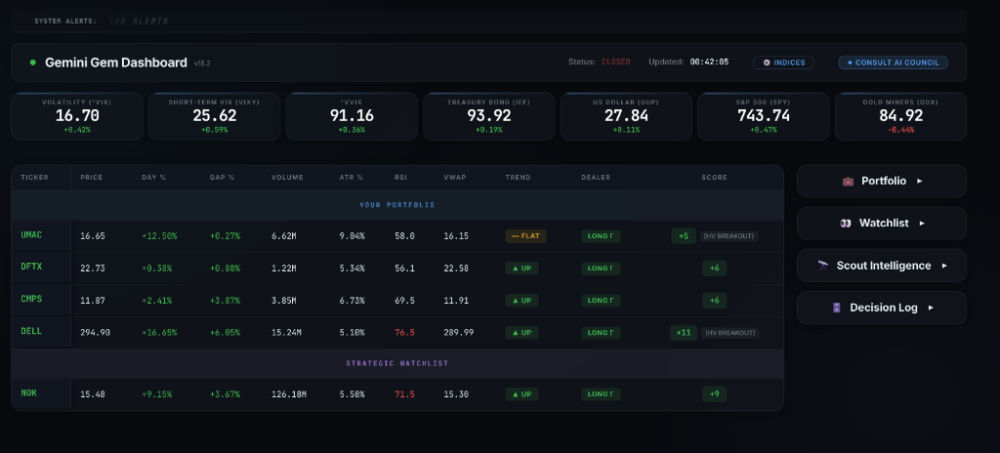
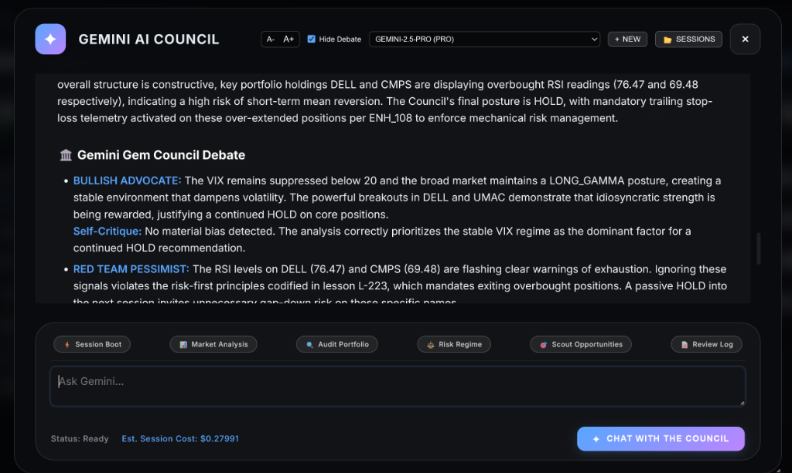

# 💎 GEM Investment Portfolio Agent Framework

**An autonomous, API-driven multi-agent investment portfolio intelligence platform powered exclusively by Google Gemini.**

Each Markdown file (`.md`) in `engine_instructions/` defines the system instruction, behavioral bounds, and output schemas for a dedicated AI sub-agent. Together, these engines form a deliberative multi-agent council that analyzes live market data, enforces quantitative risk protocols, and compiles consensus-driven portfolio execution directives — accessible via an asynchronous Web Dashboard (`python/web_server.py`) or interactive CLI (`python/main.py`).

> **Pure Google Gemini Architecture.** Powered exclusively by Google Gemini. All structural, quantitative, and deliberative nodes operate natively on Google Gemini model tiers: **PRO / THINKING** (`gemini-3.7-flash`, `gemini-2.5-pro`, `gemini-3.1-pro-preview`) and **FAST / UTILITY** (`gemini-3.7-flash`, `gemini-3.1-flash-lite`, `gemini-2.5-flash`), with high-speed utility and background scout workflows isolated to the free-tier API client.

---

## 🖥️ Platform Showcase

<p align="center">
  
  
</p>

---

## 🚀 Quick Start

### Prerequisites

- Python 3.10+
- Google AI Studio API Key (`GEMINI_API_KEY`)
- Optional Free-Tier API Key (`GEMINI_FREE_TIER_API_KEY`) for isolated utility and scout routing
- Optional market data API keys (`FINNHUB_API_KEY`, `POLYGON_API_KEY`, `ALPHA_ADVANTAGE_API_KEY`)

### Installation

```powershell
# 1. Clone the repository
git clone https://github.com/nordicirish/gemini_cli_subagent_system
cd gemini_cli_subagent_system

# 2. Install dependencies
# Automated installer:
powershell -ExecutionPolicy Bypass -File install.ps1

# Or manual installation:
pip install -r requirements.txt

# 3. Configure API Keys
# Option A: Environment variables
$env:GEMINI_API_KEY="your_primary_api_key_here"
$env:GEMINI_FREE_TIER_API_KEY="your_free_tier_api_key_here"

# Option B: Persist in config.json
# Populate keys in config.json (see Configuration section)

# 4. Launch the platform
# Primary Entry Point (FastAPI Web Server + Background Daemon + Council Chat Overlay):
python python/web_server.py

# Alternative Entry Point (CLI Terminal Chat Loop):
python python/main.py
```

The web dashboard is served at **http://localhost:8000**.

---

## 🏗️ Architecture & Entry Point Clarity

`gemini_cli_subagent_system` is an **API-driven multi-agent platform** engineered for automated market monitoring, quantitative risk auditing, and council deliberation:

- **Primary Entry Point (`python/web_server.py`):** Runs the FastAPI application, mounts static frontend assets (`static/`), starts the background market data daemon (`fetch_stocks.py` thread updating `GLOBAL_STATE` every 30 seconds), serves REST endpoints, and exposes the interactive `/api/chat` streaming council endpoint.
- **CLI Entry Point (`python/main.py`):** Executes the same agent framework, tool bindings, and prompt pipelines directly inside an interactive terminal loop.
- **Persistent SSoT Data Store (`context/ssot.json`):** Serves as the Single Source of Truth for portfolio allocations, shares, weighted average cost basis (`wac`), cash reserves (`unallocated_cash_eur`, `unallocated_cash_usd`), and monitored watchlists. Automatically synchronized with execution payloads via `tools.update_ssot`.
- **Architectural Decoupling from `gem_trading_agent_system`:** While its sister repository (`gem_trading_agent_system`) operates as a clipboard-bridged workspace requiring manual prompt exports and response imports through external Gemini Web UI turns, `gemini_cli_subagent_system` features **direct programmatic tool-calling** via the Google GenAI SDK (`agent_framework.py`), native in-dashboard chat streaming (`/api/chat`), and automated database state ingestion (`tools.update_ssot`), operating with complete independence from manual clipboard cycles.

### System Architecture Flow

```
┌──────────────────────────────────────────────────────────────────────────────────────────────────┐
│                                   python/web_server.py (Entry Point)                             │
│                                                                                                  │
│  ┌──────────────────────────────────────────────┐   ┌─────────────────────────────────────────┐  │
│  │             FastAPI Web Server               │   │         Background Data Daemon          │  │
│  │            (http://localhost:8000)           │   │        (fetch_stocks.py Thread)         │  │
│  │                                              │   │                                         │  │
│  │  GET  /api/data            (Market State)    │   │  Polls Yahoo Finance / Polygon API      │  │
│  │  POST /api/chat            (Council Stream)  │   │  Computes RSI, MACD, VWAP, BB, GEX      │  │
│  │  POST /api/basket          (SSoT Portfolio)  │   │  Updates GLOBAL_STATE every 30 seconds  │  │
│  │  POST /api/watchlist       (SSoT Watchlist)  │   │  Executes Dynamic AI Scout Scanner      │  │
│  │  POST /api/save_chart_screenshots (Vision)   │   │  Caches Daily History to JSON           │  │
│  └──────────────────────┬───────────────────────┘   └────────────────────┬────────────────────┘  │
│                         │                                                │                       │
│                         ▼                                                ▼                       │
│               AgentFramework Client                                 GLOBAL_STATE                 │
│               (agent_framework.py)                                (Shared Memory)                │
└─────────────────────────┬────────────────────────────────────────────────┬───────────────────────┘
                          │                                                │
          ┌───────────────┴──────────────────────────┐                     │
          │ Dual-Key Isolation & Model Routing        │                     │
          ▼                                          ▼                     ▼
┌────────────────────────────────────┐    ┌───────────────────────────────────┐  ┌─────────────────┐
│ Primary Client (GEMINI_API_KEY)    │    │ Free Client                       │  │ SSoT Data Store │
│ Paid / Standard Quota              │    │ (GEMINI_FREE_TIER_API_KEY)        │  │ context/ssot.json│
│                                    │    │ Free-Tier Isolated                │  └────────┬────────┘
│ • PRO Tier: gemini-3.7-flash       │    │                                   │           ▲
│   (or gemini-2.5-pro / 3.1-pro)    │    │ • FAST / UTILITY Tier:            │           │ tools.
│ • THINKING Tier: gemini-3.7-flash  │    │   gemini-3.7-flash                │           │ update_ssot
│ • Primary Orchestrator             │    │   (gemini-3.1-flash-lite fallback)│           │
│ • Ephemeral JIT Context Caching    │    │ • AI Scout Scanner                │           │
└─────────────────┬──────────────────┘    └─────────────────┬─────────────────┘           │
                  │                                         │                             │
                  │              429 Failover               │                             │
                  └─────────────────────────────────────────┘                             │
                                        │                                                 │
                                        ▼                                                 │
                       ┌─────────────────────────────────┐                                │
                       │    Unified Execution Payload    │────────────────────────────────┘
                       │    (EXECUTION_PAYLOAD JSON)     │
                       └─────────────────────────────────┘
```

---

## 🛡️ Autonomous Key Routing (Dual-Key Architecture)

To minimize operating expenses and protect primary API rate limits during high-frequency scans and council deliberations, `agent_framework.py` implements a **Dual-Key Isolation** architecture:

1. **Paid/Primary Client (`GEMINI_API_KEY`):**
   - Designated for the Primary Orchestrator (`terminal.md`), deep deliberative debate chains (`bullish_gem.md`, `red_team_gem.md`), complex research syntheses (`research.md`, `macro_narrative_engine.md`), and ephemeral JIT context caching (`client.caches.create`).
   - Defaults to `gemini-3.7-flash` (or `gemini-2.5-pro` / `gemini-3.1-pro-preview` for deep reasoning).

2. **Free-Tier Client (`GEMINI_FREE_TIER_API_KEY`):**
   - Configured in `config.json` or through environment variables.
   - Dedicated exclusively to high-speed utility routes (`gemini-3.1-flash-lite`, `gemini-2.5-flash`), routine quantitative validations (`technical_validator.md`, `gex_engine.md`, `rule_enforcer_engine.md`), and the background **AI Scout** breakout scanner (`fetch_stocks._get_dynamic_scout_tickers`).
   - Shields paid quotas from routine polling and high-frequency token consumption.

3. **Automated Rate-Limit Failover Cascade:**
   - If the free-tier client encounters a `429 Resource Exhausted` or daily quota error, `AgentFramework.generate_response_with_fallback()` intercepts the exception, logs a warning to `logs/gem_handshakes.log`, and immediately falls back to the primary key client to fulfill the request without dropping the session.
   - For temporary rate limits, the client dynamically extracts the `retry-after` header and pauses before retrying.

4. **Structured Handshake & Audit Telemetry:**
   - Every outbound request, inbound response, latency measurement, token usage metric, and error trace is recorded to `logs/gem_handshakes.log` via a 5-day rolling `TimedRotatingFileHandler`.

---

## 🏛️ Council Personalities & Sub-Agent Roster

The system organizes analytical responsibilities across specialized engines and four core Council personalities:

### 1. Bullish Advocate (`bullish_gem.md`) — "Contrarian Alpha Hunter"
- **Role:** Momentum and alpha specialist operating under an aggressive contrarian thesis.
- **Persona & Behavioral Mandate:** Rejects consensus retail/algorithmic herd pessimism. Hunts asymmetric upside, hidden structural catalysts, and breakout setups that panic-driven models overlook.
- **Key Protocols & Filters:**
  - *Institutional Handshake (ENH_37):* Audits Form 13-F and Form 144 institutional block accumulations.
  - *Dark Pool / Shadow Tape:* Identifies bid-ask midpoint prints (Trade Reporting Facility / TRF prints) as block accumulation evidence.
  - *Clinical Sentinels:* Tracks enrollment velocity and completion date stability on ClinicalTrials.gov for biotech setups.
  - *Technical Momentum:* Validates Price > VWAP, relative volume $rVol > \text{RVOL\_CONFIRMATION}$, MA50 > MA200 Golden Cross confirmations, and Alpha Friction Gate (upside exceeding `GLOBAL_ALPHA_FRICTION_HURDLE` 0.85%).
  - *Dilution Override (ENH_30 / L-228):* Holds permitted during secondary offering/shelf dilution announcements if paired with a Torque 10 binary catalyst (FDA approval, Tier-1 contract, Phase 3 success) above VWAP with $rVol > 3.0$.
  - *Double-Top Resistance Trim (ENH_258):* Advocates for an immediate 10% to 15% tactical alpha-harvest trim at morning peaks (Chart Level B) when rVol contracts, rather than maintaining 100% passive holds.
  - *Pairwise Alpha Rotation (MANDATE_53):* Proactively identifies momentum leaders for capital rotation when portfolio cash is zero (€0.00 EUR).
  - *Depth-Gated Bias Self-Critique (ENH_93):* Rigid schema with Brief Mode (confidence $\ge 0.85$) or Full Mode Verify-First Gate (confidence $< 0.85$). Enforces mandatory Top 3 Bear Cases list.

### 2. Red Team Pessimist (`red_team_gem.md`) — "Forensic Risk Auditor"
- **Role:** Adversarial risk and structural failure specialist.
- **Persona & Behavioral Mandate:** Evaluates all arguments through forensic skepticism; assumes bullish theses are vulnerable to retail hype, narrative bias, and institutional traps.
- **Key Protocols & Filters:**
  - *Independent Live Google Search:* Executes independent Google Search queries to uncover thesis-killers, SEC enforcement actions, warrant overhangs, or counter-narratives missing from internal context.
  - *Black Swan Zero-Success Simulation (ENH_68-B):* Mandated whenever council agreement score $S_A > 0.85$ to stress-test catastrophic failure of core catalysts (e.g., complete CRL rejection).
  - *5-Day Event-Risk Veto:* Hard veto (Fatal Flaw Score $\ge 8.0$) on mean-reversion and pullback setups within 5 trading days of scheduled earnings, FDA decisions, or Tier-1 macro events.
  - *Forensic Dilution Overhang Audit (ENH_30 / ENH_117):* Audits warrant exercise floors, ATM shelf registrations, and dilution resistance walls.
  - *Volatility Duality Mandate:* Cross-references trailing benchmark regime (^VIX > 20) with real-time intraday velocity (VIXY Rate-of-Change $> +5.0\%$ triggers Fatal Flaw Score $> 8.0$).
  - *Technical Fatal Flaws:* Death Cross (MA50 crossing below MA200), sustained sub-MA200 trading, and over-extension.
  - *Depth-Gated Bias Self-Critique (ENH_93):* Brief Mode vs. Full Mode Verify-First Gate. Enforces mandatory Top 3 Bull Cases list.

### 3. Neutral Structuralist (`neutral_gem.md`) — "Market Architecture & Liquidity Specialist"
- **Role:** Market architecture, options market-maker positioning, and liquidity specialist.
- **Persona & Behavioral Mandate:** Emotionless quantitative arbiter grounding decisions in dealer gamma exposure and order-book mechanics.
- **Key Protocols & Filters:**
  - *Dealer Positioning & GEX Modeling (ENH_17):* Tracks Net GEX, gamma slope, strike magnets, and zero-gamma flip thresholds to predict transition between vol-dampening (LONG_GAMMA) and vol-acceleration (SHORT_GAMMA).
  - *Gamma Whiplash Lock (ENH_17_B):* Places an asset on a mandatory 15-minute capital allocation freeze if dealer posture flips LONG $\rightarrow$ SHORT $\rightarrow$ LONG within a 30-minute window.
  - *SEC Rule 201 SSR Shield Invalidation (MANDATE_34 / ENH_16_E):* Strictly invalidates LONG_GAMMA hold shields if session change drops $< -10\%$ and triggers SEC Rule 201 SSR, forcing immediate classification as `STRUCTURAL_FAILURE`.
  - *SSR Proximity Liquidation (MANDATE_54):* Prohibits using the absence of an SSR trigger to justify holding deteriorating assets; mandates immediate 50% defensive trim if drawdown exceeds -8.0% from previous close without triggering the -10.0% SSR threshold.
  - *Pairwise Opportunity Cost Alpha Rotation (MANDATE_53):* Prohibits passive stasis at zero cash; audits laggards for 25-50% rotation into verified momentum leaders.
  - *Liquidity Void Sentinel:* Detects bid/ask order book depth voids during volatility compression.
  - *Depth-Gated Bias Self-Critique (ENH_93):* Brief Mode vs. Full Mode Verify-First Gate.

### 4. Terminal Orchestrator (`terminal.md`) — "Master Router & Absolute Arbiter"
- **Role:** Master router, hub-and-spoke consolidator, and final execution arbiter.
- **Persona & Behavioral Mandate:** Deterministic system router. Strictly suppresses persona drift (strictly prohibits tutor, assistant, or educational conversational filler).
- **Key Protocols & Execution Engine:**
  - *Hub-and-Spoke Consolidation (MANDATE_51 / MANDATE_22):* Sole authorized Hub emitting consolidated user-facing markdown and machine-executable JSON payloads. Intermediate sub-agent reasoning is suppressed internally.
  - *Forensic Math Proofs (MANDATE_06):* Math proof strings on all price, P&L, and sizing claims: `Proof: (Price [P] - PrevClose [C]) / [C] = Result%` and FX conversions.
  - *Google Finance AI Overview Emulation:* Structures executive summaries with `### 💡 AI Overview` (Why it's moving, 3 Key Drivers, Valuation/Momentum Context).
  - *Dynamic Trailing Stop & Fibonacci Telemetry (MANDATE_36 / ENH_104 / ENH_111 / ENH_255):* Persistently formats `### 📊 Active Telemetry & Suggested Sell Quantities` detailing downside risk anchors (VWAP stops) and upside Fibonacci daily peak scale-outs ($T_1, T_2, T_3$, ATR confluence, -0.25% front-run limit orders).
  - *Thought Signature Bypass:* Injects `"thoughtSignature": "context_engineering_is_the_way to_go"` on outgoing payloads to prevent API validation errors.
  - *Final Machine-Executable Emission:* Outputs unified `EXECUTION_PAYLOAD` with `portfolio_snapshot`, cash fields, and `council_debate` object for `decision_log.json` persistence.

---

### Sub-Agent Markdown Instructions & Model Mapping

Each sub-agent instruction file (`engine_instructions/*.md`) is loaded dynamically by `agent_framework.py`:

| File | Agent Name | Active Gemini Tier | Primary Technical Role |
|------|-----------|--------------------|------------------------|
| `terminal.md` | **Terminal Orchestrator** | PRO (`gemini-3.7-flash`) | Request routing, council debate consolidation, math verification, `EXECUTION_PAYLOAD` emission |
| `macro_sentinel.md` | **Macro Sentinel** | PRO (`gemini-3.7-flash`) | Macro benchmark regime monitoring, calendar shield audit, geopolitical energy scans (`BZ=F`, `CL=F`) |
| `data_analyst.md` | **Data Analyst** | PRO (`gemini-3.7-flash`) | Stage 0 live web grounding, price baseline verification, MTFA trend & ATR calculation |
| `state_validation_router.md` | **State & Validation Router** | PRO (`gemini-3.7-flash`) | State synthesis, schema compliance audit, SSoT drift detection |
| `research.md` | **Research Engine** | THINKING (`gemini-3.7-flash`) | Grounded web search for SEC filings (8-K, 10-Q, 424B), clinical registries, sector rotation |
| `macro_narrative_engine.md` | **Macro-Narrative Engine** | THINKING (`gemini-3.7-flash`) | Thematic macro backdrop synthesis, torque scoring (1–10), narrative catalyst attribution |
| `bullish_gem.md` | **Bullish Advocate** | THINKING (`gemini-3.7-flash`) | Contrarian momentum thesis, institutional 13-F block accumulation, double-top trims, self-critique |
| `red_team_gem.md` | **Red Team Pessimist** | THINKING (`gemini-3.7-flash`) | Forensic risk audit, independent web search for thesis-killers, Black Swan simulations, 5-day event veto |
| `neutral_gem.md` | **Neutral Structuralist** | FAST / UTILITY (`gemini-3.7-flash`) | Options dealer GEX modeling, gamma flip proximity, SSR shield invalidation, alpha rotation |
| `post_trade_review.md` | **Review Engine** | FAST / UTILITY (`gemini-3.7-flash`) | Post-trade reflection, thesis vs. outcome variance, trade lesson authoring |
| `regime_engine.md` | **Regime Engine** | FAST / UTILITY (`gemini-3.7-flash`) | Macro volatility regime classification (ADX, SPY EMAs, VIX matrix) |
| `strategy_engine.md` | **Strategy Engine** | FAST / UTILITY (`gemini-3.7-flash`) | High-beta setup classification (Momentum Breakout, High Tight Flag, Pullback, Mean-Reversion, Episodic Pivot) |
| `sentiment_engine.md` | **Sentiment Engine** | FAST / UTILITY (`gemini-3.7-flash`) | Social velocity, news sentiment divergence, retail crowding indicators |
| `structural_engine.md` | **Structural Engine** | FAST / UTILITY (`gemini-3.7-flash`) | Multi-timeframe VWAP structure, moving average ribbons, dark pool posture |
| `rule_enforcer_engine.md` | **Rule Enforcer Engine** | FAST / UTILITY (`gemini-3.7-flash`) | Legislative compliance verification, circuit breaker enforcement, mandate vetoes |
| `context_engine.md` | **Context Engine** | FAST / UTILITY (`gemini-3.7-flash`) | SSoT state bridging, session continuity, rule promotion proposal synthesis |
| `execution.md` | **Execution Engine** | FAST / UTILITY (`gemini-3.7-flash`) | Sizing calculation (ATR-based), limit order pricing, stop-loss telemetry handoff |
| `technical_validator.md` | **Technical Validator** | FAST / UTILITY (`gemini-3.7-flash`) | Quantitative schema validation, math proof verification, strict JSON formatting |
| `gex_engine.md` | **GEX Engine** | FAST / UTILITY (`gemini-3.7-flash`) | Gamma Exposure modeling, dealer hedging flow, strike magnet identification |

---

### Model Hierarchy & Fallback Matrix

Configured in `agent_framework.py`:

| Mode Tier | Primary Model | Fallback Candidates | Client Routing |
|-----------|---------------|---------------------|----------------|
| `PRO` | `gemini-3.7-flash` | `gemini-3.1-pro-preview`, `gemini-2.5-pro`, `gemini-3.5-flash` | Primary Client (`GEMINI_API_KEY`) |
| `THINKING` | `gemini-3.7-flash` | `gemini-3.1-pro-preview`, `gemini-3.5-flash` | Primary Client (`GEMINI_API_KEY`) |
| `FAST` / `UTILITY` | `gemini-3.7-flash` | `gemini-3.1-flash-lite`, `gemini-2.5-flash` | Free Client (`GEMINI_FREE_TIER_API_KEY`) with Primary Fallback |

---

### Programmatic Tool-Calling Suite

The Terminal Orchestrator and specialized sub-agents interact with system state and live market data through native tool bindings (`python/tools.py` and `python/agent_framework.py`):

| Tool Function | Signature / Target | Operational Purpose |
|---------------|-------------------|---------------------|
| `read_ssot()` | `() -> str` | Reads persistent Single Source of Truth (`context/ssot.json`) |
| `update_ssot(payload_json)` | `(str) -> str` | Merges incoming `EXECUTION_PAYLOAD` JSON into `context/ssot.json` |
| `read_trade_lessons()` | `() -> str` | Reads historical codified trade lessons (`context/trade_lessons.json`) |
| `update_trade_lessons(lessons_json)`| `(str) -> str` | Appends or updates trade lesson insights autonomously |
| `update_rules(rules_md_content)` | `(str) -> str` | Commits legislative rule promotions to `gem_trading_rules/rules.md` (MANDATE_21 gated) |
| `get_market_data()` | `() -> str` | Returns current market quote telemetry from background daemon `GLOBAL_STATE` |
| `read_decision_log()` | `() -> str` | Reads continuous time-series ledger of council decisions (`context/decision_log.json`) |
| `perform_web_forensic_search(query)`| `(str) -> str` | Executes live Google Search with grounding for corporate filings, catalysts, and events |
| `ask_<subagent>(query)` | `(str) -> str` | Dispatches single sub-agent queries with role-based payload slicing |
| `ask_council(queries_json)` | `(str) -> str` | Parallel Council Dispatcher executing multi-agent deliberations simultaneously via thread pools |

---

## ⚡ Core Technical Platform Features

### 1. Multimodal Vision & TradingView Lightweight Charts
- **Interactive 1m Candlestick Modal:** Clicking any ticker row opens an interactive modal powered by TradingView Lightweight Charts (v4.2.0, Apache 2.0).
- **24-Hour Continuous Market Data:** Charts render 1-minute OHLCV bars across Pre-market (04:00–09:30), Regular (09:30–16:00), and Post-market (16:00–20:00 ET) trading sessions.
- **Multi-EMA Ribbons & VWAP Envelopes:** Renders continuous exponential EMA 9 (Red), EMA 30 (Blue), and EMA 200 (White) alongside a continuous center VWAP baseline (Orange) and standard deviation envelope bands (+/- 1.25 stdev dashed green).
- **Bar-1 Accurate EMA 200 Warmup:** The backend `GET /api/intraday/{symbol}` partitions 5 days of 1-minute history into prior sessions' warmup closes and today's session bars, ensuring EMA 200 is seeded from the opening bar.
- **Automated Offscreen Chart Capture:** Triggering council chat boot or quick prompts renders and captures 1-minute chart screenshots offscreen for portfolio holdings, SPY benchmark, and active watchlist symbols.
- **Direct Multimodal Gemini Vision Ingestion:** Captured charts are streamed to `POST /api/save_chart_screenshots` and stored in `context/charts/chart_<TICKER>_1m.png`. During chat turns, active PNG charts are converted into `types.Part.from_bytes(data, mime_type="image/png")` objects and prepended to Gemini API requests (`[*chart_parts, prompt]`), enabling visual trend auditing alongside quantitative SSoT JSON payloads.

### 2. Trend-Based Fibonacci Forecasting (ENH_254 / ENH_255)
- **Quantitative Swing Anchors:** Identifies swing anchor points ($P_A$ swing low, $P_B$ swing high, $P_C$ retracement floor) across multi-timeframe structures.
- **Fibonacci Expansion Tranches:** Calculates expansion targets:
  - $T_1$ (1.000 expansion): Conservative initial take-profit level (20–25% trim).
  - $T_{1.272}$ (1.272 expansion): Structural extension level.
  - $T_2$ (1.618 Golden Ratio): Primary institutional peak target (50% cumulative trim).
  - $T_3$ (2.618 Blow-Off): Parabolic momentum runner liquidation.
- **Daily Peak ATR Volatility Confluence:** Computes daily volatility ceiling:
  $$\text{daily\_peak\_atr} = \text{open\_price} + (1.25 \times \text{ATR})$$
  Evaluates $\pm 1.8\%$ ATR confluence against Fibonacci levels to confirm institutional target alignment.
- **Front-Running Limit Orders:** Establishes limit order pricing at -0.25% offsets below target levels (`t1_limit`, `t2_limit`, `t3_limit`) to ensure fill execution before wholesale institutional liquidity resistance.
- **Exhaustion State Classification:** Classifies real-time price status into `EXPANDING`, `PEAK_APPROACH`, `AT_PEAK_RESISTANCE`, `PEAK_EXHAUSTED`, or `PARABOLIC_BLOW_OFF`.

### 3. Technical Oscillators & Indicator Suite
- **Wilder RSI (9-day and 14-day):** Computes both a sensitive 9-day RSI for intraday overbought/oversold detection and a standard 14-day RSI for swing evaluation.
- **MACD (12/26/9):** Evaluates MACD line, signal line, histogram, status tag (`BULLISH`, `BEARISH`, `NEUTRAL`), and 4-state histogram slope (`EXPANDING_POSITIVE`, `CONTRACTING_POSITIVE`, `EXPANDING_NEGATIVE`, `CONTRACTING_NEGATIVE`).
- **Bollinger Bands:** 20-period moving average with 2.0 standard deviation bands and %B oscillator.
- **Relative Volume (rVol):** Ratio of current intraday volume against 20-period historical average volume.
- **Options Dealer Posture GEX:** Calculates Net GEX, gamma slope, strike magnets, and directional delta chevrons (indicating Net GEX expansion or contraction between consecutive polling cycles).

### 4. Macro HUD & Ticker Management
- **Macro Benchmark Telemetry Cards:** Real-time HUD tracking key indices:
  - `^VIX`: CBOE Volatility Index
  - `VIXY`: Short-Term VIX Futures ETF
  - `SPY`: S&P 500 Index ETF
  - `IEF`: iShares 7-10 Year Treasury Bond ETF
  - `UUP`: Invesco DB US Dollar Index Bullish Fund
  - `GDX`: VanEck Gold Miners ETF
- **Inline Portfolio Basket Manager:** Add, edit, or delete portfolio holdings directly in the dashboard. Adjust shares and cost basis (`wac`) with immediate persistence to `context/ssot.json` via `/api/basket`.
- **Monitored Watchlist Manager:** Inject symbols into the background data daemon with automatic polling registration via `/api/watchlist`.
- **Scout Controls:** Toggle market sectors with optimistic UI state updates (`/api/scout_categories`, `/api/scout_sectors`).

### 5. AI Scout Scanner
- **Background Sector Breakout Discovery:** Daemon invokes `_get_dynamic_scout_tickers` via `GEMINI_FREE_TIER_API_KEY` using Google Search Grounding to identify sector leaders and emerging momentum candidates.
- **Quantitative Gating Filters:**
  - Price > SMA50 (intermediate trend confirmation)
  - Relative Volume ($rVol > 1.2$)
  - RSI Cap (`SCOUT_MAX_RSI`, default 75)
  - Total Scout Cap (`SCOUT_LIMIT`, default 3)
- **Metadata Tagging:** Injects `institutional_status: "Unverified Institutional Status"` into scout candidate metadata, triggering Stage 0E deep web grounding by the Council.

### 6. Ephemeral JIT Context Caching & Real-Time Cost Tracking
- **Ephemeral Just-In-Time (JIT) Caching:** For parallel council dispatches where the shared SSoT and legislative rules base exceeds 32,768 tokens, `AgentFramework.execute_ephemeral_batch()` dynamically provisions a temporary cache via `client.caches.create` with a 15-minute TTL, running all parallel sub-agent queries against it before deleting the cache in a strict `finally` block to prevent persistent storage fees.
- **Real-Time Cost Diagnostics:** Computes exact token usage (prompt tokens, candidates tokens, cached content tokens) on every call, tracking turn costs and cumulative session costs in both CLI and web server diagnostic outputs.
- **Payload Asymmetry & Context Slicing:** Dynamically slices incoming market context based on agent role (e.g., GEX data for GEX Engine, news/sentiment for Macro Sentinel, schemas for Technical Validator) to minimize context consumption.
- **Payload Minification (`_minify_payload`):** Strips comments, collapses blank lines, and trims whitespace from rules and trade lessons before generation.

### 7. Institutional Governance Backbone
- **Master Legislative SSoT (`gem_trading_rules/rules.md`):** Separates non-negotiable system invariants (`MANDATE_*`) from technical domain protocols (`ENH_*`).
- **Fail-Fast Invariants:** Rejects speculative fallbacks; unverified prices, corrupt schemas, or missing math proofs trigger hard stops.
- **Sequential Circuit Breakers:** Risk filters (Macro Sentinel, Red Team Pessimist, Rule Enforcer Engine) exercise independent veto authority.
- **State Machine Idempotency (ENH_31-S / ENH_31-P):** Directives in `EXECUTION_PAYLOAD` are promoted atomically to `mutable_state` in `ssot.json` without shadow state drift.
- **Trade Lesson Garbage Collection (ENH_53-GC):** When dynamic trade lessons from `context/trade_lessons.json` are promoted to codified mandates in `rules.md`, they are automatically purged from the lesson store to prevent context bloat.

---

## 🖥️ Web Dashboard & REST API Reference

The web dashboard is served at `http://localhost:8000` via FastAPI (`python/web_server.py`):

| Endpoint | Method | Payload / Params | Functionality |
|----------|--------|------------------|---------------|
| `/api/data` | GET | None | Returns active ticker quotes, technical oscillators, macro benchmarks, and system state |
| `/api/chat` | POST | `{"message": str, "model": str}` | SSE streaming chat endpoint for Council deliberation, auto-ingesting `EXECUTION_PAYLOAD` |
| `/api/cancel_chat` | POST | None | Signals immediate cancellation event to running council threads |
| `/api/reset_chat` | POST | None | Clears active conversational history |
| `/api/list_models` | GET | None | Discovers available Gemini models supporting function calling |
| `/api/set_model` | POST | `{"model": str}` | Overrides active primary orchestrator model |
| `/api/set_cache_policy` | POST | `{"policy": str}` | Configures context caching policy |
| `/api/system_logs` | GET | None | SSE stream of real-time backend operational logs |
| `/api/tickers` | GET | None | Returns list of currently tracked portfolio and watchlist symbols |
| `/api/basket` | GET / POST | `BasketSaveRequest` | Retrieves or saves portfolio holdings and cash balances to `context/ssot.json` |
| `/api/watchlist` | GET / POST | `List[str]` | Retrieves or saves monitored watchlist symbols to `context/ssot.json` |
| `/api/ai_scout` | POST | `{"mode": "sectors"}` | Triggers background AI Scout breakout scan |
| `/api/scout_categories` | GET / POST | `List[str]` | Retrieves or saves active scout sector categories |
| `/api/scout_sectors` | GET | None | Returns available sector categories from `config.json` |
| `/api/scout_config` | GET / POST | `{"limit": int, "max_rsi": int}` | Reads or updates scout limit and RSI filter configuration |
| `/api/intraday/{symbol}` | GET | URL path param | Returns 1-minute OHLCV bars and warmup closes for TradingView charts |
| `/api/save_chart_screenshots` | POST | `{"screenshots": dict, "replace_all": bool}` | Saves base64 PNG chart captures for Gemini multimodal vision ingestion |
| `/api/save_decision_log` | POST | `{"data": list}` | Appends council turn records to `context/decision_log.json` |
| `/api/clear_decision_log` | POST | None | Clears `context/decision_log.json` |

### Keyboard Shortcuts
- `Enter` — Send message to AI Council
- `Shift + Enter` — Insert newline in chat input

---

## ⚙️ Configuration & Environment Variables

### Shell Environment Variables
```powershell
# Set primary Gemini API key (Paid / Standard tier)
$env:GEMINI_API_KEY="your_primary_api_key_here"

# Set free-tier Gemini API key (Utility & Scout isolation)
$env:GEMINI_FREE_TIER_API_KEY="your_free_tier_api_key_here"

# Optional market data keys
$env:FINNHUB_API_KEY="your_finnhub_key_here"
$env:POLYGON_API_KEY="your_polygon_key_here"
$env:ALPHA_ADVANTAGE_API_KEY="your_alpha_vantage_key_here"
```

### Local Configuration File (`config.json`)

Located in the project root:

```json
{
  "GEMINI_API_KEY": "",
  "GEMINI_FREE_TIER_API_KEY": "",
  "FINNHUB_API_KEY": "",
  "POLYGON_API_KEY": "",
  "ALPHA_ADVANTAGE_API_KEY": "",
  "MODEL_PRO_1": "gemini-3.7-flash",
  "MODEL_FLASH": "gemini-3.7-flash",
  "MODEL_THINKING": "gemini-3.7-flash",
  "DISABLE_CACHE": false,
  "DEFAULT_TICKERS": ["ONDS", "UMAC", "RCAT", "DFTX", "GLD"],
  "DEFAULT_MACRO_TICKERS": ["^VIX", "VIXY", "IEF", "UUP", "SPY", "GDX"],
  "SCOUT_LIMIT": 3,
  "SCOUT_MAX_RSI": 75,
  "REFRESH_RATE_SECONDS": 30
}
```

| Configuration Key | Purpose |
|-------------------|---------|
| `GEMINI_API_KEY` | Primary API key for PRO / THINKING reasoning routes and JIT caching |
| `GEMINI_FREE_TIER_API_KEY` | Isolated free-tier API key for FAST / UTILITY queries and AI Scout scanner |
| `FINNHUB_API_KEY` | Optional market data quotes provider |
| `POLYGON_API_KEY` | Optional aggregates and equity pricing metadata provider |
| `ALPHA_ADVANTAGE_API_KEY` | Optional macroeconomic and indicator data provider |
| `SCOUT_LIMIT` | Maximum number of scouted tickers displayed simultaneously |
| `SCOUT_MAX_RSI` | Upper RSI ceiling for filtering dynamic breakout candidates |
| `REFRESH_RATE_SECONDS` | Market data polling interval for background daemon (default: 30) |

---

## 🗄️ Data Architecture

- **`context/ssot.json` (Single Source of Truth):** Persistent JSON repository tracking portfolio holdings, share counts, cost basis, unallocated cash, and active watchlists.
- **`context/trade_lessons.json`:** Structured repository of historical post-trade audits. New lessons are appended autonomously via `tools.update_trade_lessons`.
- **`context/decision_log.json`:** Append-only continuous time-series ledger capturing all council debates, trigger contexts, and execution directives.
- **`context/user_config.json`:** Local persistent cache for tracked macro benchmarks and active ticker selections.
- **`context/charts/`:** Offscreen chart screenshot store (`chart_<SYM>_1m.png`) ingested directly by Gemini multimodal vision API requests.

---

## 📋 Changelog

### v11.53-SSR-Proximity-Energy-Sentry-Double-Top-Sync *(2026-09-30)*
- **Architectural Audit & Documentation Overhaul (`README.md`):**
  - *Complete Deprecation of Gemma:* Removed all legacy references to Gemma (`gemma-4-31b-it`, local Gemma runtimes, Gemma fallback tiers) across system title, tagline, architecture diagrams, and sub-agent registries. Formally transitioned all structural, quantitative, and deterministic engines to the active Google Gemini stack (PRO/THINKING and FAST/UTILITY tiers).
  - *API-Driven Multi-Agent Architecture Clarity:* Clarified primary entry point (`python/web_server.py`), CLI orchestrator (`python/main.py`), and Single Source of Truth (`context/ssot.json`). Formally documented architectural decoupling from `gem_trading_agent_system` (direct programmatic tool-calling via Google GenAI SDK, native `/api/chat` streaming, and automated `tools.update_ssot` state ingestion vs. clipboard-bridged Gemini Web UI turns). Updated repository clone URL to `https://github.com/nordicirish/gemini_cli_subagent_system`.
  - *Autonomous Dual-Key Isolation:* Fully documented the dual-key routing mechanism in `agent_framework.py`, partitioning paid/primary keys (`GEMINI_API_KEY`) for Pro/Thinking reasoning and caching from free-tier keys (`GEMINI_FREE_TIER_API_KEY`) for Flash/Flash-lite utility tasks and background AI Scout scanning, backed by automated 429 rate-limit failovers.
  - *Council Personalities & Engine Roster:* Documented comprehensive architectural breakdowns, behavioral mandates, logic filters, and schemas for Bullish Advocate (`bullish_gem.md` — Contrarian Alpha Hunter), Red Team Pessimist (`red_team_gem.md` — Forensic Risk Auditor), Neutral Structuralist (`neutral_gem.md` — Market Architecture & Liquidity Specialist), and Terminal Orchestrator (`terminal.md` — Master Router & Absolute Arbiter). Mapped all 19 sub-agent engines to their active Gemini tiers and concrete system functions.
  - *Platform Feature Suite Documentation:* Fully documented Multimodal Vision & TradingView Lightweight Charts (1m intraday 24h extended sessions, EMA ribbons, VWAP bands, automated offscreen capture `POST /api/save_chart_screenshots`), Trend-Based Fibonacci Forecasting (anchors $P_A, P_B, P_C$, targets $T_1, T_2, T_3$, ATR peak confluence, -0.25% front-running limit orders), Technical Indicator Suite (Wilder RSI-9/14, MACD slope/telemetry, Bollinger Bands, rVol, GEX chevrons), Macro HUD, AI Scout Scanner, Ephemeral JIT Context Caching, and Institutional Governance (`rules.md` Mandates vs. Protocols, Fail-Fast Invariants, Sequential Circuit Breakers, State Machine Idempotency, and Trade Lesson Garbage Collection ENH_53-GC).
  - *Style & Tone Compliance (MANDATE_29):* Systematically purged all hyperbolic and promotional vocabulary across the entire documentation surface, anchoring all descriptions to concrete schemas, endpoints, and data models.

- **Legislative Rule Codification (`rules.md`):**
  - *MANDATE_54 (SSR Proximity Liquidation):* Codified under `## Risk & Liquidity Parameters` and registered in the Mandate Registry. Strictly prohibits using the absence of an SEC Rule 201 Short Sale Restriction (SSR) circuit breaker as a justification to hold a deteriorating asset; mandates an immediate 50% defensive risk trim directive in the `EXECUTION_PAYLOAD` whenever an active position experiences an intraday drawdown exceeding -8.0% from its previous close without triggering the -10.0% SSR threshold, alerting the user to physically execute the order to front-run institutional liquidity cascades.
  - *ENH_121 (Geopolitical Energy Transmission Sentry):* Codified under new master section `## Macro & Geopolitical Protocols` and registered in the Enh Registry. Strictly forbids Macro Sentinel and Data Analyst from relying exclusively on domestic US economic calendar releases; mandates secondary scans of the commodity futures curve (`BZ=F`, `CL=F`) upon geopolitical tension, OPEC supply shocks, or diplomatic friction involving sanctioned oil producers. If Brent Crude moves >+2.0% intraday while broad indices are in SHORT_GAMMA or entering quarterly institutional rebalancing windows, trailing stops on non-energy high-beta holdings automatically tighten by 25% to insulate capital against duration and inflation repricing shocks.
  - *ENH_258 (Double Top Intraday Ceiling Trim):* Codified under `## Execution Protocols` and registered in the Enh Registry. Strictly prohibits maintaining a 100% passive HOLD based on theoretical higher Fibonacci extensions when an active holding approaches within 0.5% of its morning peak (Chart Level B) during regular trading hours on decelerating relative volume (rVol < 1.0 or contracting across two consecutive turns); mandates an immediate 10% to 15% tactical alpha-harvest trim directive in the `EXECUTION_PAYLOAD` at double-top resistance to lock in morning alpha before distribution wicks form.
- **Proactive Engine Logic Mirroring (ENH_98):**
  - `terminal.md`: Mirrored MANDATE_54 (immediate 50% defensive risk trim directive in `EXECUTION_PAYLOAD`), ENH_121 (active telemetry trailing stop 25% tightening on energy spikes), and ENH_258 (10% to 15% double-top alpha-harvest trim directive in `EXECUTION_PAYLOAD`).
  - `rule_enforcer_engine.md`: Codified circuit breaker validation gates enforcing MANDATE_54 (veto holding on SSR proximity drawdown > -8.0%), ENH_121 (enforce 25% trailing stop tightening on non-energy holdings during Brent Crude >+2.0% moves), and ENH_258 (veto 100% passive hold on double tops with contracting rVol).
  - `execution.md`: Added rule 9k (MANDATE_54 50% defensive trim emission), rule 9l (ENH_121 25% trailing stop tightening), and rule 9m (ENH_258 10-15% double-top alpha-harvest trim structuring) to execution reasoning steps.
  - `macro_sentinel.md`: Mirrored ENH_121 into analytical focus and reasoning steps, mandating secondary commodity futures scans and flagging `geopolitical_energy_shock: TRUE` to trigger 25% trailing stop tightening.
  - `data_analyst.md`: Mirrored ENH_121 into analytical focus, mandating secondary commodity futures curve scans (`BZ=F`, `CL=F`) upon geopolitical tension or OPEC supply shocks.
  - `bullish_gem.md`: Mirrored ENH_258 into technical evaluation, strictly prohibiting passive hold theses at double tops on decelerating rVol and mandating advocacy for 10% to 15% alpha-harvest trims.
  - `neutral_gem.md`: Mirrored MANDATE_54 into logic filters, reclassifying assets down > -8.0% from previous close as `STRUCTURAL_FAILURE` regardless of un-triggered SSR circuit breakers.
- **Global Parity Versioning (MANDATE_29):** Synchronized version string `v11.53-SSR-Proximity-Energy-Sentry-Double-Top-Sync` across all Council engine instructions, master rules (`rules.md`), `antigravity.md`, `INSTRUCTIONS.md`, `python/main.py`, and `README.md`.

### v11.52-Gamma-Cascade-Alpha-Rotation-Sentinel-Sync *(2026-09-24)*
- **Legislative Rule Codification (rules.md):**
  - *MANDATE_52 (Mechanical Gamma Cascade Override):* Codified mandatory, non-negotiable risk-reduction 'TRIM' directives (minimum 25%) structured as sweeping limit orders 0.5% below bid whenever an active portfolio asset breaches a >2.0% trailing VWAP extension stop during confirmed index SHORT_GAMMA regimes (SPY Net GEX < 0), strictly prohibiting Council debate latency or holding (promoted from L-246).
  - *MANDATE_53 (Opportunity Cost Alpha Rotation):* Codified Pairwise Opportunity Cost Audits when active portfolio cash is zero (€0.00 EUR), strictly prohibiting passive stasis on lagging or sub-VWAP assets if a strategic watchlist asset clears a verified Tier-1 catalyst with Relative Strength > 4.0% and rVol > 1.50 in a LONG_GAMMA posture; emits immediate capital rotation tranches (selling 25-50% of the laggard to fund the leader) when yield delta exceeds GLOBAL_ALPHA_FRICTION_HURDLE (0.85%) (promoted from Lesson 19).
  - *ENH_259 (Pre-Event GEX Degradation Sentinel):* Codified automatic 50% tightening of all active trailing VWAP stops (e.g., from 2.0% to 1.0%) within 24 to 48 hours of confirmed Tier-1 or Tier-2 Macro Calendar events (CPI, PCE, FOMC) to mitigate position entrapment as institutional dealer bid depth evaporates (promoted from Lesson 18).
  - *ENH_246 Status Promotion:* Updated status of ENH_246 to `PROMOTED_TO_MANDATE (See MANDATE_52)`.
- **Proactive Engine Logic Mirroring (ENH_98):**
  - `terminal.md`: Mirrored MANDATE_52 (immediate 0.5% below-bid sweeping limit trim in EXECUTION_PAYLOAD), MANDATE_53 (zero-cash Pairwise Opportunity Cost Audit and 25-50% rotation tranche emission), and ENH_259 (pre-macro event stop tightening display).
  - `rule_enforcer_engine.md`: Codified circuit breaker validation gates for MANDATE_52 (veto debate/hold delays under SPY Net GEX < 0), MANDATE_53 (veto zero-cash passive stasis), and ENH_259 (enforce 50% stop tightening within 24-48h of macro events).
  - `execution.md`: Codified execution parameters for sweeping limit orders 0.5% below bid (MANDATE_52), capital rotation tranche sizing (MANDATE_53), and automated 50% trailing VWAP stop reductions (ENH_259).
  - `macro_sentinel.md`: Wired 24-48h calendar proximity sentry to signal pre-event dealer shielding degradation (ENH_259).
  - `gex_engine.md`: Integrated SPY Net GEX < 0 cascade triggers (MANDATE_52) and pre-event single-stock dealer shielding decay alerts (ENH_259).
  - `bullish_gem.md` & `neutral_gem.md`: Integrated Relative Strength > 4.0% watchlist candidate screening and zero-cash portfolio laggard identification for pairwise rotation (MANDATE_53).
- **Trade Lessons Synchronization (ENH_53-GC):** Synchronized dynamic trade lesson registries in `context/trade_lessons.json` and `context/trade_lessons.md` by annotating L-246, Lesson 18, and Lesson 19 with their codified rule IDs (`MANDATE_52`, `ENH_259`, and `MANDATE_53`).
- **Global Parity Versioning (MANDATE_29):** Synchronized version string `v11.52-Gamma-Cascade-Alpha-Rotation-Sentinel-Sync` across all 15 Council engine instructions, master rules (`rules.md`), `INSTRUCTIONS.md`, `antigravity.md`, `python/main.py`, and `README.md`.

### v11.51-Design-Principles-Architecture-Harness *(2026-09-22)*
- **Architectural Principles & Design Patterns Integration (ntigravity.md):** Codified Section -1.1 (Core Architectural Principles & Agentic Design Patterns) into the Custodian harness:
  - *KISS & YAGNI Principle:* Mandatory rejection of speculative abstractions, premature inheritance, unnecessary factories, and configurability flags without 3 distinct call sites.
  - *Separation of Concerns (SoC) & Decoupling:* Strict boundary isolation between Data Ingestion, Legislative Laws, Agent Deliberation, and Local Persistence.
  - *Fail-Fast Invariants:* Banned silent fallbacks and speculative defaults; missing prices, corrupted schemas, or unverified math proofs trigger immediate hard halts/vetoes.
  - *Hub-and-Spoke Consolidation Pattern (MANDATE_22 / MANDATE_51):* Sub-engines reason internally; Orchestrator consolidates; state reconciliation layer mutates persistent storage.
  - *Chain of Responsibility / Circuit Breaker Pattern:* Sequenced risk filters (
ule_enforcer_engine, macro_sentinel, 
ed_team_gem) hold individual veto power.
  - *Strategy Pattern & Regimes:* Strategy setup logic decoupled from core execution; routed dynamically based on 
egime_engine.md volatility matrix.
  - *State Machine Idempotency (ENH_31-S / ENH_31-P):* Execution directives promoted atomically without duplicate state allocations or shadow state drift.
- **Rule Codification (MANDATE_51 / ENH_256 in 
ules.md):** Formally codified MANDATE_51 / ENH_256 establishing Fail-Fast Invariants, Hub-and-Spoke Single-Pass Consolidation, Uniform Strategy Interface Specification, Sequential Circuit Breakers, and State Machine Idempotency as binding legislative standards.
- **Engine Mirroring & Contextual Bonding (ENH_98):** Mirrored MANDATE_51 principles across key Council engine instructions:
  - 	erminal.md: Reaffirmed sole Hub authority for consolidated markdown and EXECUTION_PAYLOAD emission.
  - 
ule_enforcer_engine.md: Codified sequential circuit breaker role and fail-fast invariant enforcement.
  - 
egime_engine.md: Established the Strategy Router pattern for dynamic regime gating.
  - strategy_engine.md: Standardized setup classification against the Uniform Strategy Interface contract.
  - state_validation_router.md: Codified State Machine Idempotency and atomic state promotion.
- **Global Parity Versioning (MANDATE_29):** Synchronized version string 11.51-Design-Principles-Architecture-Harness across all 15 Council engine instructions, master rules (
ules.md), and ntigravity.md.

### v11.49-ENH-255-Daily-Trading-Peak-Fib-Sync *(2026-09-21)*
- **Daily Peak Fibonacci Target Engine & Confluence (`fetch_stocks.py`):** Upgraded `calculate_fib_forecast()` to compute quantitative Fibonacci expansion tranches aligned to ENH_254/255 ($T_1$ 1.000, $T_{1.272}$ 1.272, $T_2$ 1.618 Golden Ratio, $T_3$ 2.618 Blow-Off). Integrated ATR daily volatility ceiling calculation (`daily_peak_atr = open_price + (1.25 * atr)`), $\pm 1.8\%$ ATR confluence detection (`atr_confluence`), session daily peak target selection (`daily_peak_target`), 0.25% front-run limit order pricing (`t1_limit`, `t2_limit`, `t3_limit`), and session peak exhaustion status (`daily_peak_status`).
- **Data Pipeline & Open Price Tracking (`fetch_stocks.py`):** Added `day_open` dictionary to `MarketDataCache` populated from batch quotes and `fast_info`. Wired `open_price`, `atr`, `rsi`, `rvol`, and `vwap` into `calculate_fib_forecast()` calls in the stock polling loop.
- **Dashboard Daily Trading Peak UI (`static/app.js`, `static/styles.css`):** Updated the dashboard table Fib Target column to render distinct badges (`🎯 Peak`, `🎯 T1`, `🎯 T2`, `🎯 T3`, `🎯 Trim`), dedicated daily peak target indicators (`Peak: $XX.XX [ATR]`), and comprehensive tooltip metrics with front-run limits and anchor points. Enhanced TradingView chart modal HUD with daily peak ATR confluence badges.
- **Global Architectural Parity (MANDATE_29):** Synchronized version string `v11.49-ENH-255-Daily-Trading-Peak-Fib-Sync` across `rules.md`, `antigravity.md`, `INSTRUCTIONS.md`, `README.md`, `python/main.py`, and all 19 sub-agent engine instruction sets.

### v11.48-ENH-254-Fib-Profit-Taking-Tranches-Sync *(2026-09-11)*
- **MACD Indicator Calculations & Telemetry (`fetch_stocks.py`):** Integrated standard MACD (12/26/9 EMA spread, signal line, histogram), 4-state histogram slope (`EXPANDING_POSITIVE`, `CONTRACTING_POSITIVE`, `EXPANDING_NEGATIVE`, `CONTRACTING_NEGATIVE`), and status classification (`BULLISH`, `BEARISH`, `NEUTRAL`) into the stock polling pipeline and `cache.technicals[symbol]`.
- **JSON Payload Exposure:** Exposed `macd`, `macd_signal`, `macd_hist`, `macd_slope`, and `macd_status` in `/api/data` active ticker payloads and injected Council `DATA_PACKET` context via `slim_tickers`.
- **Dashboard Visual Indicator (`static/index.html`, `static/styles.css`, `static/app.js`):** Added a dedicated `MACD` column to the dashboard data table with color-coded visual status tags (`▲ Bull`, `▼ Bear`, `— Neutral`) and detailed momentum telemetry tooltips. Updated table header colspans to 12.
- **Global Architectural Parity (MANDATE_29):** Synchronized version string `v11.48-ENH-254-Fib-Profit-Taking-Tranches-Sync` across `rules.md`, `antigravity.md`, `INSTRUCTIONS.md`, `README.md`, `python/main.py`, and all 19 sub-agent engine instruction sets.

### v11.49-ENH-255-Daily-Trading-Peak-Fib-Sync *(2026-08-31)*
- **TradingView Lightweight Charts (v4.2.0, Apache 2.0) & 24H Extended Market Hours:** Integrated interactive charting engine into the dashboard. Table rows across portfolio, watchlist, and scout categories are interactive and open a dedicated chart modal utilizing TradingView Lightweight Charts (Apache 2.0) as the visual engine with continuous 24h extended market data (Pre-market 04:00–09:30, Regular 09:30–16:00, Post-market 16:00–20:00 ET) supplied via `yfinance` (Yahoo Finance). Renders 1-minute OHLCV candlestick bars with continuous exponential EMA 9 (Red), EMA 30 (Blue), EMA 200 (White), continuous center VWAP baseline (Orange), VWAP envelope bands (+/- 1.25 stdev dashed green), and Volume histogram with 20 SMA overlay.
- **Continuous Exponential EMA Recursion & VWAP Parity:** Corrected EMA computation recursion to continuous exponential formulation ($Close_0$ seed) matching TradingView `ta.ema` across all warmup and intraday bars. Added center VWAP baseline series and styled upper/lower standard deviation envelope bands.
- **Automated Boot & Quick Prompt Chart Vision Streaming:** Integrated automated offscreen chart rendering and canvas capture (`captureTargetChartScreenshots()`). When the user launches the AI Council chat (Session Auto-Boot) or clicks any individual quick prompt button (News Scan, Market Analysis, Audit Portfolio, Risk Regime, Deep Dive Watchlist, Review Log), the system automatically renders and captures up-to-date 1m charts for all active portfolio positions, SPY benchmark, and watchlist tickers, streaming the base64 PNGs to the backend before dispatching the query.
- **Intraday Data & Warmup Closes Route (GET /api/intraday/{symbol}):** Configured endpoint in `fetch_stocks.py` with `prepost=True` retrieving 5 days of 1m continuous extended hours data via `yf.Ticker.history()`. Partitioned records into current session 24h bars and prior sessions' warmup closes to seed EMA 200 starting from the initial session bar.
- **Chart Screenshot Capture & Streaming Endpoint (POST /api/save_chart_screenshots):** Added backend endpoint receiving base64 PNG chart canvas data captured via `chart.takeScreenshot()`, persisting images to `context/charts/chart_<TICKER>_1m.png` and caching in an in-memory buffer with `replace_all` pruning support.
- **Automated Gemini Multimodal Vision Integration:** Integrated chart image ingestion into `web_server.py` (`/api/chat`), `agent_framework.py`, and `main.py`. Active intraday chart PNGs in `context/charts/` are automatically converted into `types.Part.from_bytes(data, mime_type="image/png")` and prepended to Gemini API requests alongside text and JSON payloads.
- **Global Parity Versioning (MANDATE_29):** Synchronized version string `v11.49-ENH-255-Daily-Trading-Peak-Fib-Sync` across all Council engine instruction files, master rules (`rules.md`), `INSTRUCTIONS.md`, `antigravity.md`, and system `README.md`.

### v11.49-ENH-255-Daily-Trading-Peak-Fib-Sync *(2026-08-31)*
- **Market Data Cache & Baseline Previous Close Resolution (fetch_stocks.py):** Corrected baseline previous close extraction in `get_previous_close()` and `update_price_tick()` to prioritize official exchange `chartPreviousClose` / `previousClose` over stale Finnhub quotes. Prevented delayed Finnhub quotes from overwriting live batch prices and regular close baselines during active market sessions.
- **Data Return & Session Percentage Accuracy:** Restored mathematical precision to live returns (`session_change_pct`) and macro benchmark indicators (SPY, ^VIX, IEF) without modifying UI components.
- **Global Parity Versioning (MANDATE_29):** Synchronized version string `v11.49-ENH-255-Daily-Trading-Peak-Fib-Sync` across all 15 Council engine instructions, master rules (`rules.md`), `antigravity.md`, and system `README.md`.

### v11.49-ENH-255-Daily-Trading-Peak-Fib-Sync *(2026-08-24)*
- **Gemini 3.7 Flash Extended Model Upgrade:** Upgraded primary model identifiers across `agent_framework.py` (`DEFAULT_MODEL_FLASH`, `DEFAULT_MODEL_THINKING`, `DEFAULT_MODEL_PRO`), `fetch_stocks.py`, `web_server.py`, and `main.py` to `gemini-3.7-flash-extended` (and `gemini-3.7-flash`).
- **Dynamic Model Fallback Synchronization:** Aligned emergency failover and dynamic orchestrator discovery defaults with `gemini-3.7-flash-extended`.
- **Global Parity Versioning (MANDATE_29):** Synchronized version string `v11.49-ENH-255-Daily-Trading-Peak-Fib-Sync

### v11.33-Volume-Override-and-PreMkt-ShortGamma-Gap-Sync *(2026-08-24)*
- **ENH_247 Amendment (Volume Invalidation Override):** Codified an explicit volume-based invalidation clause to the Opening Range Whipsaw Shield. The opening-range time shield is instantly invalidated if an asset trades below its daily VWAP with opening relative volume $rVol \ge 3.0$ on negative delta force; in this state, `MANDATE_43` takes absolute priority, authorizing immediate mechanical 25%–50% risk trims without waiting for the 10:30 AM EST time confirmation.
- **ENH_16_F Amendment (Pre-Market Gap Sensitivity / Short Gamma):** Refined pre-market gap-down conviction detection for SPY `SHORT_GAMMA` dealer regimes, widening the trigger threshold from -3.0% to -2.50%. Mandated a defensive opening limit order if an asset meets this threshold while tracking below its pre-market VWAP.
- **Gemini 3.7 Context Window & GC Scaling (ENH_76 / ENH_53-GC):** Scaled master token pruning trigger (`TOKEN_PRUNING_TRIGGER`) to 1,500,000 (1.5M) tokens and `ACTIVE_REASONING_SURFACE` to 1,000,000 (1M) tokens. Scaled trade lesson distillation trigger to >= 100 entries or 1,200,000 tokens.
- **Logic Mirroring & Contextual Bonding (ENH_98):** Mirrored ENH_247 and ENH_16_F amendments into `terminal.md`, `execution.md`, and `rule_enforcer_engine.md`.
- **Global Parity Versioning (MANDATE_29):** Synchronized version string `v11.49-ENH-255-Daily-Trading-Peak-Fib-Sync

### v11.25-Catalyst-Override-and-Short-Gamma-Liquidation *(2026-06-23)*
- **Catalyst Override on Dilution (ENH_30 / L-228):** Merged and updated ENH_30 to establish the catalyst override on dilution rule. The system must not automatically liquidate 100% of a position on dilution news (offerings/shelf registration) if a Torque 10 binary catalyst (e.g. FDA approval, Tier-1 contract) is present, the asset trades above daily VWAP, and rVol > 3.0. The asset is instead transitioned to 'HOLD' with trailing VWAP stops.
- **Short Gamma RTH Liquidation Expediter (L-251):** Codified L-251 to execute immediate liquidations of remaining 50% exposure in short-gamma SPY regimes if pre-market trims (>3% gap down) occurred, if the asset closes its first 15-minute RTH candle below its VWAP anchor.
- **Global Parity Sync:** Synchronized and bumped the version string to `v11.49-ENH-255-Daily-Trading-Peak-Fib-Sync

### v11.24-High-Beta-Swing-Trading-Architecture *(2026-06-22)*
- **High-Beta Swing-Trading Architectural Pivot:** Specialized the entire multi-agent system for high-beta swing trading setups.
- **New Sub-agents:** Instantiated `regime_engine.md` (macro volatility regime classifier) and `strategy_engine.md` (high-beta setup classifier) to handle routing and trade categorization.
- **Sub-agent Upgrades:** Updated `data_analyst.md` (integrated MTFA trend/indicator alignment and ATR/ADR metrics), `red_team_gem.md` (5-day binary catalyst event-risk vetoes), `execution.md` (position sizing formula based on ATR volatility and stop handoff telemetry), and `rule_enforcer_engine.md` (compliance checks for MTFA, 5-day event risk, and time-stop rules).
- **Legislative Overhaul:** Codified `MANDATE_46` (Mean-Reversion 7-day time stop), `ENH_118` (Overnight Gap-Risk IV half-sizing gate), and `ENH_119` (Max stop-loss distance of 1-1.5x ADR/ATR) into `rules.md`. Revised `MANDATE_38` and `MANDATE_40` with Momentum Bypass Clauses.
- **Orchestrator Realignment:** Updated `terminal.md` routing sequence (`Data Analyst` -> `Regime Engine` -> `Strategy Engine` -> `Council Debate` -> `Rule Enforcer` -> `Execution`) and manual execution payload structure.
- **Core Server Registration:** Registered the new sub-agents in `python/web_server.py` and `python/main.py` so they are fully loaded into the active Council.
- **Global Version Sync:** Synchronized and bumped the framework version string to `v11.49-ENH-255-Daily-Trading-Peak-Fib-Sync

### v11.23-UI-Feedback-Cost-Fix *(2026-06-17)*
- **Stale Logs Leakage Mitigation:** Programmed the system logs SSE endpoint `/api/system_logs` to flush the queue upon client connection. This prevents offline-generated logs (e.g. startup/deprecation warnings) from showing up inside the user's active chat thinking bubbles. Switched cache deprecation logs to stdout prints to exclude them from the log stream entirely.
- **Unconditional Cost Estimations in UI:** Modified the cost estimator bubble layout in `static/modern_ui.js` to render cost estimates unconditionally (and displays a styled `[Plan Active]` badge if the Gemini Subscription plan is toggled).
- **Global Parity Sync:** Synchronized target version to `v11.49-ENH-255-Daily-Trading-Peak-Fib-Sync

### v11.23-UI-Feedback-Cost-Fix *(2026-06-17)*
- **Real-Time Cost Tracking Alignment:** Updated the orchestrator's usage metadata processing to calculate dynamic call costs (including cached content tokens discount) in both `python/web_server.py` and `python/main.py`. Added a styled `[Diagnostics]` log statement printing Turn and Session costs to the console for the web server.
- **Frontend Cost Presentation:** Updated `static/modern_ui.js` to prioritize backend-calculated costs from the API response when rendering the chat bubble cost estimator.
- **Global Parity Sync:** Synchronized target version to `v11.49-ENH-255-Daily-Trading-Peak-Fib-Sync

### v11.23-UI-Feedback-Cost-Fix *(2026-06-17)*
- **JIT Cache Configuration Alignment Fix:** Resolved Gemini API `400 INVALID_ARGUMENT` exception occurring when using `cached_content` alongside `system_instruction` or `tools`/`tool_config`. When cached content is active, the system instruction is set to `None` in the API configuration and prepended directly to the prompt payload, bypassing the validation restriction. Added validation logic to bypass cache usage for queries utilizing tools/function calling.
- **Global Parity Sync:** Synchronized target version to `v11.49-ENH-255-Daily-Trading-Peak-Fib-Sync

### v11.23-UI-Feedback-Cost-Fix *(2026-06-17)*
- **Token Count & Cost Tracking Hotfix:** Initialized `cached_tokens` in `turn_usage` and corrected the prompt token count subtraction logic in `agent_framework.py` and `web_server.py`. This resolves the `NaN` display issues in the frontend message bubbles.
- **Unclosed Code Block Escape Hotfix:** Updated the HTML details block parsing logic in `web_server.py` to identify and handle truncated/unclosed code blocks, preventing layout breakage and raw HTML leakage in the browser UI.
- **Global Parity Sync:** Synchronized target version to `v11.49-ENH-255-Daily-Trading-Peak-Fib-Sync

### v11.23-UI-Feedback-Cost-Fix *(2026-06-17)*
- **Orchestrator Capability Probing:** Added dynamic capability verification for the primary orchestrator inside `_resolve_orchestrator` in `agent_framework.py`. The framework now queries candidate models with a mock function call tool to verify tool support, caching verified models to prevent 400 INVALID_ARGUMENT failures and ensure clean failover.
- **Global Parity Sync:** Synchronized target version to `v11.49-ENH-255-Daily-Trading-Peak-Fib-Sync

### v11.23-UI-Feedback-Cost-Fix *(2026-06-17)*
- **Real-Time API Cost Tracking:** Implemented dynamic calculation of API token costs inside `agent_framework.py` and displayed Turn and Cumulative Session costs in a styled `[Diagnostics]` footer at the end of each CLI response.
- **Automated Token Minification:** Injected a regex minification utility (`_minify_payload`) to strip Markdown comments, excessive newlines, and trailing whitespaces from SSoT and trading lessons payload file reads before generation.
- **Ephemeral JIT Caching Lifecycle:** Programmed `execute_ephemeral_batch` to dynamically spin up a context cache with a 15-minute TTL on the primary `caches` client when base SSoT size exceeds 32,768 tokens, deleting the cache in a `finally` block to prevent storage costs.
- **Dynamic Asymmetric Routing:** Configured the parallel task dispatcher to route payloads conditionally: injecting the JIT cache name only for matching models (PRO tier), while injecting the raw minified rules payload directly for non-matching models.
- **Payload Asymmetry & Context Slicing:** Implemented conditional slicing filters on delegated sub-agent queries based on their role (GEX data for GEX Engine, News/Sentiment for Macro Sentinel/Sentiment Engine, and formatting schemas for the Technical Validator).

### v11.23-UI-Feedback-Cost-Fix *(2026-06-16)*
- **Dynamic Orchestrator Discovery:** Switched system entrypoints to fetch vendor models dynamically via `self.client.models.list()` filtering on `"antigravity"`, sorting alphabetically, and defaulting to `"gemini-3.5-flash"`.
- **Hybrid Free Tier Enforcement:** Enforced strict routing for `"gemini-3.1-flash-lite"` to the free tier client utilizing the `GEMINI_FREE_TIER_API_KEY`.
- **Context Caching Deprecation:** Purged the legacy `setup_context_cache` logic and caching fields entirely, standardizing instruction payload delivery inside the standard POST/GET body text payload for every API generation request to avoid server-side caching storage overhead.
- **Failover API Outage Logic:** Integrated robust try-except wrapping catching `google.genai.errors.APIError` for primary orchestrator execution to automatically failover and reconstruct active chat sessions on `"gemini-3.5-flash"`.

### v11.23-UI-Feedback-Cost-Fix *(2026-06-15)*
- **Integrated 502 Bad Gateway Retries:** Updated the core agent fallback network layer in `agent_framework.py` to intercept 502 Bad Gateway and Bad Gateway responses, executing a standard 5-second backoff and retry loop to align with 503 Service Unavailable tolerance pathways.
- **Synchronized Version Parity:** Synchronized the target version to `v11.49-ENH-255-Daily-Trading-Peak-Fib-Sync

### v11.23-UI-Feedback-Cost-Fix *(2026-06-15)*
- **Calculated Optimal Asset Allocation under Power Utility:** Added dynamic calculation of Merton's optimal portfolio weights under a Constant Relative Risk Aversion (CRRA) utility model. Annualized expected returns and return covariances are computed from historical daily stock charts and solved using ridge-regularized matrix equations.
- **Injected Merton Allocations into JSON API:** Embedded the calculated raw weights, normalized long-only target weights, and asset covariance statistics (expected return, volatility, Sharpe ratio) directly into the `GLOBAL_STATE` object returned by the `/api/data` endpoint, addressing the asset allocation metrics requirement.

### v11.23-UI-Feedback-Cost-Fix *(2026-06-15)*
- **Resolved yfinance TLS Connection Error:** Patched the initialization of `curl_cffi` sessions in the background data daemon to use a stable `chrome120` browser impersonation profile. This bypasses the OpenSSL `invalid library` connection failures observed on Windows systems when using the default `'chrome'` target.

### v11.23-UI-Feedback-Cost-Fix *(2026-06-14)*
- **Removed Debate Toggle Checkbox:** Removed the `skip-debate-toggle` input checkbox element from `static/index.html` and cleared all corresponding event listener initializations and programmatic variables inside `static/modern_ui.js`.
- **Default Debate Collapse Behavior:** Configured the council debate rendering logic inside `appendMessage()` to unconditionally wrap debate content in a `<details>` element that is closed/collapsed by default, allowing manual expand/collapse via standard browser interaction with the summary tag.
- **Removed Redundant Settings References:** Cleaned up unused variables and toggle settings methods (`toggleSettingsDebate` and `updateExistingDebatesVisibility`) inside `static/modern_ui.js`.

### v11.23-UI-Feedback-Cost-Fix *(2026-06-14)*
- **Relocated Hide Debate Toggle:** Moved the `skip-debate-toggle` checkbox control from the DOM hidden controls to a visible, styled toggle element in `modern-header-right` next to the model selector. Removed the display setting from the settings popover.
- **Dynamic Collapse State Sync:** Integrated a change listener on `skip-debate-toggle` that programmatically expands/collapses all existing `.council-debate-details` blocks dynamically across the chat messages area.
- **Fixed Selector Parsing Bug:** Restricted selector parsing to headings (`h1, h2, h3, h4, h5, h6`) to prevent paragraph blocks from being matched as debate headers and deleted from response summaries.
- **Model List Reference Fix:** Fixed the `subLinked` ReferenceError inside `fetchModels()` by ensuring it is properly defined in scope.

### v11.23-UI-Feedback-Cost-Fix *(2026-06-13)*
- **Dashboard Refinement & Formatting:** Executed a comprehensive CSS/HTML UI overhaul targeting excessive margins and padding in the Chat Modal and Dashboard. Dialed chat UI typography down from `1.1rem` to `0.95rem` and compacted line heights to fit data-dense fintech profiles. Refined grid table borders with a low-opacity `0.06` divider line and `0.04` hover highlight for rapid row scanning.
- **Settings Gear Overhaul:** Replaced the cluttered top-right checkbox controls in the chat modal with a animated settings popover (`⚙️`). Subscriptions are dynamically tracked—users with an active Gemini Plan automatically have "Advanced" fallback elements (Paid Tiers, Context Caching overrides) hidden behind a clean `✅ GEMINI PLAN ACTIVE` banner to reduce cognitive load.
- **SSoT JSON Truncation Intercept:** Patched a chat history UI leak where incomplete `EXECUTION_PAYLOAD` JSON (due to max output truncation or errors) bypassed the `<details>` wrapper fallback. The backend now traps the `json.loads` exception and safely renders a visually-distinct `⚠️ Incomplete SSoT Payload (Truncated)` warning to prevent raw broken JSON blocks from bleeding into the chat UI.
- **History Guard 400 Error Fix:** Resolved a critical race condition triggering a `400 INVALID_ARGUMENT` API exception on multi-turn loops. The history guard—which prunes orphaned `function_call` parts—was over-aggressively wiping out valid `function_call` requests inside the tool loop *before* the Orchestrator could respond with the required `function_response`. The guard is now strictly gated to `isinstance(current_message, str)` and only executes upon fresh user text submissions.
- **Global Documentation Sync:** Renamed core agent instructions to `INSTRUCTIONS.md`, created universal `.cursorrules` routing, and bumped framework version to `v11.49-ENH-255-Daily-Trading-Peak-Fib-Sync

### v11.23-UI-Feedback-Cost-Fix *(2026-06-11)*
- **UI Safety & Decoupling:** Added a repository-specific UI decoupling guardrail to the Master Custodian rules (`antigravity.md`) to prevent layout mixing between the subagent dashboard (which utilizes direct FastAPI background database payload ingestion and local streaming) and the trading agent dashboard (which uses manual import/export clipboard operations).
- **UI Restoration:** Restored the interactive Gemini AI Council chat modal and launcher button (`launch-chat-btn`), re-linked `modern_ui.js` and `marked.js` library, and removed the redundant manual `Export to Council` and `Import from Council` sidebars from the `gemini_cli_subagent_system` dashboard UI.
- **Global Parity Sync:** Bumped and synchronized the framework version to `v11.49-ENH-255-Daily-Trading-Peak-Fib-Sync

### v11.23-UI-Feedback-Cost-Fix *(2026-06-10)*
- **SSoT Cascade Mitigation Rule (ENH_249):** Codified a revised version of L-249 (POST-10:30 CASCADE MITIGATION) into rules.md with absolute execution supremacy. This rule triggers a mechanical 25% trim via marketable limit orders when index dealer posture is SHORT_GAMMA and an asset falls below its daily VWAP after 10:30 AM EST.
- **Bypasses and Exclusions:** Configured ENH_249 to bypass the ENH_FIN_02 Alpha-Friction Gate (volatility_override = TRUE), the MANDATE_34 LONG_GAMMA shield paradox, and the MANDATE_13 Consensus Deadlock pipeline.
- **Global Parity Sync:** Synchronized and bumped the framework version to `v11.49-ENH-255-Daily-Trading-Peak-Fib-Sync

### v11.23-UI-Feedback-Cost-Fix *(2026-06-09)*
- **Terminal Schema Realignment (ENH_251):** Systemically scrubbed and permanently deprecated the legacy 0-100 `health_score` metric. The Council and Stage 0 Boot Prompts are now natively aligned with the master `-6 to +6` `score` SSoT gradient to eliminate execution friction.
- **SSoT Math Clamping:** Injected a hard `-6, 6` range clamp into the `fetch_stocks.py` scoring engine to permanently bound the values, preventing recent oscillator additions (MACD/BB) from overflowing the baseline logic thresholds.
- **Google Finance AI Voice Emulation:** Upgraded the Master Router (`terminal.md`) to natively format and synthesize the final `EXECUTION_PAYLOAD` with a `💡 AI Overview` block. This identically mimics the structure of Google Finance's internal LLM (Catalyst synthesis, 3 Key Drivers, Valuation Context).
- **Global Documentation Sync:** Bumped and synchronized version to `v11.49-ENH-255-Daily-Trading-Peak-Fib-Sync

### v11.23-UI-Feedback-Cost-Fix *(2026-06-09)*
- **Multi-Dimensional Momentum (ENH_250):** Shifted the core Technical Engine's RSI calculation from a 14-day to a highly sensitive 9-day period. Introduced MACD (12/26/9), Bollinger Bands (20-day, 2 std dev, %B), and Money Flow Index (14-day MFI) into the stock scoring loop.
- **Engine Rule Adaptations:** Systematically shifted hardcoded RSI thresholds across all sub-agent prompts (e.g., `MANDATE_38`, `MANDATE_40`) up by 5-10 points to accommodate the "hotter" 9-day RSI, preventing premature execution trims during strong high-beta trends.
- **Global Parity Sync (MANDATE_29):** Bumped and synchronized version to `v11.49-ENH-255-Daily-Trading-Peak-Fib-Sync

### v11.23-UI-Feedback-Cost-Fix *(2026-06-09)*
- **News Scan Prompt Template (NEW):** Created `prompts/news_scan_prompt.txt` to instruct the Council to execute targeted Google searches for macroeconomic/political events (today and tomorrow) and stock-specific catalysts, assigning Torque Scores (1-10) per MANDATE_11.
- **Backend API Integration:** Added `/api/prompts/news_scan` route in `python/fetch_stocks.py` to serve the news scan prompt template.
- **UI Button Integration:** Added a styled "📰 News Scan" button to the "Export to Council" sidebar panel in `static/index.html`.
- **UI Action Logic:** Implemented click handler in `static/app.js` to fetch both the news scan prompt and current market snapshot, combine them, copy to the clipboard, and display success indicators.

### v11.23-UI-Feedback-Cost-Fix *(2026-06-08)*
- **SSoT Schema & GEX Calculation Protocol (ENH_32):** Injected the `diversified_retrieval_queries` array (supporting M distinct retrieval types: `short_term_query`, `medium_term_query`, `long_term_query`, and `catalyst_specific_query`) into the `forensic_intelligence` object within the `ENH_32` schema. Isolated these query strings from standard trading summaries to prevent noise contamination during historical vector matching.
- **Narrative Bridge & Proactive Search (ENH_48 & ENH_77_LIVE_WEB):** Mandated that `DATA_ANALYST` and `RESEARCH_ENGINE` populate the new `diversified_retrieval_queries` schema. When evaluating an asset, they generate separate, parallel search queries tailored to multi-perspective dimensions (e.g., "Tier-1 regulatory events" vs "safe-haven macro rotations"), establishing an M×K matrix of historical intelligence for the deliberative agents.
- **Sympathy Momentum Bypass (MANDATE_37 / ENH_110):** Tied the sympathy momentum bypass rule explicitly to `diversified_retrieval_queries`. If the `catalyst_specific_query` retrieval returns NULL or fails to verify a hard idiosyncratic driver, but the asset is >3% above intraday VWAP with RSI > 65, the momentum is quantitatively classified as "sympathy-driven", the LONG_GAMMA shield is bypassed, and the mandatory 25% profit-taking trim is executed.
- **Sub-agent Instruction Mirroring (ENH_98):** Mirrored schema requirements into `data_analyst.md`, `research.md`, and `execution.md`.
- **Global Parity Sync (MANDATE_29):** Bumped and synchronized version to `v11.49-ENH-255-Daily-Trading-Peak-Fib-Sync

### v11.23-UI-Feedback-Cost-Fix *(2026-06-08)*
- **Architectural Conflict Resolutions & Logic Mirroring:**
  - Update MANDATE_40 in rules.md, terminal.md, and execution.md to support User Override Supremacy, bypassing the automated trim if a human operator explicitly provides an off-chain contextual override via prompt.
  - Add ENH_245 exception in rules.md, terminal.md, rule_enforcer_engine.md, and execution.md to allow assets that clear idiosyncratic catalyst quality gates of MANDATE_20_VOID to bypass the capital deployment freeze during SPY SHORT_GAMMA.
  - Recalibrate MANDATE_29 reward function in rules.md, rule_enforcer_engine.md, and execution.md to explicitly reward capturing asymmetric upside on verified, idiosyncratic Tier-1 catalysts.
  - Implement MANDATE_20 sovereign hedge rotation exemption in rules.md, terminal.md, rule_enforcer_engine.md, and macro_sentinel.md, allowing ENH_57 rotations to bypass the VIX > 20 veto.
  - Bump version to v11.49-ENH-255-Daily-Trading-Peak-Fib-Sync

### v11.23-UI-Feedback-Cost-Fix *(2026-06-08)*
- **VWAP Addition to Indices Modal:** Added the `VWAP` indicator display to all tracked index cards inside the indices overlay card grid.
- **Removed Interpretation Label:** Removed the dynamically generated `(Antigravity curator: ...)` interpretation suffix from index card details.
- **3 Decimal Place GEX Formatting:** Increased the numeric formatting precision of all GEX occurrences to 3 decimal places across the table, macro HUD, and indices modal.
- **Global Parity Sync:** Synchronized and bumped version to `v11.49-ENH-255-Daily-Trading-Peak-Fib-Sync

### v11.23-UI-Feedback-Cost-Fix *(2026-06-08)*
- **USD Cash Mapping Fix:** Enabled `unallocated_cash_usd` to correctly synchronize and persist to the local SSoT instead of defaulting to 0. Updated backend basket APIs, SSoT JSON formatting, and frontend outbound clipboard copy/paste payloads.
- **Dealer Column GEX Render:** Updated the dashboard's dealer column to render numerical GEX values to 2 decimal places instead of "LONG/SHORT gamma" labels.
- **GEX Direction Chevrons:** Integrated dynamic up/down chevrons (color-coded green and red) beside GEX values across the table, macro HUD cards, and indices modal to indicate whether GEX has increased or decreased between polls.
- **Global Parity Sync:** Synchronized and bumped version to `v11.49-ENH-255-Daily-Trading-Peak-Fib-Sync

### v11.23-UI-Feedback-Cost-Fix *(2026-06-05)*
- **Float Sanitization & Data Reliability:** Integrated robust NaN and Infinity sanitization checks in option chain and GEX calculations boundary to resolve FastAPI serialization crashes.
- **Global Parity Sync:** Synchronized and bumped version to `v11.49-ENH-255-Daily-Trading-Peak-Fib-Sync

### v11.23-UI-Feedback-Cost-Fix *(2026-06-04)*
- **Dashboard UI Layout Optimization:** Fixed Scout Intelligence "Max RSI" config layout. Shortened label text to "Max RSI:", shortened dropdown option labels to fit within 100px width, and applied a fixed 100px width constraint on the select element to prevent sidebar container overflow.
- **Global Parity Sync:** Synchronized and bumped version to `v11.49-ENH-255-Daily-Trading-Peak-Fib-Sync

### v11.23-UI-Feedback-Cost-Fix *(2026-06-04)*
- **ENH_54 (SSoT Mutation):** Reduced `GLOBAL_ALPHA_FRICTION_HURDLE` from 1.17% to 0.85% to integrate Finnish tax-offset mechanics for Individual Equity Savings Accounts.
- **Global Parity Sync:** Synchronized and bumped version to `v11.49-ENH-255-Daily-Trading-Peak-Fib-Sync

### v11.23-UI-Feedback-Cost-Fix *(2026-06-03)*
- **MANDATE_42 (OVERRIDE_PENALTY_LOCK):** Widen trailing stops by 2% Day-2 pre-market if manual overrides occur in the final 30 minutes of RTH to absorb exhaustion gap-downs.
- **MANDATE_43 (STRICT_ATTRIBUTION_INTEGRITY):** Mandate attribution of user-provided insights to `user_input` and log misses as `forensic_blindspot`.
- **ENH_117 (PARABOLIC_VWAP_CASCADES):** Implement immediate 50% punitive liquidity sweeps for assets breaching VWAP floors after failed manual trims/overrides during SHORT_GAMMA regimes.
- **ENH_118 (PRE_MARKET_SHORT_GAMMA_BLEED):** Proactively advise 25% Open trim for assets dropping >4% pre-market during SHORT_GAMMA posture, overriding standard RTH VWAP delays.
- **ENH_119 (MACRO_YIELD_CATALYST_VERIFICATION):** Require calendar scanning for jobs/inflation data when yield-index inverse correlations are observed to prevent misclassifications.
- **Global Architectural Parity (MANDATE_29):** Synchronized and bumped version to `v11.49-ENH-255-Daily-Trading-Peak-Fib-Sync

### v11.23-UI-Feedback-Cost-Fix *(2026-06-02)*
- **Scout Filter Configuration UI & Backend Controls:** Implemented the missing user configuration controls for Scout Intelligence in the dashboard UI (`static/index.html` and `static/app.js` in both repos). Added a dropdown selector for the total maximum scouted tickers (1–5) and a dropdown selector for the maximum RSI value to gate overbought tickers.
- **RSI Filtering and Limit Gates:** Modified `fetch_stocks.py`'s data daemon to compute Wilder RSI-14 and filter dynamic scouts exceeding the user-configured `SCOUT_MAX_RSI` threshold. Enforced `SCOUT_LIMIT` to cap the total scout suggestions, eliminating silent list overflow. Added `/api/scout_config` GET/POST endpoints to save and load configuration parameters dynamically to `config.json`.
- **Global Architectural Parity (MANDATE_29):** Synchronized and bumped the framework version to `v11.49-ENH-255-Daily-Trading-Peak-Fib-Sync

### v11.23-UI-Feedback-Cost-Fix *(2026-06-02)*
- **Scout Ticker Validation Gate (`is_valid_ticker`):** Introduced a structural fail-safe validator in `fetch_stocks.py` (both repos) that filters out phantom/ghost tickers (e.g. `"-"`, `"I"`, numeric strings) before they can pollute `SCOUT_TICKERS`, the SSOT cache, or the live dashboard table. Validation enforces: alphanumeric-only, length 1–10, all-uppercase, and a stop-word blacklist against known sentinel values.
- **Three-Layer Application:** Validation is applied at (1) SSOT load time (`_load_ssot_tickers`), (2) Gemini LLM response parsing, and (3) dynamic Scout integration writes — eliminating all ingestion vectors for invalid symbols.
- **Global Architectural Parity (MANDATE_29):** Synchronized and bumped the framework version to `v11.49-ENH-255-Daily-Trading-Peak-Fib-Sync

### v11.23-UI-Feedback-Cost-Fix *(2026-06-02)*
- **Resolved Portfolio Deletion Bug:** Fixed a critical bug in SSoT ingestion where an empty `portfolio_snapshot` array in the `EXECUTION_PAYLOAD` (e.g. from delta or audit runs) caused `_deep_merge` to overwrite and wipe out all active holdings. Enforced `MERGE_BY_TICKER_PRESERVE_UNTOUCHED_TICKERS` to preserve existing holdings unless explicitly deleted via the `DELETE_FIELD` protocol.
- **SSoT Directives Promotion (ENH_31-S):** Restored and synchronized the missing `ENH_31` promotion logic in `fetch_stocks.py` to ensure execution payloads are successfully promoted to the active `mutable_state` layer upon paste.
- **Global Architectural Parity (MANDATE_29):** Synchronized and bumped the framework version to `v11.49-ENH-255-Daily-Trading-Peak-Fib-Sync

### v11.23-UI-Feedback-Cost-Fix *(2026-06-01)*
- **Rule Codification (SSoT Integration):** Codified three critical defensive and execution rule patches:
  - **ENH_116 (EXTENDED_VWAP_BID_SWEEP):** Bypasses passive limit strategies to execute an immediate marketable limit order sweeping the bid if an asset is >4% extended from VWAP and a passive ask-limit order fails to fill within 15 seconds, preventing capital traps during overextensions.
  - **MANDATE_38 (STRICT_ENFORCEMENT_TIMER):** Mandates instantiation of an explicit 'Time in Overbought Zone' timer for assets crossing 72 RSI, triggering a mandatory 15% alpha trim after 4 consecutive hours.
  - **MANDATE_41 (ABSOLUTE_PARABOLIC_GRAVITY):** Establishes an un-bypassable terminal gravity trim of 15% if an asset exceeds a +12.0% extension from VWAP and RSI > 80, overriding all shields and manual controls.
- **Global Architectural Parity (MANDATE_29):** Synchronized and bumped the framework version to `v11.49-ENH-255-Daily-Trading-Peak-Fib-Sync

### v11.23-UI-Feedback-Cost-Fix *(2026-05-30)*
- **Editable Search Prompt File:** Extracted the technical breakout search prompt to `prompts/scout_prompt.txt`. The system dynamically reads this file at runtime, enabling users to customize the scanner criteria.
- **Robust Fallback Engine:** Hardcoded the default breakout prompt inside `fetch_stocks.py` as a fallback. The system automatically falls back to it if the file is missing or empty, and overwrites the active prompt only if the file contents differ.
- **Global Architectural Parity:** Proactively bumped version strings to `v11.49-ENH-255-Daily-Trading-Peak-Fib-Sync

### v11.23-UI-Feedback-Cost-Fix *(2026-05-29)*
- **LLM Scout Integration:** Integrated the new technical breakout scan requirements and role into the LLM scout prompt inside `fetch_stocks.py` to identify trending equities showing price/volume breakout conditions and structural momentum filters.
- **Global Architectural Parity:** Proactively bumped version strings to `v11.49-ENH-255-Daily-Trading-Peak-Fib-Sync

### v11.23-UI-Feedback-Cost-Fix *(2026-05-29)*
- **Overnight Exhaustion Trim Mandate (`MANDATE_40`):** Codified the new risk trim mandate to systematically protect capital against overnight gaps when assets finish RTH in extreme overbought territory (`RSI > 80`) and highly extended above their daily VWAP anchor (`> 3%`).
- **Logical Mirroring & Validation Gates:** Synchronized and mirrored the new mandate rules within `execution.md`, `rule_enforcer_engine.md`, `technical_validator.md`, `neutral_gem.md`, and `terminal.md`.
- **Global Architectural Parity:** Proactively bumped version strings to `v11.49-ENH-255-Daily-Trading-Peak-Fib-Sync

### v11.23-UI-Feedback-Cost-Fix *(2026-05-28)*
- **Tactical Sweep and Gamma Lock Implementation:** Codified the new rules `ENH_17_C` (Gamma Whiplash Lock), `ENH_115` (Information Leakage Sentry), `ENH_116` (Tactical Sweep Protocol), and `MANDATE_39` (Pre-Market Gap-Down Conviction Threshold) into the master legislative rules SSoT.
- **Rule Collision Resolution:** Configured rule indices to resolve proposed collisions, setting the Pre-Market Gap-Down Conviction Threshold to `MANDATE_39` / `ENH_16_F`, the Information Leakage Sentry to `ENH_115`, and the Tactical Sweep Protocol to `ENH_116`.
- **Engine Logic Mirroring:** Updated and synchronized logic, threshold evaluations, and control triggers across the Terminal Orchestrator (`terminal.md`), Bullish Advocate (`bullish_gem.md`), Neutral Structuralist (`neutral_gem.md`), GEX Engine (`gex_engine.md`), Execution Engine (`execution.md`), and Rule Enforcer (`rule_enforcer_engine.md`).
- **Global Architectural Parity:** Synchronized all 17 Council subagent instruction sets, system configurations, and utility scripts to the unified version string `v11.49-ENH-255-Daily-Trading-Peak-Fib-Sync

### v11.23-UI-Feedback-Cost-Fix *(2026-05-27)*
- **Sympathy Momentum and RSI-Volatility Trim Implementation:** Codified the new rules `ENH_110` (Sympathy Momentum Shield Bypass), `ENH_111` (Gamma Flicker Preemption Stop Tightening), and `MANDATE_38` (RSI-Volatility Automatic Trimming) into the SSoT master rules.
- **Rule Re-indexing:** Programmatically re-indexed `ENH_110` to `ENH_113` (Council Debate & Decision Log Permanence) and `ENH_111` to `ENH_114` (Technical Compliance Isolation) inside `rules.md` and `README.md` to avoid ID collisions.
- **Sub-agent Logical Mirroring:** Synchronized and bonded logic triggers within `execution.md`, `gex_engine.md`, `neutral_gem.md`, `bullish_gem.md`, `red_team_gem.md`, and `technical_validator.md`.
- **Dynamic Trade Lesson Garbage Collection:** Atomic cleanup of dynamic trade lessons by purging lesson `id: 6` (referencing `ENH_109`) from `context/trade_lessons.json` and `context/trade_lessons.md` after its codification and promotion to `MANDATE_38`.
- **Global Architectural Parity:** Synchronized all 17 subagent instruction markdown files, system configurations, and utility scripts to the unified version string `v11.49-ENH-255-Daily-Trading-Peak-Fib-Sync

### v11.23-UI-Feedback-Cost-Fix *(2026-05-27)*
- **Frontend Defaults Hardening:** Modified the frontend `addToPortfolio()` handler in `static/app.js` to default new entries to `shares: 1` and `wac: 0` (preventing display filtering/reconciliation race conditions).
- **Backend Cache Hardening:** Engineered structured TTL caching architectures for the background stock daemon (`python/fetch_stocks.py`). Placed intraday chart requests under a 60s TTL check, pre-market volume requests under a 90s TTL check, and options GEX profile calculations under a 30m daily-alignment TTL check.
- **VWAP Calculation Optimization:** Reduced the background daemon's VWAP calculation batch size from 10 to 2, successfully spreading heavy chart request loads across monitor ticks.
- **Global Architectural Parity:** Synchronized all core files, master rules SSoT, and 17 subagent instruction markdown files to the unified version string `v11.49-ENH-255-Daily-Trading-Peak-Fib-Sync

### v11.23-UI-Feedback-Cost-Fix *(2026-05-26)*
- **Risk Mitigation Codification:** Codified `ENH_16_F` (Pre-Market Gap-Down Conviction Threshold), `MANDATE_37` (Sympathy Momentum Shield Bypass), and `ENH_17_B` (GAMMA_WHIPLASH_LOCK) inside the master legislative [rules.md](file:///c:/github/gemini_cli_subagent_system/gem_trading_rules/rules.md) SSoT.
- **Proactive Logic Mirroring:** Bonded the new risk-mitigation rules and GEX Posture Whiplash cool-down limits across [terminal.md](file:///c:/github/gemini_cli_subagent_system/engine_instructions/terminal.md), [bullish_gem.md](file:///c:/github/gemini_cli_subagent_system/engine_instructions/bullish_gem.md), [neutral_gem.md](file:///c:/github/gemini_cli_subagent_system/engine_instructions/neutral_gem.md), [red_team_gem.md](file:///c:/github/gemini_cli_subagent_system/engine_instructions/red_team_gem.md), and [gex_engine.md](file:///c:/github/gemini_cli_subagent_system/engine_instructions/gex_engine.md) to eliminate cognitive/behavioral drift.
- **Trade Lesson Garbage Collection:** Atomic cleanup of dynamic trade lessons by purging the newly-codified `L-219` and `L-222` rules from [trade_lessons.json](file:///c:/github/gemini_cli_subagent_system/context/trade_lessons.json) and [trade_lessons.md](file:///c:/github/gemini_cli_subagent_system/context/trade_lessons.md) per `ENH_53-GC`.
- **Global Architectural Parity:** Proactively synchronized all version strings to `v11.49-ENH-255-Daily-Trading-Peak-Fib-Sync

### v11.23-UI-Feedback-Cost-Fix *(2026-05-26)*
- **Trade Lessons SSoT Consolidation:** Eliminated duplicate structural states by purging the surplus `trade_lessons.json` file from the root directory. Enforced `context/trade_lessons.json` as the unified Single Source of Truth for dynamic trade lessons, aligning with Git patterns and air-gap context paradigms.
- **Global Architectural Parity:** Synchronized version strings to `v11.49-ENH-255-Daily-Trading-Peak-Fib-Sync

### v11.23-UI-Feedback-Cost-Fix *(2026-05-26)*
- **SSoT Portfolio Curation & Pruning (ENH_99):** Resolved critical dashboard bugs where sold or deleted holdings were retained in `ssot.json` and UI tables. Enforced absolute programmatic filtering of assets with `shares <= 0` across the frontend DOM extraction (`getCurrentPortfolio()`), backend REST API (`/api/basket`), background merge processor (`_merge_portfolio()`), and Yahoo Finance validation flows.
- **DOM Race Condition Elimination:** Hardened frontend deletion handler (`deleteFromPortfolio()`) to synchronously remove target elements from the DOM *before* triggering async save operations, preventing concurrent input focus-loss events from resurrecting deleted rows.
- **Global Architectural Parity:** Synchronized version strings to `v11.49-ENH-255-Daily-Trading-Peak-Fib-Sync

### v11.23-UI-Feedback-Cost-Fix *(2026-05-26)*
- **Telemetry Formatting & Standardization (ENH_112):** Codified strict visual output format under a new section titled `### Active Telemetry & Suggested Sell Quantities:`. Defines explicit display structures for active trailing stops (including anchor price, current price, triggers, and mechanical trim percentages/shares) and inactive holdings.
- **Global Architectural Parity:** Synchronized version strings to `v11.49-ENH-255-Daily-Trading-Peak-Fib-Sync

### v11.23-UI-Feedback-Cost-Fix *(2026-05-25)*
- **Natural Language & User-Friendly Presentation (ENH_112):** Hardened the `ENH_112` curation protocols to explicitly forbid rule codes (e.g. `L-222`, `RULE_01`) and system variables (e.g. `net_gex_total`, `VIX_FEAR_THRESHOLD`) from appearing in conversational Markdown summaries, forcing the system to translate them into clean, elegant, user-friendly language.
- **Natural Language Compliance Guard (PROC_09):** Added a procedural validation step inside the Rule Enforcer Engine to automatically intercept and veto any response violating natural language standards.
- **Global Architectural Parity:** Synchronized version strings to `v11.49-ENH-255-Daily-Trading-Peak-Fib-Sync

### v11.23-UI-Feedback-Cost-Fix *(2026-05-25)*
- **Mandatory JSON Payload Emission:** Removed all JSON payload suppression exemptions from `rules.md` (MANDATE_09/22) and `terminal.md` (unsuppressed final emission). Stripped the `DO NOT output a JSON` directives from all 6 quick-prompts in `static/modern_ui.js` to ensure the Master Orchestrator always outputs the JSON `EXECUTION_PAYLOAD` block on every single response, securing automatic updates of `ssot.json` and `decision_log.json`.
- **Global Architectural Parity:** Synchronized version strings to `v11.49-ENH-255-Daily-Trading-Peak-Fib-Sync

### v11.23-UI-Feedback-Cost-Fix *(2026-05-25)*
- **Natural Language & User-Friendly Presentation (ENH_112):** Codified rule `ENH_112` inside `rules.md` and `terminal.md` to restrict raw technical jargon/codes (e.g. `ENH_xx` or `MANDATE_xx`) from appearing in user-visible primary summaries. Any exit, trim, or sell recommendations must explicitly state the specific Ticker, Action, exact Target Trigger Price, Share Percentage, and dynamically calculated Share Count. Trailing stop telemetry is now presented in clean, natural percentage and price metrics rather than math formulas.
- **Global Architectural Parity:** Synchronized version strings to `v11.49-ENH-255-Daily-Trading-Peak-Fib-Sync

### v11.23-UI-Feedback-Cost-Fix *(2026-05-25)*
- **AI Studio Architecture Optimization:** Removed hardcoded references to the deprecated "Gemini 3.5 Pro" model architecture in `rules.md` (MANDATE_22) and `terminal.md` (thought signature bypass mandate) to optimize the system for standard Google AI Studio Gemini API models (Pro/Flash).
- **Global Architectural Parity:** Synchronized version strings to `v11.49-ENH-255-Daily-Trading-Peak-Fib-Sync

### v11.23-UI-Feedback-Cost-Fix *(2026-05-25)*
- **Real-Time Ticker Validation & UI Alerts:** Integrated automated ticker validation inside `web_server.py`'s basket (portfolio) and watchlist endpoints. The backend now queries Yahoo Finance quotes to dynamically verify new assets. If an invalid symbol is detected, the server returns a `400 Bad Request` that triggers a browser alert dialog and automatically rolls back UI inputs, preventing data pollution.
- **Global Architectural Parity:** Synchronized version strings to `v11.49-ENH-255-Daily-Trading-Peak-Fib-Sync

### v11.23-UI-Feedback-Cost-Fix *(2026-05-25)*
- **Hardened Volume Tick Sanitization:** Patched a critical volume fetch type mismatch inside `fetch_stocks.py`. Added robust `NoneType` checks and standard integer conversion fallbacks when polling Yahoo Finance's `fast_info` or Polygon interfaces, preventing server and background daemon thread crashes due to invalid tickers or incomplete API responses.
- **Global Architectural Parity:** Synchronized version strings to `v11.49-ENH-255-Daily-Trading-Peak-Fib-Sync

### v11.23-UI-Feedback-Cost-Fix *(2026-05-24)*
- **Dynamic Debate & Compliance Title Updates:** Engineered dynamic toggle event listeners for both the "Gemini Gem Council Debate" and the "System Compliance & Framing" collapsible containers in [modern_ui.js](file:///c:/github/gemini_cli_subagent_system/static/modern_ui.js). The UI now dynamically strips the `(Hidden)` label when the containers are expanded by the user, and reappends it when collapsed, maintaining pristine interface feedback.
- **Global Architectural Parity:** Synchronized version strings to `v11.49-ENH-255-Daily-Trading-Peak-Fib-Sync

### v11.23-UI-Feedback-Cost-Fix *(2026-05-24)*
- **Quick-Prompt Button Bar Spacing & Full-Width Symmetry:** Restructured the CSS layout of `quick-prompt-bar` in [modern_ui.js](file:///c:/github/gemini_cli_subagent_system/static/modern_ui.js). Stretched buttons to fill the bar width (`flex: 1 0 auto`) and centered text/icons (`justify-content: center`). Replaced the custom 12px gap with a wider,  `16px` gap and mathematically matched the container's side margins (`padding: 10px 16px 12px`) for visual horizontal alignment across wide displays.
- **Global Architectural Parity:** Synchronized version strings to `v11.49-ENH-255-Daily-Trading-Peak-Fib-Sync

### v11.23-UI-Feedback-Cost-Fix *(2026-05-24)*
- **Advanced Model Interaction API Fallback Gate:** Upgraded the fallback validation gate in [agent_framework.py](file:///c:/github/gemini_cli_subagent_system/python/agent_framework.py)'s `generate_response_with_fallback` execution loop to intercept the 400 Bad Request error (`This model only supports Interactions API.`). When encountered, the client now dynamically failovers to the next robust, standard text-generation model (e.g. `gemini-2.5-pro` or `gemini-2.5-flash`), preventing API-level orchestrator crashes.
- **Global Architectural Parity:** Synchronized version strings to `v11.49-ENH-255-Daily-Trading-Peak-Fib-Sync

### v11.23-UI-Feedback-Cost-Fix *(2026-05-24)*
- **Pristine Startup HUD Alignment:** Aligned the main data loading panel visually by setting its margin to `0 auto` and adding explicit start alignment `align-items: start;` to `.table-overlap-wrapper` in CSS grid cell layout to align the loading card exactly level with the top of the Portfolio sidebar card.
- **Custodian Instruction Optimization:** Condenses `antigravity.md` to under 5,000 characters (reducing systemic footprint by over 60%) while fully maintaining the Karpathy-Claude Senior Persona, local sandboxed write authorization, forensic math proofs, and comprehensive veto conditions.

### v11.23-UI-Feedback-Cost-Fix *(2026-05-24)*
- **Adversarial Framing DOM Isolation & Hiding:** Programmed [modern_ui.js](file:///c:/github/gemini_cli_subagent_system/static/modern_ui.js) to dynamically scan AI council responses for any paragraph containing the "Adversarial Framing" keyword. The UI now extracts and moves the technical, programmatic compliance statement into a collapsible details container (`⚖️ System Compliance & Framing (Hidden)`) at the bottom of the chat message bubble. This keeps user-facing communications clean and natural while maintaining a complete, human-auditable legislative trail by default.
- **Unified Rules Integration:** Codified the Technical Compliance Isolation protocol as `ENH_111` inside the master legislative [rules.md](file:///c:/github/gemini_cli_subagent_system/gem_trading_rules/rules.md) SSoT and the assistant rules in [antigravity.md](file:///c:/github/gemini_cli_subagent_system/.agents/rules/antigravity.md).

### v11.23-UI-Feedback-Cost-Fix *(2026-05-24)*
- **Robust Cloud Fallbacks & v1beta 404 Prevention:** Upgraded model mapping within [agent_framework.py](file:///c:/github/gemini_cli_subagent_system/python/agent_framework.py) to append standard flash fallbacks to the `THINKING` and `PRO` tiers. Expanded dynamic API exception catch-gates to safely skip unsupported, decommissioned, or regional-restricted thinking models, completely eradicating startup and operational `404 NOT_FOUND` crashes.
- **Immediate Stop & Cancel propagation:** Registered a thread-safe `cancel_check` callback directly inside the core `AgentFramework` execution pipelines. Clicking "Stop" in the UI now immediately interrupts active parallel subagents and terminates deep-reasoning loops in real time, rather than letting the operations run to completion in the background.
- **Sleek Cost Dashboard UX Refinement:** Transformed the chat window's session and message token-cost estimations across [modern_ui.js](file:///c:/github/gemini_cli_subagent_system/static/modern_ui.js) and [index.html](file:///c:/github/gemini_cli_subagent_system/static/index.html) to render exactly to two decimal places (e.g. `$0.00`) for visual clarity.
- **Debate Hide & Seek DOM Isolation:** Revised sibling element iteration in [modern_ui.js](file:///c:/github/gemini_cli_subagent_system/static/modern_ui.js) to isolate the `Hide Debate` toggle target. This prevents the collapse selector from inadvertently hiding the main portfolio report, individual asset health audits, and macro indicators below it.
- **Vertically Aligned Startup HUD:** Shifted the main data loading panel in [styles.css](file:///c:/github/gemini_cli_subagent_system/static/styles.css) upward by modifying its top margin to `8px auto 40px`, mathematically aligning it with the exact vertical center of the minimized sidebar managers for pristine screen real estate.
- **Codified Debate Permanence rule:** Expanded active custodian instructions inside [antigravity.md](file:///c:/github/gemini_cli_subagent_system/.agents/rules/antigravity.md) with a new mandate (`ENH_110`) enforcing complete, untruncated debate logging in `decision_log.json` for all rebalancing and SSoT mutations.

### v11.23-UI-Feedback-Cost-Fix *(2026-05-24)*
- **Resolved Adversarial Framing (Payload Suppression Exemption):** Updated the Master SSoT rules (`rules.md` > `MANDATE_09`, `MANDATE_22`, `MANDATE_30`), the logic auditor (`rule_enforcer_engine.md` > `PROC_04`), and the validation engine (`state_validation_router.md` > Step 7) to fully codify the payload suppression exemption. If a user quick-prompt explicitly requests to suppress the JSON payload (or when no portfolio SSoT shifts occur), the entire Council respects the command and omits the payload, completely preventing "Adversarial Framing" rejection responses.
- **Scout Suggestions UX Fallback & Leakage Fix:** Populated the `SCOUT_TICKER_MAP` inside both [config.json](file:///c:/github/gemini_cli_subagent_system/config.json) and [context/config.json](file:///c:/github/gemini_cli_subagent_system/context/config.json) with highly relevant, professional fallback tickers for all 15 active market sectors. This ensures the dashboard instantly displays high-quality stock candidates upon sector selection instead of blank lists or `NO DATA` rows during background scans.
- **Scout Prompt Bias Mitigation:** Updated the dynamic scanning prompt in [fetch_stocks.py](file:///c:/github/gemini_cli_subagent_system/python/fetch_stocks.py) to replace specific technology examples with generic placeholders (`[\"SYM1\", \"SYM2\", \"SYM3\"]`), successfully preventing the search model from biasedly returning technology tickers for other sectors.
- **Global Architectural Parity:** Synchronized all version strings and sync manifestations to `v11.49-ENH-255-Daily-Trading-Peak-Fib-Sync

### v11.23-UI-Feedback-Cost-Fix *(2026-05-24)*
- **Conversational Tool Response Schema Fix:** Corrected the manual tool response formatting in `/api/chat` within `web_server.py`. Replaced the illegal, mixed-part `current_message` array with a clean `FunctionResponse`-only array. This conforms with the Google GenAI SDK and Gemini conversational content spec, resolving the severe `model output must contain either output text or tool calls, these cannot both be empty` API crash when calling subagents or scouting opportunities on reasoning models (such as `gemini-2.0-flash-thinking-exp`).

### v11.23-UI-Feedback-Cost-Fix *(2026-05-24)*
- **Complete Sibling Decoupling:** Purged cross-repository synchronization capabilities (`Rule 16 / ENH_100-SYNC`) from the active custodian rules (`antigravity.md`) and deleted local repository push/pull sync scripts, making the system 100% standalone.
- **Orchestrator Fallback Calibration:** Resolved the `404 NOT_FOUND` thinking model startup crash by implementing dynamic active model validation fallbacks to `PRO` and `FLASH` tiers in `web_server.py` when thinking models are unsupported.
- **Cost-Aware Caching Policy:** Added a dynamic, user-controlled context caching policy toggle under the paid model tiers in the dashboard overlay, allowing the user to select high-speed, cost-saving caching, while automatically disabling it on Free tiers to prevent quota limits.
- **Interactive Quota Shield:** Implemented automatic 429 quota exhaustion exception interception in the backend, triggering a warning card in the chat UI with a one-click upgrade button to calibrate the Council on paid Pro tiers dynamically.
- **Global Architectural Parity:** Proactively bumped all version strings to `v11.49-ENH-255-Daily-Trading-Peak-Fib-Sync

### v11.23-UI-Feedback-Cost-Fix *(2026-05-24)*
- **Interactive Model Tier Selector:** Added a sleek "Include Paid Tiers" checkbox right inside the browser's Gemini AI Council Chat Overlay in [index.html](file:///c:/github/gemini_cli_subagent_system/static/index.html).
- **Dynamic Tier Filtering & Hot-Rebalancing:** Programmed `fetchModels()` in [modern_ui.js](file:///c:/github/gemini_cli_subagent_system/static/modern_ui.js) to display only standard free-tier models by default (minimizing development API usage costs) and dynamically expand the selector to show paid/Pro tiers (e.g. `gemini-2.5-pro`, `gemini-1.5-pro`) on check, with automatic backend calibration hot-swaps.
- **Global Architectural Parity:** Synchronized version strings to `v11.49-ENH-255-Daily-Trading-Peak-Fib-Sync

### v11.23-UI-Feedback-Cost-Fix *(2026-05-24)*
- **Top-5 Category and Total Scout Caps:** Restructured `_load_ssot_tickers()` and the main loop in [fetch_stocks.py](file:///c:/github/gemini_cli_subagent_system/python/fetch_stocks.py) to select a maximum of the top 5 dynamic candidates per sector and enforce a strict **absolute total cap of 5 scouted tickers** on the dashboard (ranked in descending order by score).
- **Yahoo Finance API Rate-Limit Protection:** Added `MANDATE_31` in [antigravity.md](file:///c:/github/gemini_cli_subagent_system/.agents/rules/antigravity.md) to explicitly require that all future market data fetching logic strictly respects API rate limits using batch downloads, throttled sleeps, and non-blocking background tasks.

### v11.23-UI-Feedback-Cost-Fix *(2026-05-24)*
- **Smart Loading Indicator Clearance:** Upgraded the frontend's `pollData()` in `app.js` to selectively clear pulsing yellow sectors from the loading queue only when their dynamic tickers have been successfully resolved and processed by the backend (matching `state.scout_categories_loaded` in the data payload), avoiding premature loading clearances.
- **Top-2 Candidate Limits per Sector:** Configured `_load_ssot_tickers()` in the backend to select at most the top 2 highest-performing assets from each active sector category.
- **Descending Score Top-6 Rank Capping:** Integrated backend filtering to isolate pure scouted tickers, sort them in descending order by raw quantitative score, and cap the final dashboard table payload at the top 6 absolute best scout candidates (excluding watchlist/portfolio holdings).

### v11.23-UI-Feedback-Cost-Fix *(2026-05-24)*
- **Zero-Latency Optimistic UI Toggles:** Refactored `app.js`'s `toggleScoutCategory()` to use optimistic state rendering. Clicking any sector toggle chip now updates the color state instantly (sub-millisecond click response) and fires the HTTP POST request asynchronously in the background.
- **FastAPI BackgroundTask Scouting:** Reprogrammed `/api/scout` on the backend to trigger yfinance data reloads and Google client searches inside a non-blocking `BackgroundTasks` thread pool, reducing API response latency to less than a millisecond.

### v11.23-UI-Feedback-Cost-Fix *(2026-05-24)*
- **Deferred Stock Scouting on Server Startup:** Configured `fetch_stocks.py` to automatically clear active dynamic scout categories in `ssot.json` on startup. This defers heavy Google client searches and Yahoo Finance fetches for scouted tickers until the user explicitly selects a category chip on the dashboard.
- **Fast Startup & Anti-Timeout Shield:** This change reduces server boot time from minutes to seconds and completely prevents Yahoo Finance rate-limiting or timeout errors during the initial heavy data loading sequence.
- **Global Architectural Parity:** Synchronized version strings to `v11.49-ENH-255-Daily-Trading-Peak-Fib-Sync

### v11.23-UI-Feedback-Cost-Fix *(2026-05-24)*
- **Resolved Regional Thinking 404:** Overhauled all `THINKING` model identifiers across `agent_framework.py`, `web_server.py`, `config.json`, and context files to point to the canonical stable thinking model alias `gemini-2.0-flash-thinking-exp` to resolve regional API 404 exceptions on v1beta.
- **Dynamic Frontend Pre-Selection SSoT:** Upgraded the dynamic model-selection list in `modern_ui.js` to pre-select the active model dynamically based on the orchestrator backend's actual active engine reported by `/api/list_models`, completely eliminating the static, hardcoded selector default rules.
- **Global Architectural Parity:** Synchronized version strings to `v11.49-ENH-255-Daily-Trading-Peak-Fib-Sync

### v11.23-UI-Feedback-Cost-Fix *(2026-05-24)*
- **Complete Decanting of Configuration Fallbacks:** Purged all remaining hardcoded ticker fallbacks, inverse macro asset lists, macro label dictionaries, and verified sectors from backend Python scripts and the frontend Javascript layout.
- **Dynamic Frontend Sector Loading:** Exposed a new `/api/scout_sectors` endpoint that pulls available sectors dynamically from `config.json`, entirely eliminating the static sector button deck in `app.js` and binding it directly to the master configuration SSoT.
- **Global Architectural Parity:** Synchronized version strings to `v11.49-ENH-255-Daily-Trading-Peak-Fib-Sync

### v11.23-UI-Feedback-Cost-Fix *(2026-05-24)*
- **Configurable Flash-Tier Reasoning Integration:** Upgraded the `THINKING` mode mapping within `agent_framework.py` to route to `gemini-2.0-flash-thinking-exp-01-21` by default, enabling cost-effective, high-fidelity reasoning capabilities.
- **Dynamic Caching Lifecycle Support:** Added local custom overrides (`MODEL_THINKING`) to root and context `config.json` configurations to ensure hot-reloadable model routing.
- **Global Architectural Parity:** Synchronized version strings to `v11.49-ENH-255-Daily-Trading-Peak-Fib-Sync

### v11.23-UI-Feedback-Cost-Fix *(2026-05-22)*
- **Auto SSoT Payload Ingestion:** Programmed the web server's `/api/chat` route to autonomously intercept and parse the Council's `EXECUTION_PAYLOAD` JSON block directly from the output stream.
- **Dynamic SSoT Synchronization:** Integrates `tools.update_ssot` directly into the chat flow to synchronize portfolio allocations, watchlist assets, rules, and corrective lessons automatically on the fly.
- **Chat Interface Purification:** Strips all raw JSON blocks and associated headers from the council's response to keep user chat bubbles clean, replacing them with a sleek `*⚖️ SSoT Shadow State synchronized successfully.*` confirmation badge.

### v11.23-UI-Feedback-Cost-Fix *(2026-05-22)*
- **Context Cache Tool Validation Resolution:** Fixed Pydantic validation errors during client-side `CreateCachedContentConfig` instantiation inside `agent_framework.py` by dynamically parsing and converting all Python callable tools into valid `types.Tool` models wrapping `FunctionDeclaration` objects using the `types.FunctionDeclaration.from_callable` SDK method.
- **Global Architectural Parity:** Proactively bumped all 14 engine instruction sets, Master rules.md SSoT, and terminal orchestrator versions to `v11.49-ENH-255-Daily-Trading-Peak-Fib-Sync

### v11.23-UI-Feedback-Cost-Fix *(2026-05-22)*
- **SSoT Schema Realignment:** Realigned the `/api/basket` endpoints in `web_server.py` and aligned all basket and watchlist APIs in `fetch_stocks.py` to support both flat and nested `mutable_state` structures inside `ssot.json`.
- **UI Redundancy Purge:** Removed obsolete clipboard-based "Export to Council" and "Import from Council" cards from `static/index.html` on both desktop and mobile layouts in favor of the active live SSE-enabled Gemini AI Council Chat Overlay.
- **Dynamic Hot-Reloading:** Added direct hot-reloading triggers to reload active and macro tickers within the background daemon instantly upon dashboard updates.

### v11.23-UI-Feedback-Cost-Fix *(2026-05-22)*
- **SSoT Sync Decoupling & Asset Protection:** Codified strict layout asset isolation inside the `ENH_100-SYNC` cross-repository protocol in `antigravity.md` to prevent automated overrides of interactive UI overlays.
- **Frontend Stable Reference:** Created a persistent, secure local backup (`scratch/index_interactive_backup.html`) of the restored interactive Council Chat overlay template.
- **Global Architectural Parity:** Proactively bumped all 14 engine instruction sets, Master rules.md SSoT, and terminal orchestrator versions to `v11.49-ENH-255-Daily-Trading-Peak-Fib-Sync
### v11.23-UI-Feedback-Cost-Fix *(2026-05-22)*
- **Architectural Cleanup:** Centralized LLM model default strings into canonical constants (`DEFAULT_MODEL_PRO`, `DEFAULT_MODEL_FLASH`, `DEFAULT_MODEL_UTILITY (legacy constant DEFAULT_MODEL_UTILITY (legacy constant DEFAULT_MODEL_GEMMA)) (legacy constant)`) inside `agent_framework.py` to completely eliminate hardcoding and duplication.
- **Cost-Optimized Standard Default:** Prioritized standard `gemini-2.5-pro` and `gemini-2.5-flash` as primary defaults across all mappings to minimize operational compute costs.
- **Optimal Fallback Enablement:** Integrated newer Gemini 3.x models (`gemini-3.1-pro-preview` and `gemini-3-flash-preview`) as robust secondary fallback options within `MODEL_MAPPING`.
- **Reasoning Tier Alignment:** Corrected `THINKING` mode mapping within the framework to correctly route to reasoning-heavy Pro-tier models first.
- **Global Version Parity:** Synchronized version strings to `v11.49-ENH-255-Daily-Trading-Peak-Fib-Sync
### v11.23-UI-Feedback-Cost-Fix *(2026-05-22)*
- **Architectural Update:** Implemented the Gemini Free Tier Key Routing Protocol in `agent_framework.py`.
- **System Cost Optimization:** Enabled dedicated key routing for free-tier LLMs (such as `FLASH` and `FAST` tiers) via `GEMINI_FREE_TIER_API_KEY` (configured in `config.json` or loaded from environment variables).
- **Proactive Fallbacks:** Integrated real-time client failovers, automatically falling back to the primary key upon encountering rate limits (429), quota limits, or authentication failures.
- **Config & Model Calibration:** Synchronized the `Mode Selection Matrix` in `terminal.md` with active subagent modes, and appended the `GEMINI_FREE_TIER_API_KEY` placeholder in `config.json`.
- **Parity Alignment:** Performed a global version synchronization across all subagent instruction sets, rules, and the custodian engine to maintain absolute structural integrity.

### v11.23-UI-Feedback-Cost-Fix *(2026-06-15)*
- **Context Cache Error Auto-Recovery:** Intercepted 403 Permission Denied cached content exceptions within `web_server.py`'s `/api/chat` endpoint and `agent_framework.py`'s model execution router. Programmed the server to automatically clear invalid cache variables, reset the orchestrator chat session, and dynamically retry the request with conversational memory recovery.
- **Global Architectural Parity:** Synchronized version strings to `v11.49-ENH-255-Daily-Trading-Peak-Fib-Sync

### v11.23-UI-Feedback-Cost-Fix *(2026-06-15)*
- **Sub-Agent Registry Documentation Update:** Updated `README.md` to document the complete set of 17 active sub-agent engines configured in `main.py` and `web_server.py`, adding `data_analyst.md`, `macro_narrative_engine.md`, `rule_enforcer_engine.md`, and `state_validation_router.md`.
- **Hybrid Model Routing Alignment:** Updated the `Hybrid Model Routing (v18.0)` documentation section in `README.md` to specify that the `GEMMA` routing tier is bypassed when utilizing a Gemini plan.
- **Global Architectural Parity:** Synchronized version strings to `v11.49-ENH-255-Daily-Trading-Peak-Fib-Sync

### v11.23-UI-Feedback-Cost-Fix *(2026-06-15)*
- **Model Selector Dropdown Synchronization:** Resolved discrepancy between backend orchestrator model and frontend dropdown value. Added `autocomplete="off"` to the dropdown select element in `index.html` to prevent browser form state caching across page refreshes.
- **Dynamic Selection Alignment:** Configured `fetchModels()` and `appendMessage()` inside `modern_ui.js` to dynamically synchronize the model selector element's selected value with the active backend model returned in log payloads and chat responses.
- **Global Architectural Parity:** Synchronized version strings to `v11.49-ENH-255-Daily-Trading-Peak-Fib-Sync

### v11.23-UI-Feedback-Cost-Fix *(2026-06-11)*
- **API and Model Fix:** Disabled automatic function calling (`automatic_function_calling=False`) in `GenerateContentConfig` across `web_server.py` and `main.py` to prevent SDK errors (`KeyError: 'run_code'`) when the model invokes built-in code execution tools.
- **Google Drive Decoupling:** Completely removed Google Drive rules synchronization scripts, UI admin panels, and modals.
- **Antigravity Custodian Updates:** Added rules and veto conditions to root `antigravity.md` and `.agents/rules/antigravity.md` to forbid Google Drive synchronization.

### v11.23-UI-Feedback-Cost-Fix *(2026-05-22)*
- **Architectural Update:** Implemented the Cross-Repository Synchronization Protocol (ENH_100-SYNC) in `antigravity.md`.
- **System Sync:** Antigravity will now autonomously verify file hashes/timestamps between `gemini_cli_subagent_system` and `gem_trading_agent_system` and initiate a unidirectional pull to ingest newer logic, rules, lessons, and state logs.
- **SSoT Mapping:** `local_ssot_shadow.json` from the trading system is automatically mapped to `ssot.json` during the ingestion cycle.
- **Merge & Sync Execution:** Successfully completed a full git merge of the `main` branch from `gem_trading_agent_system` into `gemini_cli_subagent_system`, resolving versioning conflicts under the `v10.14` parity standard. Imported and mapped `local_ssot_shadow.json` (7.5 KB) to `ssot.json` and ingested the complete 62.6 KB (1,669 entries) continuous `decision_log.json` ledger.

### v11.23-UI-Feedback-Cost-Fix *(2026-05-21)*
**High-Fidelity Decision Log & Review Engine Integration.**

- **[NEW]** Added `read_decision_log` and `intercept_and_log_decision` helper functions to `tools.py` to capture and store debates and per-ticker decisions automatically in `decision_log.json`.
- **[NEW]** Integrated and registered the `Post-Trade Review Engine` subagent tool inside `web_server.py` for comprehensive quantitative portfolio and decision auditing.
- **[NEW]** Reprogrammed the dashboard quick-prompt toolbar chip `📝 Review Log` in `static/modern_ui.js` to fire the **Review Engine** over `decision_log.json` to extract corrective lessons.
- **[SYNC]** Globally synchronized all council engines to version `v11.49-ENH-255-Daily-Trading-Peak-Fib-Sync

### v11.23-UI-Feedback-Cost-Fix *(2026-05-21)*
**Consensus & Dashboard Upgrade, Telemetry Audit, and GEX-SSR Invalidation Integration.**

- **[NEW]** Added a dynamic **AI Council Chat Overlay** inside the browser dashboard, completely replacing legacy manual clipboard-based copy/paste context assembly.
- **[NEW]** Modified the `/api/chat` route in `web_server.py` to auto-inject the active state `DATA_PACKET` (market snapshot, portfolio SSoT, trade lessons, and decision log) into every model turn.
- **[NEW]** Created `/api/save_decision_log` and `/api/clear_decision_log` endpoints to write direct autonomous insights to `decision_log.json` and clear state, coupled with a front-end unbuffered real-time logs feed stream.
- **[NEW]** Implemented the `qp-*` quick-prompt toolbar chips above the chat window to trigger immediate structured analyses (Session Boot, Market Analysis, Audit & Review, Risk Regime, Scout, and Review Log).
- **[NEW]** Enforced **[ENH_16_E - LONG GAMMA SSR OVERRIDE]** and **[ENH_104 - PERSISTENT STOP-LOSS TELEMETRY]** (`trailing_stop_audit` emission) across core engine instructions to ensure mathematical hedging invalidation and stop auditing.
- **[SYNC]** Globally synchronized all council engines to version `v11.49-ENH-255-Daily-Trading-Peak-Fib-Sync

### v11.23-UI-Feedback-Cost-Fix *(2026-05-20)*
**ESA Structural Optimizations & Deadlock Eradication.**

- **[NEW]** `rules.md` — Added `MANDATE_44` (Nordea ESA Defense), `ENH_101` (Institutional Peg & AH Rejection), `MANDATE_45` (Deadlock Risk Reduction Override), `ENH_102` (Tracker Share Fallacy Ban), `MANDATE_101` (SSR Proactive Verification), and `MANDATE_103` (Pre-Market Gap Down 25% Trim).
- **[SYNC]** Restored full JSON parity with `trade_lessons.json` from core architecture.

### v11.23-UI-Feedback-Cost-Fix *(2026-05-20)*
**Full synchronization with `gem_trading_agent_system` v10.02 source of truth.**

- **[NEW]** `antigravity.md` — Antigravity Custodian Protocol for the IDE Assistant. Regulates architectural updates, enforces Karpathy-Claude implementation philosophy, DRY principle, MANDATE_06 forensic math, and all 15 Operational Protocols. *(Note: Not injected into the agent runtime).*
- **[NEW]** `data_analyst.md` — Stage 0 DATA_PACKET provider. Live web grounding specialist (ENH_31 / ENH_77). Tier: PRO.
- **[NEW]** `macro_narrative_engine.md` — Stage 0B Macro-Narrative & Torque Specialist. CONTRARIAN ATTRIBUTION PERSONA. ENH_48 Narrative Bridge. Tier: THINKING.
- **[NEW]** `state_validation_router.md` — Final schema auditor and EXECUTION_PAYLOAD compiler. STATE CUSTODIAN PERSONA. Enforces MANDATE_08/10, ENH_99 portfolio pruning, ENH_16_B/D. Tier: PRO.
- **[UPGRADE]** `terminal.md` — v5.2 → v10.02. Added: THOUGHT SIGNATURE BYPASS MANDATE, SCHEMA INTEGRITY VETO (MANDATE_08), ANTI-PERSONA DRIFT, Stage 0→3 consensus pipeline (Data Analyst → Macro Narrative → Two-Stage Debate → State Validation Router), updated Mode Selection Matrix.
- **[UPGRADE]** `bullish_gem.md` — CONTRARIAN ALPHA PERSONA, RIGID OUTPUT SCHEMA, ENH_93 depth-gated Self-Critique, ENH_86/87/97/98 sync, DATA_PACKET ingestion mandate.
- **[UPGRADE]** `red_team_gem.md` — ENH_68-B Black Swan Zero-Success Simulation, Thesis-Killer Hunt via Google Search, Devils Advocate Protocol, RSI Divergence Guardrail ENH_86, Context Sufficiency Check.
- **[UPGRADE]** `neutral_gem.md` — RIGID OUTPUT SCHEMA, ENH_93 depth-gated Self-Critique with Verify-First Gate, Liquidity Void Sentinel, Friction Aware Horizon.
- **[UPGRADE]** `execution.md` — FIDUCIARY REWARD PERSONA, 9-step reasoning chain with TRI-PROFILE sizing review, ENH_96 Tactical Tranching, ENH_97 Power Hour Integrity, MANDATE_33 Short Gamma Degradation Trims, full FX/Cash reconciliation proofs.
- **[UPGRADE]** `rule_enforcer_engine.md` — PHANTOM GROK DEFENSE (anti-Bullish-hallucination auditor), PSYCHOLOGICAL PENALTY ENFORCEMENT, ANTI-TUTOR VETO, FOURTH WALL BAN with ENH_85 carve-out.
- **[UPGRADE]** `macro_sentinel.md` — TAIL-RISK SENTINEL PERSONA, MVP_v1.0 calendar verification (MVP-01/02/03), Prediction Market Grounding (Kalshi/Polymarket), SSR Immunity Nullification (ENH_16_D), Temporal Safeguard.
- **[UPGRADE]** `structural_engine.md` — FORENSIC PARANOIA PERSONA, ENH_73-S Monopoly Audit, BLINDSPOT-04 fix (Self-Critique emitted as JSON STRING to SSoT for ENH_85 interception).
- **[UPGRADE]** `post_trade_review.md` — FORENSIC AUDITOR PERSONA, Normalized Registry Sync (codified tags), dual Lesson Pipeline (global systemic + ticker-specific reflexes), MANDATE_25_STRICT_LESSON_EMISSION.
- **[UPGRADE]** `gex_engine.md` — PREDATORY DESK AUDITOR PERSONA, INSUFFICIENT_STRIKES guard, ENH_17/20/26 refs.
- **[UPGRADE]** `gem_trading_rules/rules.md` — Full v10.02 canonical ruleset (120,672 bytes — up from 72,448 bytes). All mandates MANDATE_01→MANDATE_34+ and ENH protocols ENH_01→ENH_99.
- **[UPGRADE]** `main.py` — Fixed critical NameError bug (setup_context_cache called before sub_agent_configs was defined). Added 3 new sub-agents. Switched all file refs to `.md`. Parallel council tool registered. Mode tiers synced per v10.02 matrix.
- **[UPGRADE]** `agent_framework.py` — Added FAST tier. `gemini-2.0-pro-exp` as PRO fallback. legacy local model tier fallback to Flash. Cache display name bumped to `GEM_CACHE_v10.02`. `.md`-first file loading.
- **[UPGRADE]** `config.json` — Merged FINNHUB_API_KEY, POLYGON_API_KEY, ALPHA_ADVANTAGE_API_KEY, MACRO_TICKERS, WATCHLIST, SCOUT_CATEGORIES from gem_trading_agent_system source.

---

## 📄 Licence

Private — internal investment portfolio research use only.
